# ВВЕДЕНИЕ

Авиакомпании регулярно опрашивают пассажиров после полёта. Анкет набираются сотни тысяч, и вручную из них трудно понять главное: от чего зависит, останется ли человек доволен. Если построить модель, которая по анкете предсказывает удовлетворённость, то по той же модели можно увидеть, какие стороны сервиса на неё влияют сильнее всего.

Цель работы: проанализировать данные опроса пассажиров с упором на визуализацию и построить модели машинного обучения, которые предсказывают удовлетворённость пассажира полётом.

Задачи работы:
- выбрать набор данных и описать его;
- провести предварительный анализ и предобработку;
- провести описательный анализ: шкалы признаков, распределения, выбросы, корреляции;
- проверить, находят ли методы обучения без учителя естественные группы пассажиров;
- обосновать разбиение на обучающую и тестовую выборки и обучить пять моделей классификации;
- оценить модели по нескольким метрикам и улучшить их;
- представить результаты графиками и таблицами и сравнить их с опубликованными.

Работа выполнена на Python 3.12 в Jupyter Notebook с библиотеками pandas, matplotlib, seaborn и scikit-learn. Полный код, данные и графики лежат в публичном репозитории https://github.com/thehaffk/mmo. Ноутбук выполняется с нуля до конца без ошибок примерно за две минуты, во всех случайных процессах зафиксирован random_state = 42.

# 1 Описание набора данных и постановка задачи

Использован открытый набор Airline Passenger Satisfaction с платформы Kaggle [1]. В нём 129 880 анкет пассажиров авиакомпании, 22 признака и целевая переменная satisfaction с двумя значениями: satisfied (доволен) и neutral or dissatisfied (нейтрален или недоволен).

Признаки делятся на три группы. Первая описывает пассажира: пол (Gender), возраст (Age) и лояльность к авиакомпании (Customer Type). Вторая описывает полёт: цель поездки (Type of Travel), класс обслуживания (Class: Eco, Eco Plus, Business), дальность (Flight Distance) и задержки вылета и прилёта в минутах. Третья группа это 14 оценок сервиса по шкале от 1 до 5, где 0 означает, что оценку не поставили: Wi-Fi на борту, онлайн-бронирование, онлайн-посадка, комфорт кресла, питание, чистота и другие.

Задача поставлена как бинарная классификация: по признакам анкеты предсказать значение satisfaction. Вторая, практическая цель: найти признаки, сильнее всего влияющие на удовлетворённость, чтобы авиакомпания знала, куда вкладывать деньги в первую очередь.

На Kaggle набор уже разбит на train.csv (103 904 строки) и test.csv (25 976 строк). Я объединил оба файла, потому что по заданию разбиение нужно выполнить и обосновать самостоятельно (раздел 5).

```python
df_train_raw = pd.read_csv('data/train.csv')
df_test_raw = pd.read_csv('data/test.csv')
df = pd.concat([df_train_raw, df_test_raw], ignore_index=True)
# Размер таблицы: 129880 строк, 25 столбцов
```

# 2 Предварительный анализ и предобработка

## 2.1 Предварительный анализ

В таблице 129 880 строк и 25 столбцов. Два столбца для модели бесполезны: Unnamed: 0 хранит номер строки, id хранит номер анкеты. Пропуски есть только в Arrival Delay in Minutes, это 393 строки или 0,30 % выборки. Полных дубликатов нет. Текстовых столбцов пять: Gender, Customer Type, Type of Travel, Class и целевая satisfaction.

Недовольных пассажиров 73 452 (56,6 %), довольных 56 428 (43,4 %). Перекос небольшой, поэтому accuracy можно использовать как основную метрику, но вместе с ней я считал precision, recall, F1 и ROC-AUC.

## 2.2 Предобработка

Модели scikit-learn работают только с числами, поэтому текстовые признаки нужно было закодировать. Способ выбирал по типу признака. Бинарные признаки Gender, Customer Type, Type of Travel и цель закодированы числами 0 и 1. Class порядковый (Eco < Eco Plus < Business), его закодировал 0, 1 и 2, чтобы сохранить порядок: при one-hot кодировании порядок классов потерялся бы. Технические столбцы удалены.

Пропуски в задержке прилёта заполнены медианой. У задержек длинный хвост вправо: редкие опоздания на сутки сильно сдвигают среднее вверх, а медиану не трогают. Медиана оказалась равна нулю, больше половины рейсов прилетают без опоздания.

```python
df = df.drop(columns=['Unnamed: 0', 'id'])
median_delay = df['Arrival Delay in Minutes'].median()
df['Arrival Delay in Minutes'] = df['Arrival Delay in Minutes'].fillna(median_delay)
df['Gender'] = df['Gender'].map({'Female': 0, 'Male': 1})
df['Class'] = df['Class'].map({'Eco': 0, 'Eco Plus': 1, 'Business': 2})
df['satisfaction'] = df['satisfaction'].map({'neutral or dissatisfied': 0, 'satisfied': 1})
```

После предобработки все столбцы числовые и пропусков нет.

# 3 Описательный анализ

## 3.1 Шкалы признаков

Шкалы признаков приведены в таблице 1. От шкалы зависит, какие операции над признаком имеют смысл: у номинального признака нельзя считать среднее, у порядкового можно сравнивать значения, но разница между ними не обязательно одинаковая.

Таблица 1 — Шкалы измерения признаков

| Шкала | Признаки |
|---|---|
| Номинальная | Gender, Customer Type, Type of Travel |
| Порядковая | Class; 14 оценок сервиса от 1 до 5 (0 = нет оценки) |
| Отношений | Age, Flight Distance, Departure Delay, Arrival Delay |
| Бинарная (цель) | satisfaction |

## 3.2 Распределения признаков

Сначала построил распределение целевой переменной (рисунок 1). Классы близки к балансу, поэтому специальные приёмы против дисбаланса не понадобились.

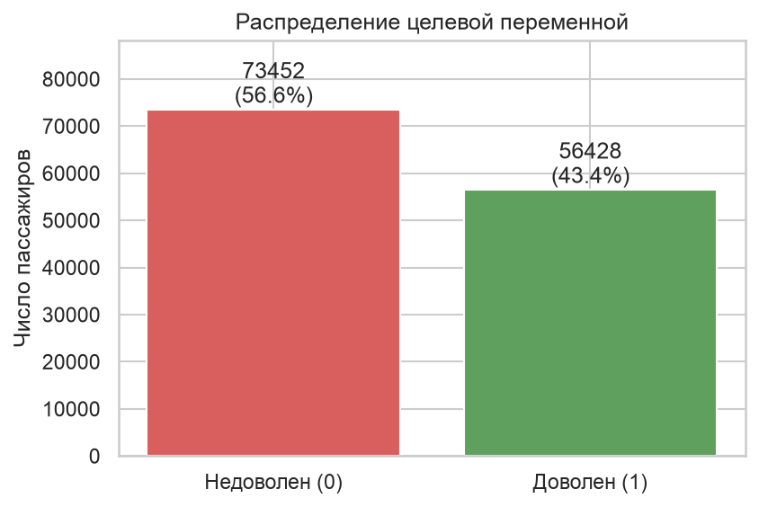

На рисунке 2 показаны распределения количественных признаков. Возраст распределён почти симметрично около 40 лет. Дальность и обе задержки сильно скошены вправо: у 56,5 % рейсов задержки вылета нет вообще.

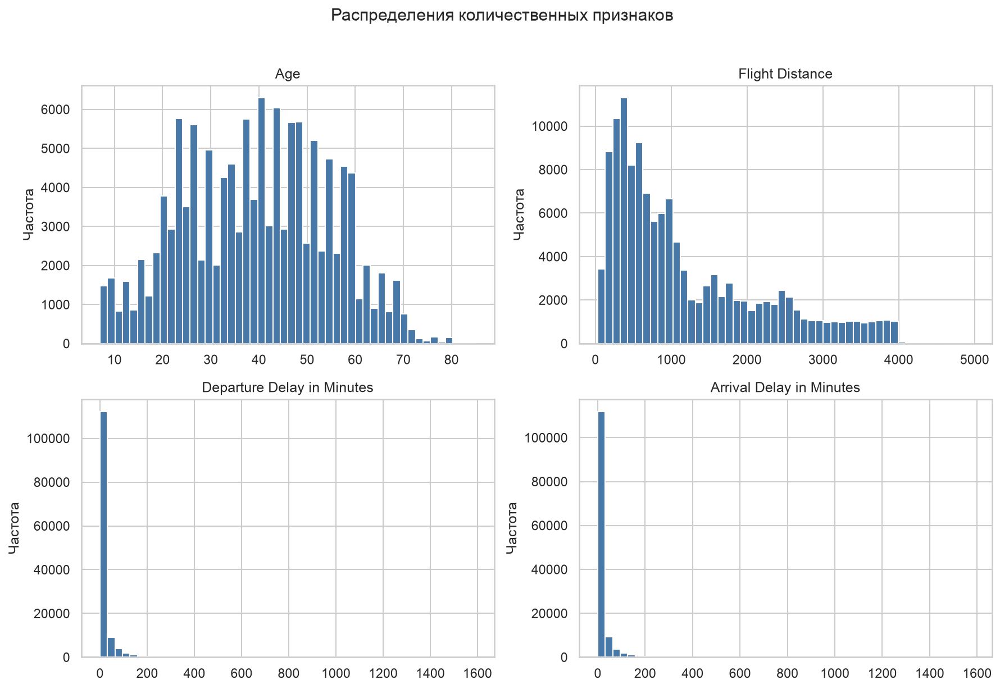

Оценки сервиса (рисунок 3) чаще всего равны 4. Слабее всего пассажиры оценивают Wi-Fi на борту (среднее 2,73) и онлайн-бронирование (2,76), лучше всего обслуживание на борту (3,64) и обработку багажа (3,63).

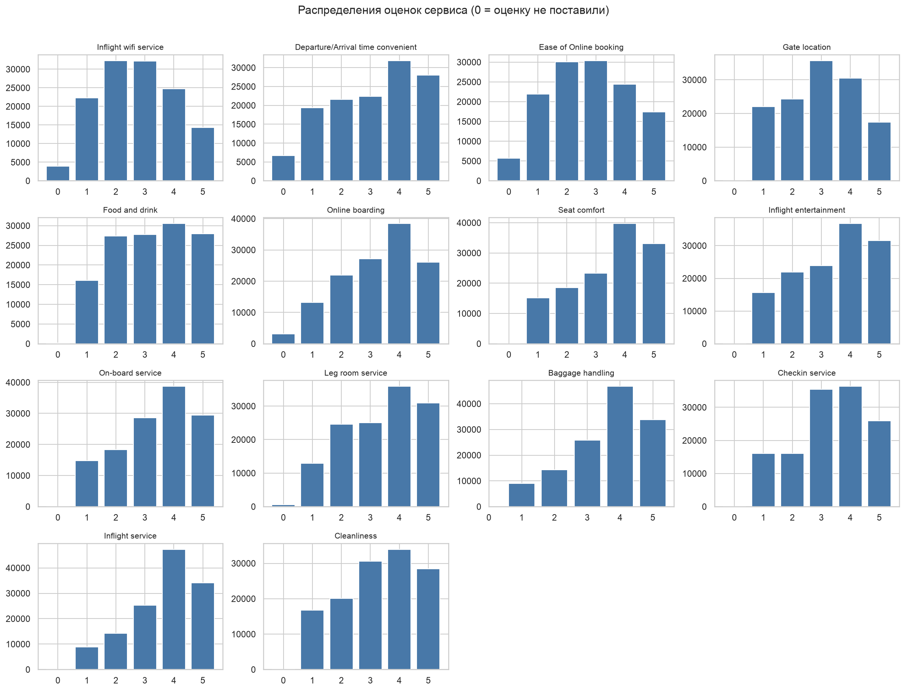

Среди категориальных признаков (рисунок 4) мужчин и женщин примерно поровну. Лояльных клиентов 81,7 %, деловых поездок 69,1 %. Классом Eco Plus летает всего 7,2 % пассажиров, поэтому выводы по нему опираются на меньшую выборку.

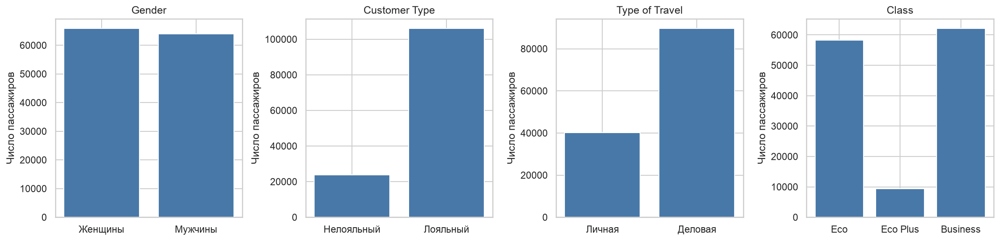

## 3.3 Выбросы

Выбросы искал ящиками с усами (рисунок 5). Выбросом считается значение дальше 1,5 межквартильного размаха от квартиля. За верхним усом оказалось 18 098 значений задержки вылета (13,9 %), 17 492 значения задержки прилёта (13,5 %) и 2 855 значений дальности (2,2 %). У возраста выбросов нет. Самая большая задержка 1592 минуты, почти 27 часов.

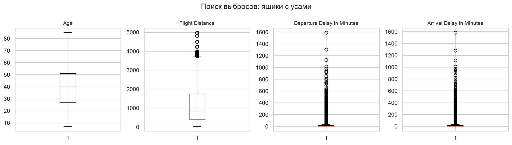

Удалять выбросы я не стал. Задержка на сутки случается на самом деле, это не ошибка ввода, а пассажир после такой задержки как раз интересен для модели. Деревьям выбросы не мешают, а для kNN и логистической регрессии в разделе 7 признаки стандартизированы.

## 3.4 Статистики и проверка на нормальность

Для количественных признаков посчитаны среднее, дисперсия и медиана, нормальность проверена критерием Шапиро–Уилка на случайной подвыборке из 5000 строк (таблица 2). На всей выборке тест отверг бы нормальность из-за любого крошечного отклонения, а scipy при n > 5000 предупреждает о неточном p-value.

Таблица 2 — Статистики количественных признаков

| Признак | Среднее | Дисперсия | Медиана | p-value |
|---|---|---|---|---|
| Age | 39,43 | 228,60 | 40 | 1,4·10⁻¹⁸ |
| Flight Distance | 1190,32 | 994 911 | 844 | 3,8·10⁻⁵⁴ |
| Departure Delay | 14,71 | 1449,41 | 0 | 9,6·10⁻⁸⁴ |
| Arrival Delay | 15,05 | 1475,82 | 0 | 1,9·10⁻⁸³ |

У всех четырёх признаков p-value намного меньше 0,05, гипотеза о нормальности отвергается. У задержек разница между средним (около 15 минут) и медианой (0) хорошо показывает, почему для скошенных распределений медиана описывает центр лучше.

## 3.5 Корреляции

Корреляционная матрица Пирсона (рисунок 6) нужна, чтобы найти признаки, дублирующие друг друга. Почти полностью совпадают только задержки вылета и прилёта (r = 0,96). Дальше идут Wi-Fi и онлайн-бронирование (0,71) и группа оценок чистоты, питания, кресла и развлечений (0,66–0,69).

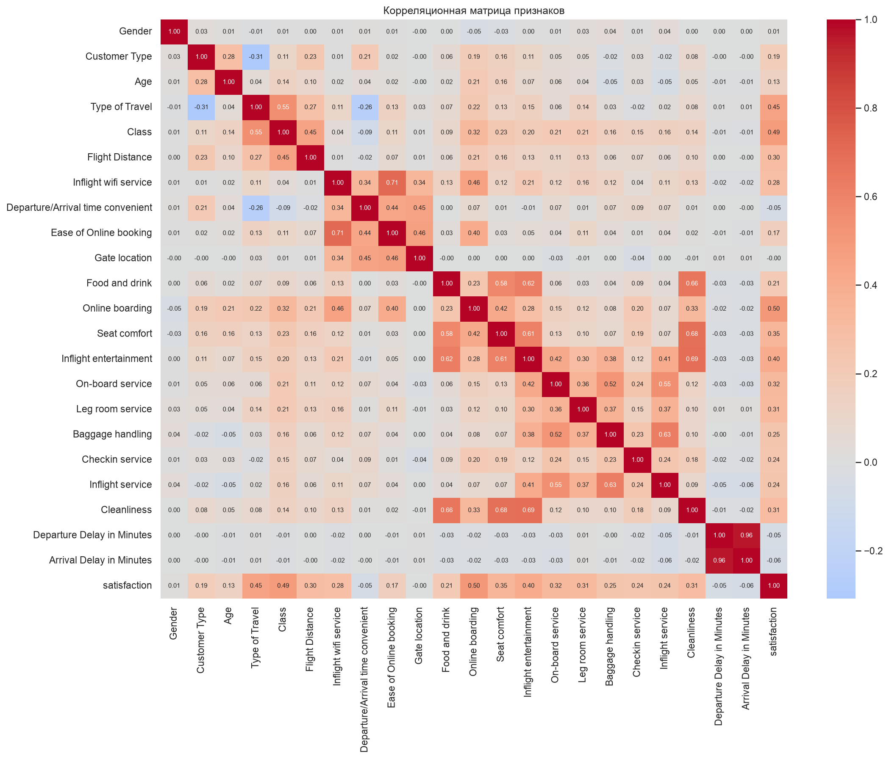

С целевой переменной сильнее всего связаны Online boarding (r = 0,50), Class (0,49) и Type of Travel (0,45), рисунок 7. У Gender (0,011) и Gate location (−0,003) линейной связи с целью почти нет. Эти признаки стали кандидатами на удаление в разделе 7.

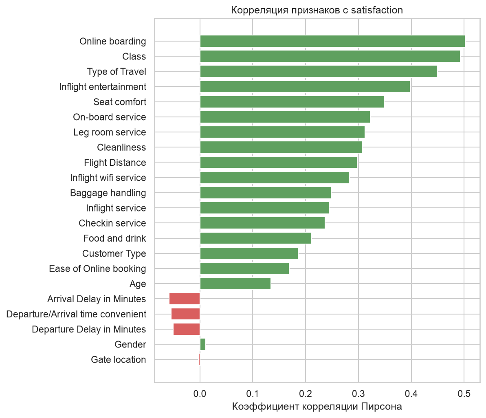

Корреляция показывает только линейную связь, поэтому я построил доли довольных пассажиров в разрезе отдельных признаков (рисунок 8). Доля довольных растёт с классом: 18,8 % в Eco, 24,6 % в Eco Plus и 69,4 % в Business. По оценке онлайн-посадки зависимость ступенчатая: при оценках от 1 до 3 довольны 11–14 % пассажиров, при оценке 4 уже 62,3 %, при оценке 5 87,1 %. По возрасту чаще всего довольны пассажиры от 40 до 60 лет (57,7 %).

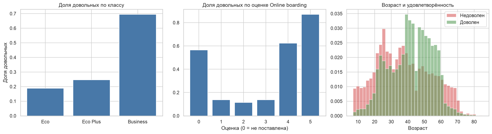

Самый наглядный результат описательного анализа на рисунке 9. В личных поездках довольны всего 9–12 % пассажиров в любом классе. В деловых поездках доля растёт с 29,9 % в Eco до 72,0 % в Business. Получается, что дорогой класс поднимает удовлетворённость только у тех, кто летит по работе. Такое взаимодействие двух признаков линейная модель не уловит, и это первый довод в пользу деревьев.

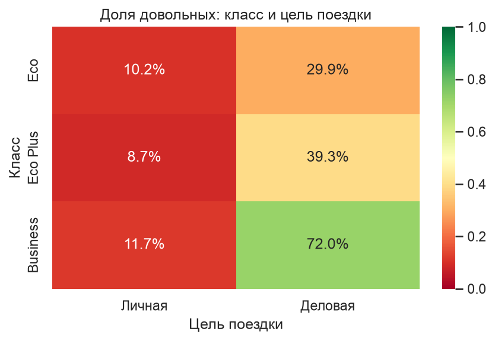

# 4 Обучение без учителя

Я проверил, делятся ли пассажиры на естественные группы без подсказки меток. Использованы два метода: кластеризация K-Means и метод главных компонент (PCA). Оба считают расстояния между объектами, поэтому признаки перед ними стандартизированы, иначе дальность в тысячи километров задавила бы оценки от 0 до 5.

Число кластеров выбирал методом локтя (рисунок 10). Инерция падает плавно, с 2,86 млн при k = 1 до 1,79 млн при k = 8, выраженного излома нет. Значит, чётких естественных групп в данных нет, и k = 2 взято по числу классов.

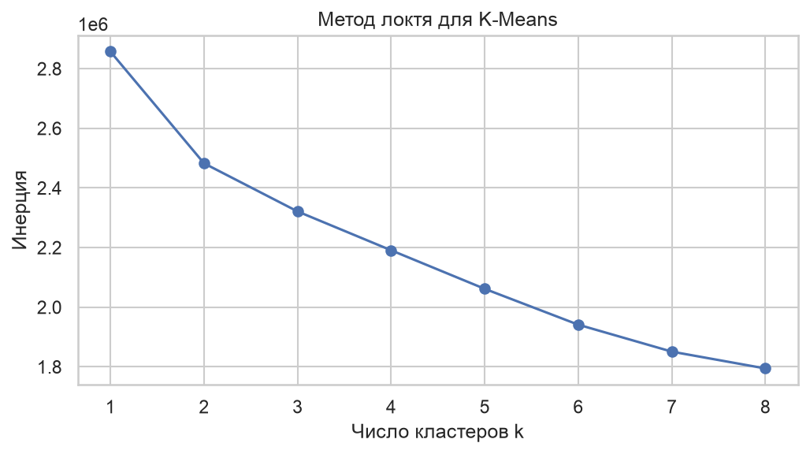

Две первые главные компоненты объясняют 29,4 % дисперсии (18,6 % и 10,8 %). На плоскости этих компонент (рисунок 11) довольные и недовольные перемешаны. Скорректированный индекс Рэнда между кластерами K-Means и настоящими классами равен 0,28 при максимуме 1, то есть кластеры совпадают с классами слабо.

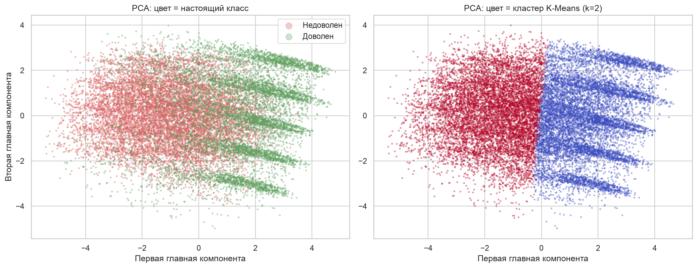

```python
X_scaled = StandardScaler().fit_transform(X_all)
pca = PCA(n_components=2, random_state=RANDOM_STATE)
X_pca = pca.fit_transform(X_scaled)
kmeans = KMeans(n_clusters=2, n_init=10, random_state=RANDOM_STATE)
clusters = kmeans.fit_predict(X_scaled)
ari = adjusted_rand_score(y_all, clusters)   # 0.282
```

Вывод: без меток задача не решается, нужны модели обучения с учителем.

# 5 Обучение моделей классификации

## 5.1 Разбиение на выборки

Разбиение случайное. Анкеты независимы и не упорядочены по времени, поэтому делить данные по дате или по порядку строк смысла нет. На обучение отдано 75 % (97 410 строк), на тест 25 % (32 470 строк). Обучающих строк моделям хватает с запасом, а при 32 тысячах тестовых строк стандартная ошибка оценки accuracy около 0,1 процентного пункта. Разбиение стратифицировано по цели, доля довольных в обеих частях одинаковая, 43,4 %.

Тестовая выборка не использовалась ни при подборе гиперпараметров, ни при отборе признаков. Для подбора применялась кросс-валидация внутри обучающей выборки.

```python
X_train, X_test, y_train, y_test = train_test_split(
    X, y, test_size=0.25, stratify=y, random_state=RANDOM_STATE)
```

## 5.2 Выбор моделей

Взяты пять моделей разной природы. Логистическая регрессия: линейная модель, взвешенная сумма признаков проходит через сигмоиду и превращается в вероятность. Она служит базовым уровнем. Метод k ближайших соседей относит пассажира к классу, который преобладает среди пяти самых похожих пассажиров обучающей выборки. Дерево решений строит набор правил вида «если оценка онлайн-посадки не выше 3, то…» и не зависит от масштаба признаков. Случайный лес обучает сто деревьев на бутстреп-подвыборках со случайным набором признаков и выбирает ответ голосованием, поэтому переобучается меньше одного дерева. Градиентный бустинг (HistGradientBoostingClassifier) строит деревья по очереди, и каждое следующее исправляет ошибки предыдущих.

Все модели сначала обучены с параметрами по умолчанию на немасштабированных данных. Это точка «до», с которой сравниваются улучшения.

```python
models = {
    'Логистическая регрессия': LogisticRegression(max_iter=1000, random_state=RANDOM_STATE),
    'kNN': KNeighborsClassifier(n_jobs=-1),
    'Дерево решений': DecisionTreeClassifier(random_state=RANDOM_STATE),
    'Случайный лес': RandomForestClassifier(random_state=RANDOM_STATE, n_jobs=-1),
    'Градиентный бустинг': HistGradientBoostingClassifier(random_state=RANDOM_STATE),
}
for name, model in models.items():
    model.fit(X_train, y_train)
```

# 6 Оценка моделей

Метрики считались на тестовой выборке. Accuracy показывает долю верных ответов. Precision показывает, какая доля пассажиров, названных моделью довольными, действительно довольна. Recall показывает, какую долю реально довольных модель нашла. F1 объединяет precision и recall через гармоническое среднее. ROC-AUC равен вероятности того, что случайный довольный пассажир получит от модели больший балл, чем случайный недовольный, и не зависит от порога 0,5. Результаты в таблице 3.

Таблица 3 — Метрики базовых моделей на тестовой выборке

| Модель | Accuracy | Precision | Recall | F1 | ROC-AUC |
|---|---|---|---|---|---|
| Логистическая регрессия | 0,8686 | 0,8560 | 0,8387 | 0,8472 | 0,9238 |
| kNN | 0,7528 | 0,7346 | 0,6747 | 0,7034 | 0,8102 |
| Дерево решений | 0,9464 | 0,9377 | 0,9391 | 0,9384 | 0,9456 |
| Случайный лес | 0,9622 | 0,9719 | 0,9403 | 0,9558 | 0,9940 |
| Градиентный бустинг | 0,9633 | 0,9742 | 0,9405 | 0,9570 | 0,9951 |

```python
def evaluate(model, X_eval, y_eval):
    y_pred = model.predict(X_eval)
    y_proba = model.predict_proba(X_eval)[:, 1]
    return {'Accuracy': accuracy_score(y_eval, y_pred),
            'Precision': precision_score(y_eval, y_pred),
            'Recall': recall_score(y_eval, y_pred),
            'F1': f1_score(y_eval, y_pred),
            'ROC-AUC': roc_auc_score(y_eval, y_proba)}
```

Матрицы ошибок (рисунок 12) показывают, в какую сторону ошибаются модели. Ансамбли чаще пропускают довольных, чем записывают недовольных в довольные: у бустинга 840 пропусков против 351 ложного срабатывания. У kNN без масштабирования ошибок больше всего, 4 589 и 3 438.

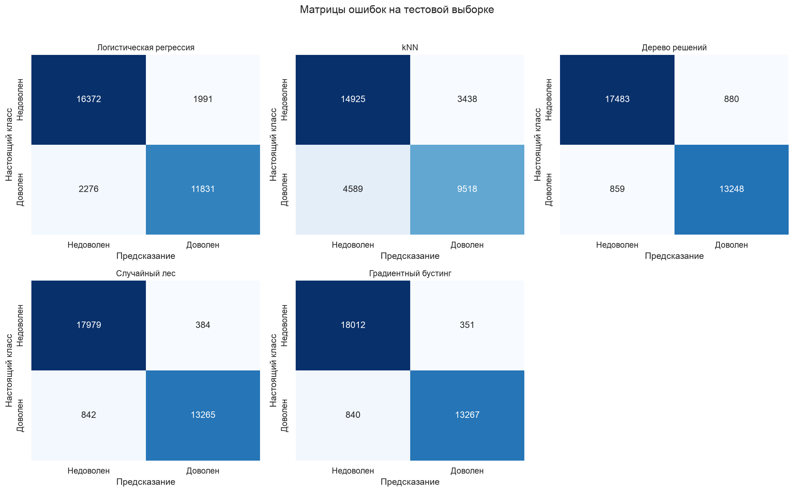

ROC-кривые бустинга и случайного леса (рисунок 13) почти прижаты к левому верхнему углу. У дерева при высокой accuracy ROC-AUC всего 0,946: вероятность дерева равна доле класса в листе, в большинстве листьев это 0 или 1, и ранжировать пассажиров по такому баллу плохо получается.

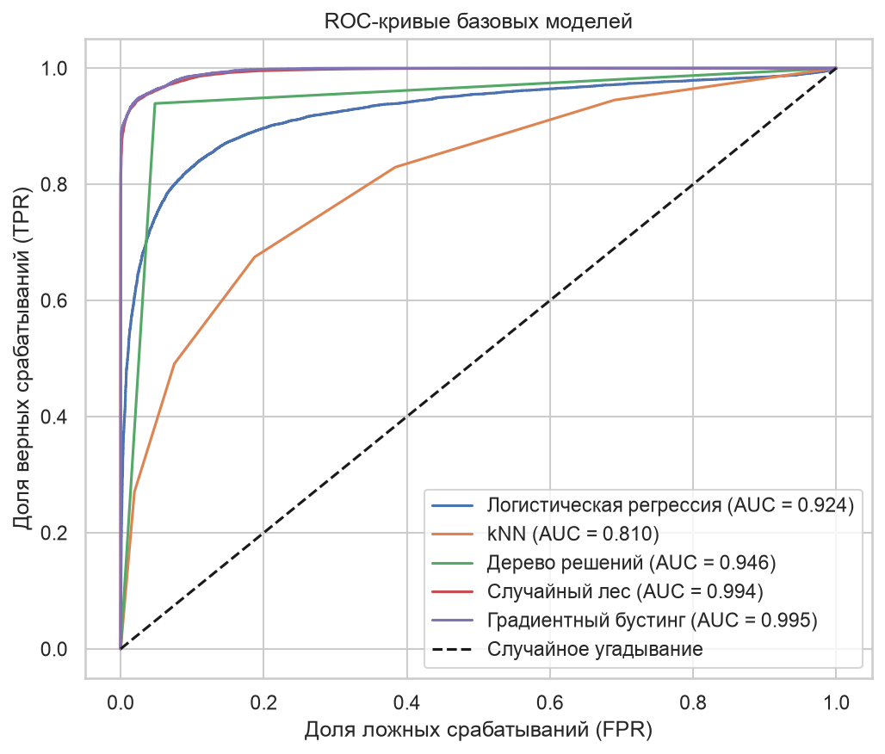

Лучшая базовая модель: градиентный бустинг (accuracy 0,9633), лес отстаёт на 0,1 процентного пункта. Логистическая регрессия заметно слабее деревьев, потому что зависимость нелинейная (рисунки 8 и 9). У kNN худший результат, и причина понятна: без масштабирования расстояние между пассажирами почти целиком задаёт Flight Distance со значениями до 4983, а оценки от 0 до 5 на него почти не влияют.

# 7 Улучшение моделей

## 7.1 Стандартизация признаков

Для логистической регрессии и kNN признаки стандартизированы: из каждого вычитается среднее и результат делится на стандартное отклонение. Среднее и отклонение считаются только по обучающей выборке, чтобы информация из теста не попала в обучение. Деревьям стандартизация не нужна, они сравнивают признак с порогом.

```python
scaler = StandardScaler()
X_train_scaled = scaler.fit_transform(X_train)
X_test_scaled = scaler.transform(X_test)
```

Accuracy kNN выросла с 0,7528 до 0,9283, на 17,6 процентного пункта. Логистическая регрессия выросла всего на 0,6 п. п. (0,8686 → 0,8747): линейная модель и так подбирает вес под масштаб признака, а стандартизация в основном помогла оптимизатору сойтись.

## 7.2 Отбор признаков

Из лучшей модели убраны четыре признака: Gender, Gate location и Departure/Arrival time convenient почти не связаны с целью, Departure Delay дублирует Arrival Delay. Accuracy бустинга упала с 0,9633 до 0,9621 (−0,12 п. п.), recall с 0,9405 до 0,9371. Отбор не помог. Как видно дальше на рисунке 16, у Gate location перестановочная важность (0,0098) выше, чем у Class, хотя корреляция с целью почти нулевая: бустинг использует этот признак в сочетании с другими. Поэтому в итоговой модели оставлены все 22 признака.

## 7.3 Подбор гиперпараметров

Для бустинга перебраны 12 комбинаций трёх параметров с трёхкратной кросс-валидацией на обучающей выборке: learning_rate (шаг, с которым каждое новое дерево поправляет предыдущие), max_leaf_nodes (сложность одного дерева) и l2_regularization (штраф против переобучения). Число деревьев подбирает ранняя остановка.

```python
param_grid = {'learning_rate': [0.05, 0.1, 0.2],
              'max_leaf_nodes': [31, 63],
              'l2_regularization': [0.0, 1.0]}
grid = GridSearchCV(
    HistGradientBoostingClassifier(max_iter=500, early_stopping=True, random_state=RANDOM_STATE),
    param_grid, cv=3, scoring='accuracy', n_jobs=4)
grid.fit(X_train, y_train)
```

Лучшая комбинация: learning_rate = 0,05, max_leaf_nodes = 63, l2_regularization = 1,0. Accuracy на кросс-валидации 0,9646, на тесте 0,9651, прирост 0,18 п. п. Оценки на кросс-валидации и тесте почти совпадают, значит под тестовую выборку модель не подгонялась. Сводка по всем приёмам в таблице 4 и на рисунке 14.

Таблица 4 — Accuracy до и после улучшений

| Приём | До | После | Прирост, п. п. |
|---|---|---|---|
| Логистическая регрессия: стандартизация | 0,8686 | 0,8747 | +0,61 |
| kNN: стандартизация | 0,7528 | 0,9283 | +17,55 |
| Бустинг: отбор признаков | 0,9633 | 0,9621 | −0,12 |
| Бустинг: подбор гиперпараметров | 0,9633 | 0,9651 | +0,18 |

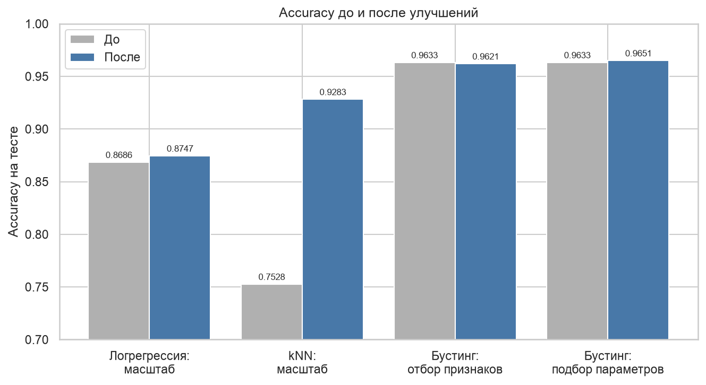

# 8 Итоговые результаты

## 8.1 Сравнение моделей

Итоговые метрики всех моделей собраны в таблице 5 и на рисунке 15. Первые три места заняли ансамбли деревьев.

Таблица 5 — Итоговое сравнение моделей на тестовой выборке

| Модель | Accuracy | Precision | Recall | F1 | ROC-AUC |
|---|---|---|---|---|---|
| Бустинг после подбора | 0,9651 | 0,9760 | 0,9429 | 0,9591 | 0,9957 |
| Градиентный бустинг | 0,9633 | 0,9742 | 0,9405 | 0,9570 | 0,9951 |
| Случайный лес | 0,9622 | 0,9719 | 0,9403 | 0,9558 | 0,9940 |
| Дерево решений | 0,9464 | 0,9377 | 0,9391 | 0,9384 | 0,9456 |
| kNN + стандартизация | 0,9283 | 0,9460 | 0,8855 | 0,9148 | 0,9705 |
| Логистическая регрессия + стандартизация | 0,8747 | 0,8707 | 0,8355 | 0,8528 | 0,9275 |
| Логистическая регрессия | 0,8686 | 0,8560 | 0,8387 | 0,8472 | 0,9238 |
| kNN | 0,7528 | 0,7346 | 0,6747 | 0,7034 | 0,8102 |

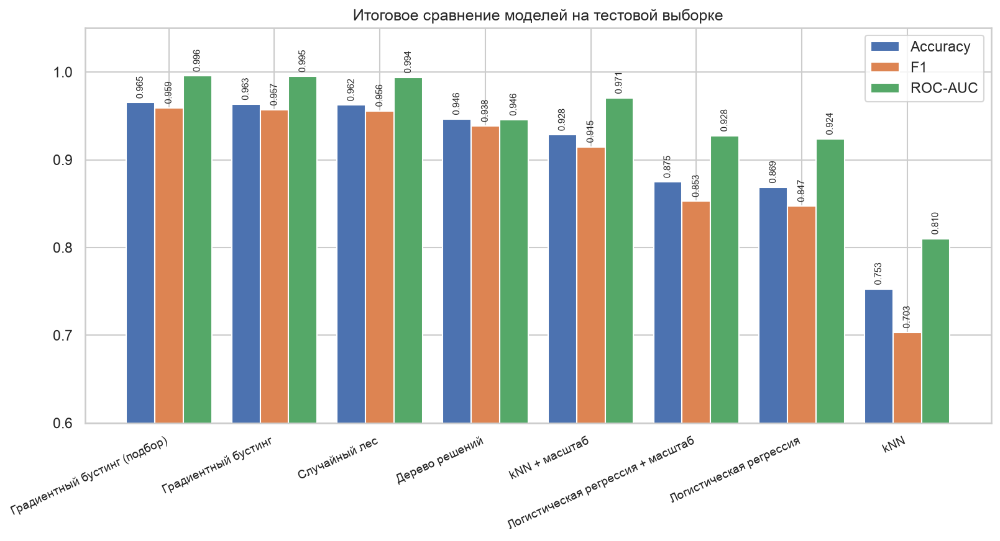

## 8.2 Важность признаков

У бустинга в scikit-learn нет встроенной важности признаков, поэтому посчитана перестановочная важность: столбец тестовой выборки перемешивается, и измеряется, насколько падает accuracy (рисунок 16). Сильнее всего модель опирается на цель поездки (падение 18,4 п. п.), Wi-Fi на борту (15,3 п. п.) и лояльность клиента (8,1 п. п.). У Class важность всего 0,9 п. п., хотя корреляция с целью 0,49: класс сильно связан с целью поездки (r = 0,55), и модель получает эту информацию из Type of Travel. Пол, питание и задержка вылета почти ничего не добавляют.

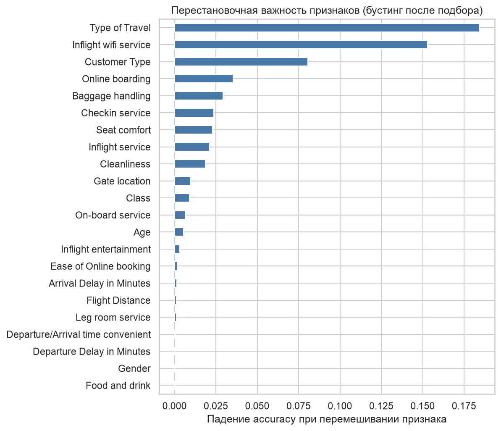

## 8.3 Кривая обучения

Кривая обучения (рисунок 17) показывает accuracy на обучении и на кросс-валидации при разном объёме данных. Разрыв между ними сокращается с 4,6 п. п. на 6 494 строках до 1,0 п. п. на 64 940 строках. Валидационная accuracy ещё растёт, но медленно (0,9632 → 0,9646). Сильного переобучения нет, а новые данные добавили бы только десятые доли процента.

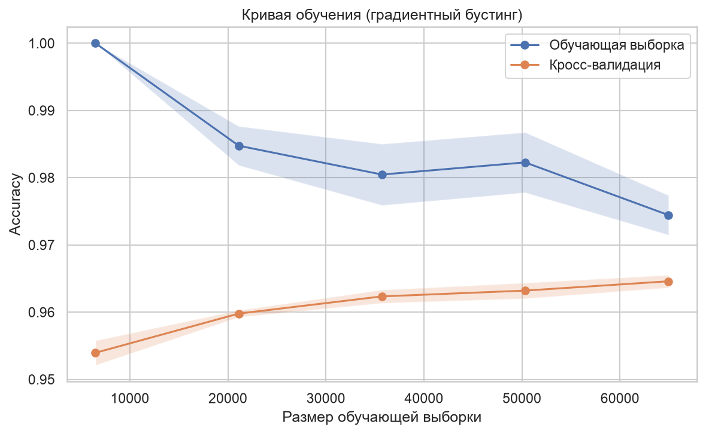

## 8.4 Сравнение с существующими решениями и перспективы

В работе T. Mirthipati [2] на этом же наборе данных случайный лес, SVM и градиентный бустинг получили accuracy 0,95 на тесте, дерево решений 0,92, логистическая регрессия 0,87. У меня логистическая регрессия дала столько же (0,869), а ансамбли на 1–1,5 процентного пункта выше. Протоколы разбиения в работах разные, поэтому сравнение приблизительное, но порядок моделей совпадает.

Работу можно продолжить в нескольких направлениях: попробовать CatBoost или LightGBM с нативной обработкой категорий; объяснять прогноз для отдельного пассажира через SHAP; сдвинуть порог классификации, если авиакомпании важнее находить недовольных; проверить модель на анкетах другой авиакомпании, потому что все данные здесь собраны в одном опросе.

# ЗАКЛЮЧЕНИЕ

В работе проанализированы 129 880 анкет пассажиров из набора Airline Passenger Satisfaction. Для анализа построено 17 графиков и обучено пять моделей классификации.

Описательный анализ показал, что количественные признаки распределены не нормально, у задержек около 14 % значений формально выбросы, но это реальные опоздания. Сильнее всего с удовлетворённостью линейно связаны оценка онлайн-посадки, класс и цель поездки. Самый наглядный результат: дорогой класс повышает долю довольных только в деловых поездках, с 29,9 % в Eco до 72,0 % в Business, а в личных поездках доволен примерно каждый десятый пассажир в любом классе.

K-Means и PCA не нашли естественных групп пассажиров (ARI = 0,28), задача решается только обучением с учителем.

Лучшая модель: градиентный бустинг после подбора гиперпараметров. На тестовой выборке из 32 470 анкет accuracy 0,9651, precision 0,9760, recall 0,9429, F1 0,9591, ROC-AUC 0,9957. Модель чаще пропускает довольных пассажиров (recall по ним 0,943), чем недовольных (0,982). Логистическая регрессия отстаёт на 9 процентных пунктов из-за нелинейности зависимостей.

Сильнее всего улучшение помогло kNN: стандартизация подняла accuracy на 17,6 п. п. Подбор гиперпараметров бустинга дал 0,18 п. п. Отбор признаков по корреляции ухудшил результат на 0,12 п. п., потому что бустинг использует признаки с нулевой линейной корреляцией в сочетании с другими.

Главные факторы удовлетворённости по перестановочной важности: цель поездки, Wi-Fi на борту, лояльность клиента и онлайн-посадка. Практический вывод для авиакомпании: в первую очередь улучшать Wi-Fi, у него самая низкая средняя оценка (2,73) и вторая по величине важность в модели.

# СПИСОК ИСПОЛЬЗОВАННЫХ ИСТОЧНИКОВ

1. Airline Passenger Satisfaction : набор данных // Kaggle : [сайт]. — URL: https://www.kaggle.com/datasets/teejmahal20/airline-passenger-satisfaction (дата обращения: 13.09.2026). — Текст : электронный.
2. Mirthipati, T. Enhancing Airline Customer Satisfaction: A Machine Learning and Causal Analysis Approach / T. Mirthipati // arXiv : [сайт]. — 2024. — URL: https://arxiv.org/abs/2405.09076 (дата обращения: 13.09.2026). — Текст : электронный.
3. Pedregosa, F. Scikit-learn: Machine Learning in Python / F. Pedregosa [et al.] // Journal of Machine Learning Research. — 2011. — Vol. 12. — P. 2825–2830.
4. Scikit-learn : User Guide // scikit-learn.org : [сайт]. — URL: https://scikit-learn.org/stable/user_guide.html (дата обращения: 13.09.2026). — Текст : электронный.
5. Hunter, J. D. Matplotlib: A 2D Graphics Environment / J. D. Hunter // Computing in Science & Engineering. — 2007. — Vol. 9, № 3. — P. 90–95.
6. Waskom, M. seaborn: statistical data visualization / M. Waskom // Journal of Open Source Software. — 2021. — Vol. 6, № 60. — Art. 3021.
7. Хасти, Т. Основы статистического обучения / Т. Хасти, Р. Тибширани, Дж. Фридман. — 2-е изд. — Москва : Вильямс, 2020. — 768 с. — Текст : непосредственный.
