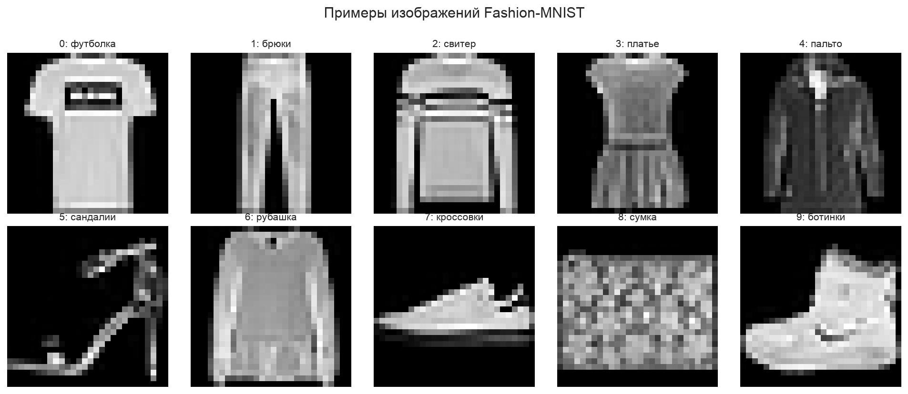
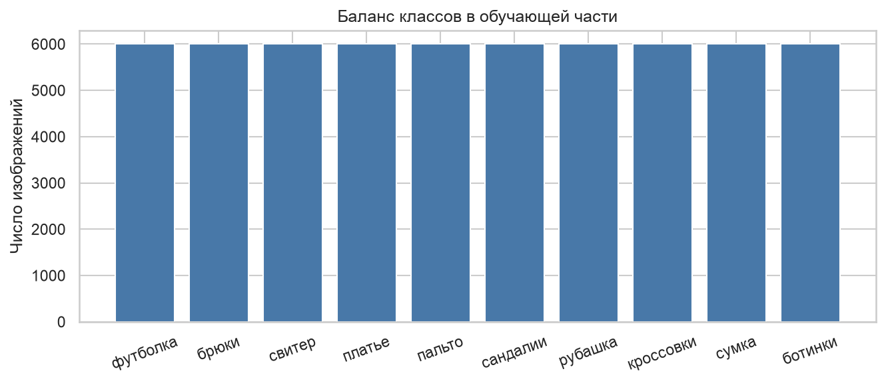
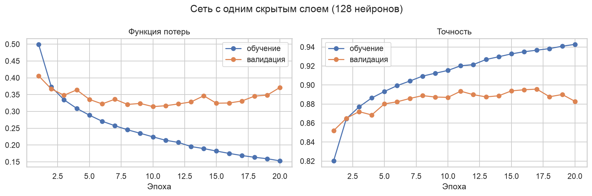
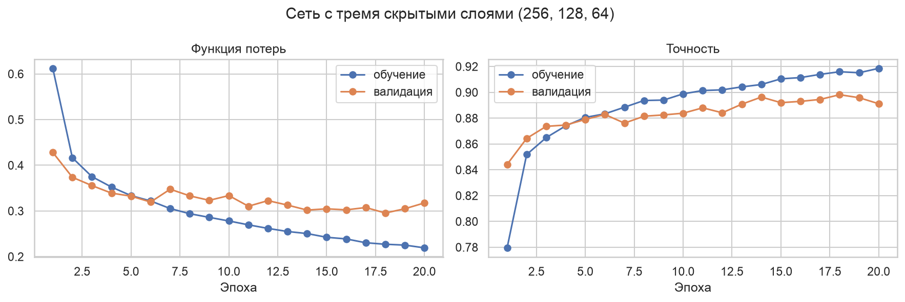
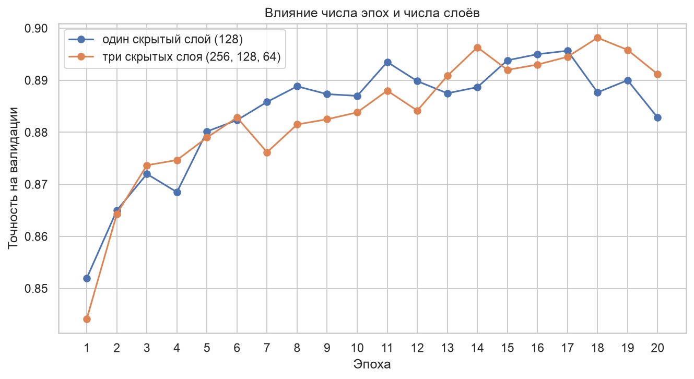
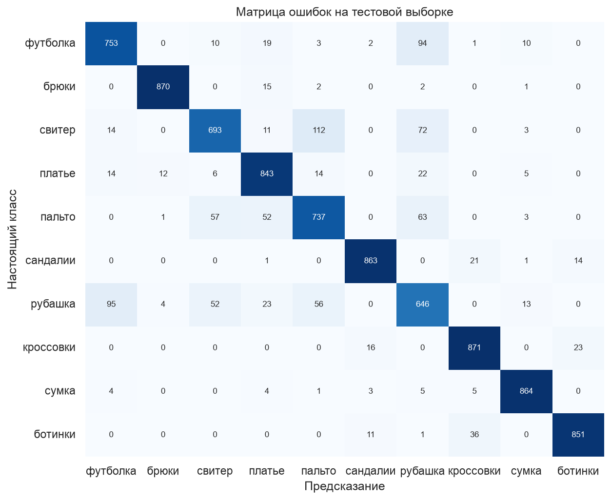
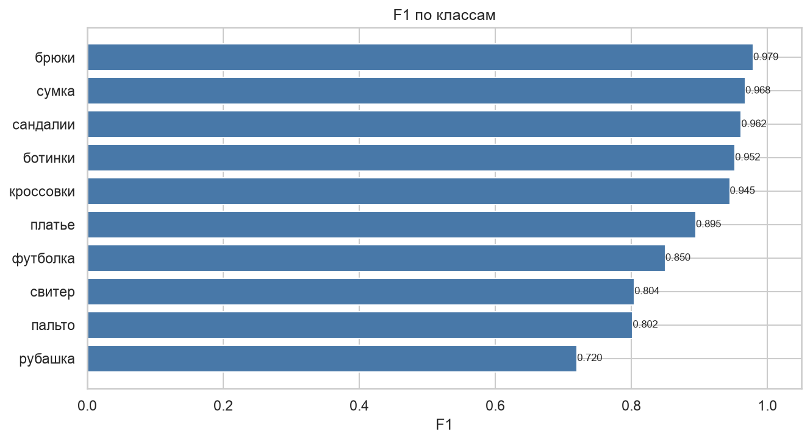
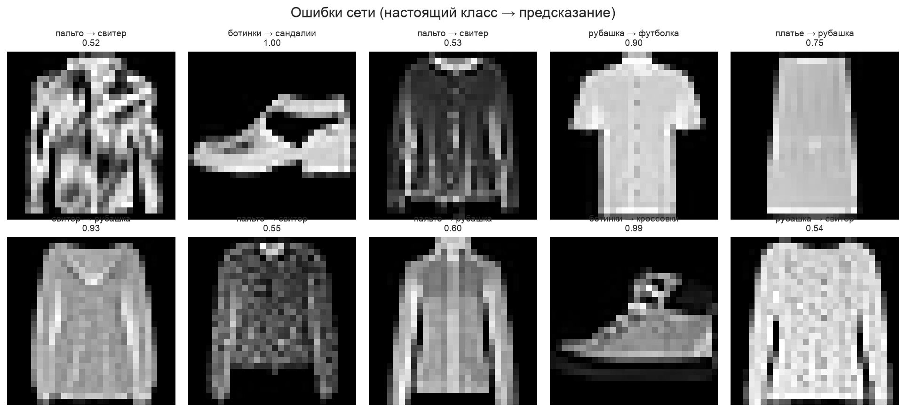
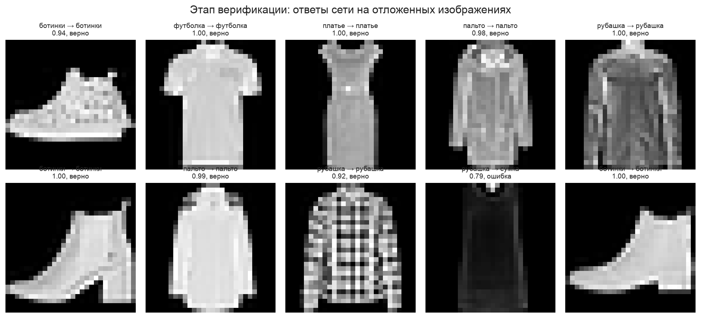

# ВВЕДЕНИЕ

Распознавание образов это первая задача, на которой обычно знакомятся с нейронными сетями: вход понятен человеку, а результат легко проверить глазами.

Цель работы: научиться собирать, обучать и оценивать полносвязную нейронную сеть на задаче распознавания изображений.

Как я понял задачу: текста задания в СДО нет, поэтому беру стандартное содержание такой работы. Обучить полносвязную сеть распознавать изображения, показать кривые точности и потерь по эпохам, матрицу ошибок, примеры верных и неверных распознаваний, проверить влияние числа эпох и числа слоёв. Преподаватель отдельно упоминала этап верификации, поэтому часть изображений откладывается заранее и используется один раз в самом конце.

Задачи работы:
- загрузить набор изображений и изучить его;
- разбить выборку, отложив часть данных для верификации;
- обучить сеть с одним скрытым слоем;
- обучить сеть с тремя скрытыми слоями и сравнить архитектуры;
- оценить лучшую сеть по классам и разобрать ошибки;
- провести этап верификации на отложенных примерах.

Работа выполнена на Python 3.12 с библиотекой PyTorch, обучение шло на ускорителе MPS в чипе Apple M4. Код и графики лежат в репозитории https://github.com/thehaffk/mmo в папке `lab1`. Все случайные процессы зафиксированы (random_state = 42).

# 1 Набор данных

Использован набор Fashion-MNIST [1]: 70 000 чёрно-белых изображений одежды размером 28 на 28 пикселей, 10 классов. Набор специально сделан как замена рукописным цифрам MNIST: на цифрах любая сеть выдаёт больше 97 %, и разницу между архитектурами не разглядеть.

Классы: футболка, брюки, свитер, платье, пальто, сандалии, рубашка, кроссовки, сумка, ботинки. Обучающая часть 60 000 изображений, тестовая 10 000, классы сбалансированы по 6000 изображений в обучающей части.





Значения яркости приводятся к среднему 0,286 и отклонению 0,353, посчитанным по обучающей части: с нормализованными входами сеть обучается устойчивее.

# 2 Разбиение и отложенная выборка

Обучающие 60 000 изображений делятся на 54 000 для обучения и 6000 для валидации. По валидации выбирается лучшая эпоха и сравниваются архитектуры.

Тестовые 10 000 делятся на две части. Первые 9000 это тестовая выборка, на ней считаются метрики. Последние 1000 откладываются для этапа верификации: они не участвуют ни в обучении, ни в выборе архитектуры, ни в подсчёте метрик, и используются один раз в конце работы.

```python
train_ds, val_ds = torch.utils.data.random_split(train_full, [54000, 6000], generator=g)
test_ds = Subset(test_full, range(9000))
verify_ds = Subset(test_full, range(9000, 10000))
```

# 3 Архитектура сети

Полносвязная сеть не знает, что на входе картинка: изображение 28 на 28 разворачивается в вектор из 784 чисел, и соседство пикселей теряется. Каждый нейрон слоя считает взвешенную сумму всех входов и пропускает её через функцию активации ReLU, которая обнуляет отрицательные значения и добавляет нелинейность. Последний слой выдаёт 10 чисел по числу классов, функция потерь CrossEntropyLoss превращает их в вероятности и сравнивает с правильным ответом.

```python
class MLP(nn.Module):
    def __init__(self, hidden=(128,), dropout=0.0):
        super().__init__()
        layers = [nn.Flatten()]
        prev = 28 * 28
        for h in hidden:
            layers += [nn.Linear(prev, h), nn.ReLU()]
            if dropout:
                layers.append(nn.Dropout(dropout))
            prev = h
        layers.append(nn.Linear(prev, 10))
        self.net = nn.Sequential(*layers)
```

# 4 Обучение и влияние архитектуры

## 4.1 Сеть с одним скрытым слоем

Первая архитектура: 784 входа, скрытый слой из 128 нейронов, выход из 10 нейронов, всего 101 770 параметров. Оптимизатор Adam с шагом 0,001, 20 эпох, обучение заняло 61 секунду. Лучшая точность на валидации 0,8957.



Кривые расходятся: точность на обучении доходит до 0,943, а на валидации после десятой эпохи стоит около 0,89 и колеблется. Сеть запоминает обучающие изображения.

## 4.2 Сеть с тремя скрытыми слоями

Вторая архитектура: слои из 256, 128 и 64 нейронов с дропаутом 0,2 после каждого, 242 762 параметра. Дропаут во время обучения случайно обнуляет пятую часть нейронов, чтобы сеть не полагалась на отдельные признаки. Обучение 20 эпох за 67 секунд, лучшая точность на валидации 0,8982.



Кривые идут ближе друг к другу, чем у первой сети: дропаут сдерживает переобучение.

## 4.3 Влияние числа эпох и числа слоёв

Таблица 1 — Точность на валидации по эпохам

| Число эпох | Один слой (128) | Три слоя (256, 128, 64) |
|---|---|---|
| 1 | 0,8520 | 0,8442 |
| 5 | 0,8802 | 0,8790 |
| 10 | 0,8870 | 0,8838 |
| 15 | 0,8938 | 0,8920 |
| 20 | 0,8828 | 0,8912 |



Обе сети выходят на плато к десятой эпохе. Дальше точность на валидации колеблется в пределах половины процентного пункта, а на обучении продолжает расти, то есть лишние эпохи дают переобучение, а не качество. Усложнение архитектуры дало 0,25 процентного пункта: полносвязная сеть не учитывает соседство пикселей, и дополнительными слоями этот недостаток не исправить.

# 5 Оценка лучшей сети

Лучшая архитектура по валидации это три скрытых слоя. На тестовой выборке из 9000 изображений accuracy 0,8879, ошибка 0,3300, средний F1 0,8877.

Таблица 2 — Метрики по классам

| Класс | Precision | Recall | F1 |
|---|---|---|---|
| брюки | 0,9808 | 0,9775 | 0,9792 |
| сумка | 0,9600 | 0,9752 | 0,9675 |
| сандалии | 0,9642 | 0,9589 | 0,9616 |
| ботинки | 0,9583 | 0,9466 | 0,9524 |
| кроссовки | 0,9325 | 0,9571 | 0,9447 |
| платье | 0,8709 | 0,9203 | 0,8949 |
| футболка | 0,8557 | 0,8442 | 0,8499 |
| свитер | 0,8472 | 0,7657 | 0,8044 |
| пальто | 0,7968 | 0,8072 | 0,8020 |
| рубашка | 0,7138 | 0,7267 | 0,7202 |





Все трудные классы это верхняя одежда. Свитер путается с пальто 112 раз, рубашка с футболкой 95 раз, футболка с рубашкой 94 раза. Обувь, сумки и брюки распознаются почти безошибочно: у них уникальный силуэт.



На примерах ошибок видно, что спутанные изображения похожи и для человека: тёмный свитер с длинным рукавом и пальто на картинке 28 на 28 пикселей различаются деталями, которые при таком разрешении теряются.

# 6 Этап верификации

Отложенная тысяча изображений не участвовала ни в обучении, ни в выборе архитектуры, ни в подсчёте метрик. Это независимая проверка итоговой сети.

Результат: точность 0,8870, ошибка 0,3057, верно распознано 887 изображений из 1000. На тестовой выборке было 0,8879, разница 0,09 процентного пункта. Оценка качества устойчива, под тестовую выборку сеть не подгонялась.



# ЗАКЛЮЧЕНИЕ

На наборе Fashion-MNIST обучены две полносвязные сети и проведён этап верификации на отложенных данных.

Сеть с одним скрытым слоем из 128 нейронов даёт на валидации 0,8957 при 101 770 параметрах, сеть с тремя слоями и дропаутом 0,8982 при 242 762 параметрах. Разница 0,25 процентного пункта: для изображений полносвязная архитектура сама по себе ограничена, она разворачивает картинку в вектор и теряет соседство пикселей.

Обе сети выходят на плато качества к десятой эпохе, дальше растёт только точность на обучении. Поэтому в работе сохраняются веса лучшей эпохи по валидации.

Лучшая сеть на тесте из 9000 изображений: accuracy 0,8879, ошибка 0,3300, средний F1 0,8877. Худший класс рубашка (F1 0,720), лучший брюки (0,979). Основные ошибки между свитером, пальто, рубашкой и футболкой.

Этап верификации на 1000 отложенных изображений дал 0,8870, то есть практически тот же результат, что и на тесте.

Улучшить результат можно свёрточной сетью, которая учитывает соседство пикселей и на Fashion-MNIST даёт около 0,93, аугментацией и увеличением разрешения входа.

# СПИСОК ИСПОЛЬЗОВАННЫХ ИСТОЧНИКОВ

1. Xiao, H. Fashion-MNIST: a Novel Image Dataset for Benchmarking Machine Learning Algorithms / H. Xiao, K. Rasul, R. Vollgraf // arXiv : [сайт]. — 2017. — URL: https://arxiv.org/abs/1708.07747 (дата обращения: 28.09.2026). — Текст : электронный.
2. Paszke, A. PyTorch: An Imperative Style, High-Performance Deep Learning Library / A. Paszke [et al.] // Advances in Neural Information Processing Systems. — 2019. — Vol. 32. — P. 8024–8035.
3. Srivastava, N. Dropout: A Simple Way to Prevent Neural Networks from Overfitting / N. Srivastava [et al.] // Journal of Machine Learning Research. — 2014. — Vol. 15. — P. 1929–1958.
4. Лысачев, М. Н. Искусственный интеллект. Анализ, тренды, мировой опыт / М. Н. Лысачев, А. Н. Прохоров ; научный редактор Д. А. Ларионов. — Москва ; Белгород : КОНСТАНТА-принт, 2023. — 460 с. — Текст : непосредственный.
