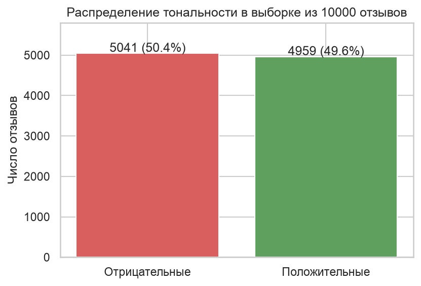
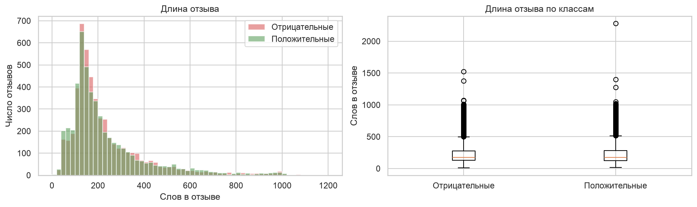
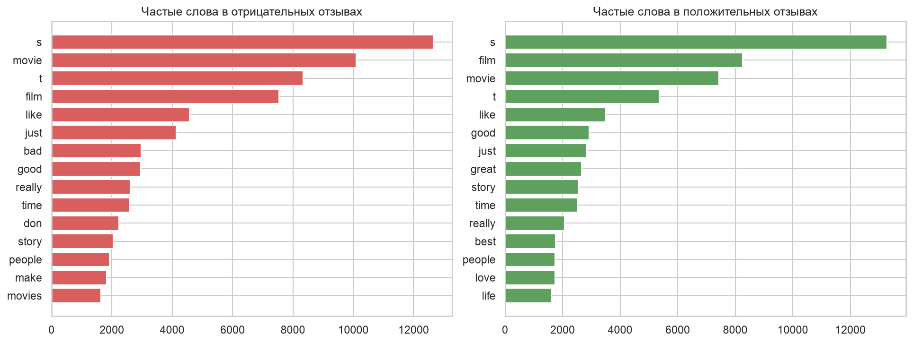
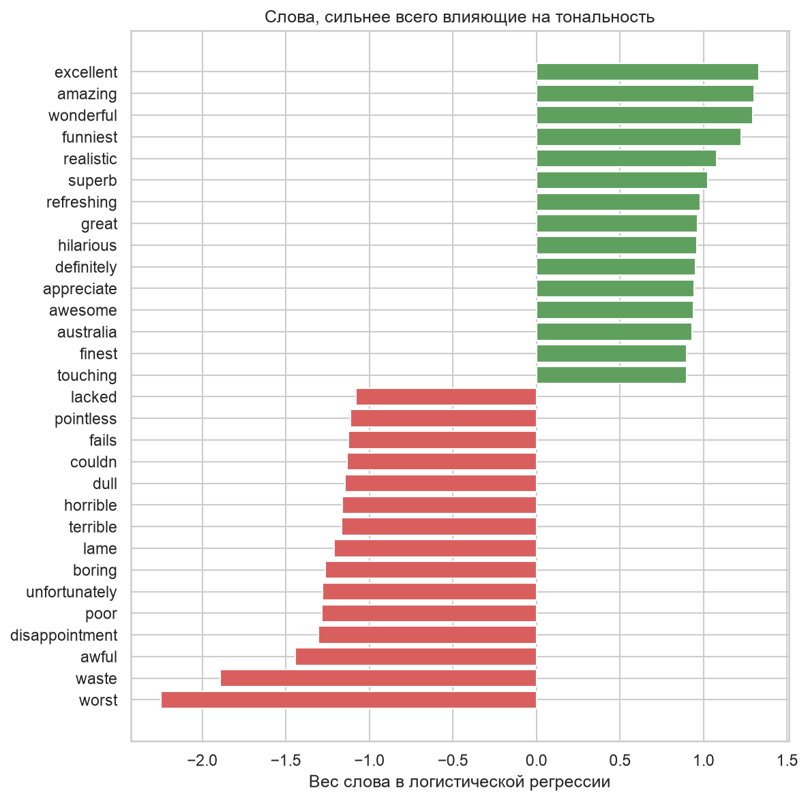
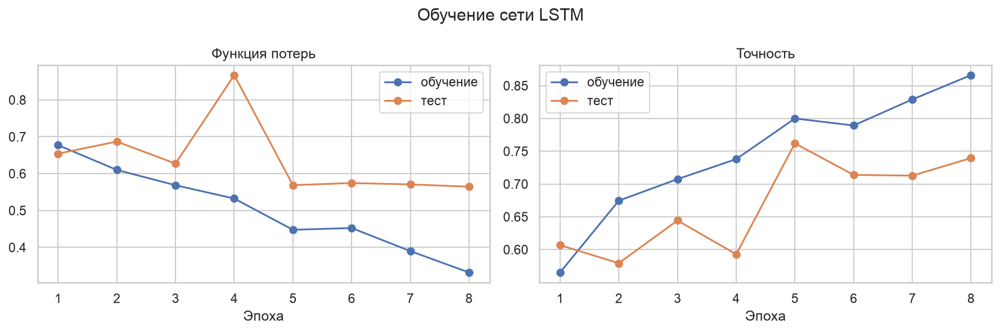
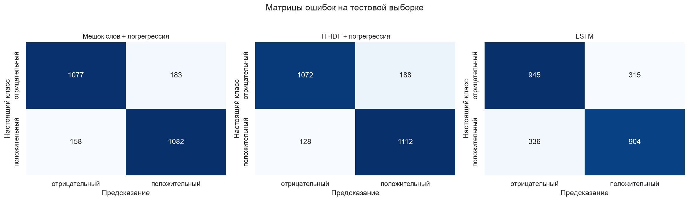
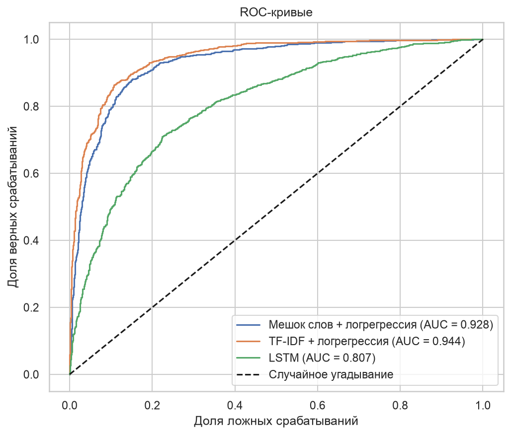
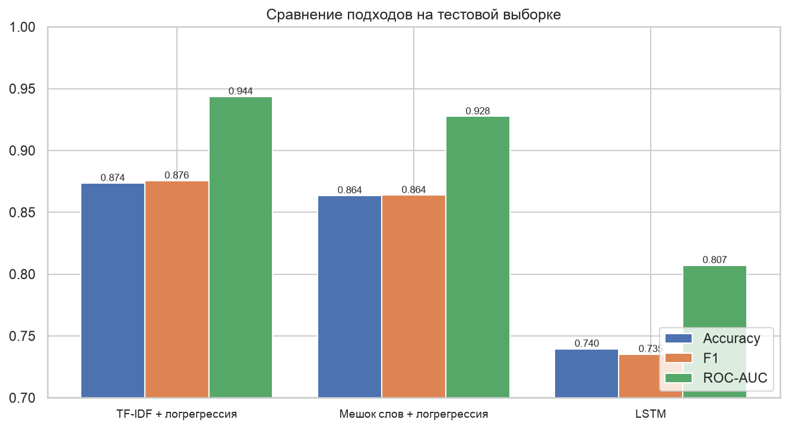
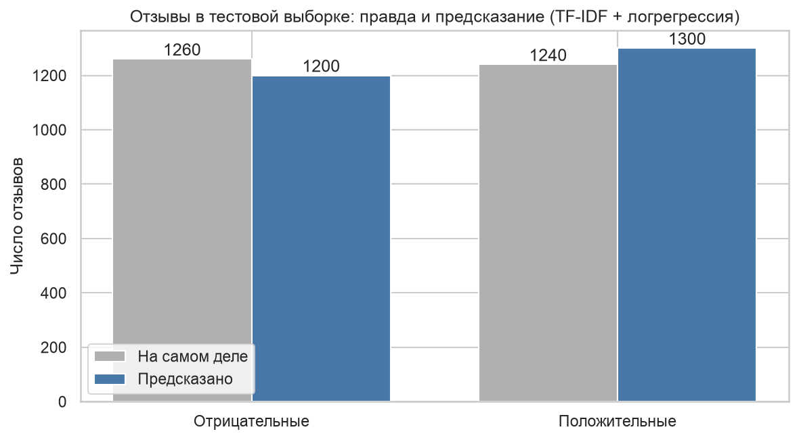

# ВВЕДЕНИЕ

Отзывов на фильмы, товары и сервисы в интернете столько, что прочитать их все невозможно. Анализ тональности решает эту задачу машинно: модель читает текст и относит его к положительным или отрицательным. Дальше по таким меткам считают долю довольных клиентов и следят, как она меняется.

Цель работы: научиться приводить тексты к числовым признакам и обучать модели, определяющие тональность отзыва.

Как я понял задачу: взять набор отзывов IMDB из материалов к работе, отобрать выборку по своему варианту, предобработать тексты, векторизовать их и сравнить два подхода к классификации. Номер в списке группы 1, значит объём выборки 10 000 отзывов, метод отбора случайный. В конце требуется таблица с числом положительных и отрицательных отзывов.

Задачи работы:
- загрузить набор и отобрать выборку по варианту;
- провести разведочный анализ отзывов;
- предобработать тексты и построить признаки;
- обучить логистическую регрессию на мешке слов и на TF-IDF;
- обучить рекуррентную сеть LSTM;
- сравнить подходы по метрикам и составить таблицу по числу отзывов.

Работа выполнена на Python 3.12 с библиотеками pandas, scikit-learn и PyTorch. Код и графики лежат в репозитории https://github.com/thehaffk/mmo в папке `lab2`. Все случайные процессы зафиксированы (random_state = 42).

# 1 Набор данных и выборка по варианту

В материалах к работе приложен файл `IMDB_dataset.xlsx`: 25 000 отзывов на фильмы, у каждого метка positive или negative, классов поровну по 12 500. Для удобства файл переведён в csv.

По варианту отбираю 10 000 отзывов случайным образом с фиксированным `random_state`. В выборку попал 5041 отрицательный отзыв и 4959 положительных, разница меньше процента (рисунок 1). Специальные приёмы против дисбаланса не нужны, accuracy корректна.



Длина отзыва у классов одинаковая: медиана 174 слова у отрицательных и 173 у положительных, самый длинный отзыв 2278 слов (рисунок 2). Значит, по длине тональность не угадать, работать придётся со словами.



# 2 Предобработка текста

Отзывы выгружены с сайта, поэтому внутри встречаются html-теги переноса строки. Предобработка:
- перевод в нижний регистр, иначе Good и good станут разными признаками;
- удаление html-тегов и всех символов, кроме латинских букв и пробелов;
- склеивание повторяющихся пробелов.

```python
TAG_RE = re.compile(r'<[^>]+>')
NON_LETTER_RE = re.compile(r'[^a-z\s]')

def clean(text):
    text = text.lower()
    text = TAG_RE.sub(' ', text)
    text = NON_LETTER_RE.sub(' ', text)
    return ' '.join(text.split())
```

Стемминг и лемматизацию не применяю: для английских отзывов выигрыш небольшой, а разбирать ошибки становится труднее. Стоп-слова убираются на этапе векторизации встроенным списком scikit-learn.

Побочный эффект очистки виден на рисунке 3: апострофы в сокращениях исчезают, и don't превращается в don и t. Такие обрывки попадают в топ частотности, но в матрицу признаков не проходят, потому что векторизатор берёт только слова длиной от двух символов.



Оценочные слова в частотности видны только ниже нейтральных: bad у отрицательных отзывов, good, great, best и love у положительных. Одних частот для решения задачи мало, нужна модель, которая взвесит слова.

# 3 Векторизация

Разбиение 75 / 25 со стратификацией: 7500 отзывов на обучение, 2500 на тест. Векторизатор настраивается только на обучающей части, иначе словарь узнает про тестовые отзывы.

**Мешок слов** (`CountVectorizer`) строит словарь из 20 000 самых частых слов и считает, сколько раз каждое слово встретилось в отзыве. Порядок слов теряется. Матрица 7500 на 20 000 заполнена на 0,41 %, то есть почти целиком состоит из нулей.

**TF-IDF** (`TfidfVectorizer`) делит частоту слова в отзыве на то, насколько часто слово встречается во всех отзывах. Слова movie и film получают меньший вес, редкие и содержательные больший. Дополнительно беру пары соседних слов, тогда not good попадает в словарь как отдельный признак.

```python
bow = CountVectorizer(max_features=20000, stop_words='english')
tfidf = TfidfVectorizer(max_features=20000, stop_words='english', ngram_range=(1, 2))
```

# 4 Подход 1: логистическая регрессия

Логистическая регрессия присваивает каждому слову вес: положительный тянет отзыв к классу «положительный», отрицательный наоборот. Сумма весов слов отзыва проходит через сигмоиду и превращается в вероятность.

Результаты на тесте: мешок слов даёт accuracy 0,8636 и ROC-AUC 0,9275, TF-IDF 0,8736 и 0,9437.

Модель легко проверить глазами, достаточно посмотреть на слова с самыми большими весами (рисунок 4). Отрицательные веса у worst (−2,2), waste (−1,9), awful (−1,4), положительные у excellent, amazing и wonderful (около +1,3). Модель сама нашла оценочную лексику, никто ей словарей не давал. Слово australia среди положительных показывает, что на 7500 отзывов часть весов случайна.



# 5 Подход 2: рекуррентная сеть LSTM

Мешок слов не видит порядок слов, поэтому not good at all и good для него похожи. Рекуррентная сеть читает отзыв по словам и хранит состояние, в котором накапливается смысл прочитанного. LSTM это рекуррентная ячейка с тремя вентилями: забывания, входным и выходным. Вентили решают, что стереть из состояния, что записать и что отдать наружу, поэтому сеть удерживает смысл на длинных отзывах лучше простой рекуррентной сети.

Подготовка данных: словарь из 20 000 самых частых слов обучающей выборки, редкие слова заменяются на `<unk>`, каждый отзыв обрезается или дополняется нулями до 300 слов. Слова превращаются в векторы обучаемым слоем Embedding размерности 128, всего в сети 2 692 225 параметров.

```python
class LSTMSentiment(nn.Module):
    def forward(self, x, lengths):
        e = self.emb(x)
        packed = nn.utils.rnn.pack_padded_sequence(e, lengths.cpu(),
                                                   batch_first=True, enforce_sorted=False)
        out, (h, c) = self.lstm(packed)
        return self.fc(self.drop(h[-1])).squeeze(1)
```

Отдельно стоит сказать про длину отзыва. В первом варианте я подавал в сеть отзывы, дополненные нулями до 300 слов, и брал последнее состояние LSTM. Для отзыва в 170 слов сеть после этого прокручивала ещё 130 пустых шагов, и от смысла в состоянии ничего не оставалось: accuracy получилась 0,507, то есть сеть работала на уровне подбрасывания монетки. Функция `pack_padded_sequence` останавливает LSTM на настоящей длине отзыва, после чего точность поднялась до 0,7396.

Обучение шло 8 эпох и заняло 229 секунд. По кривым (рисунок 5) видно переобучение: потери на обучении падают с 0,677 до 0,332, а на тесте после пятой эпохи держатся около 0,57.



# 6 Сравнение подходов

Метрики трёх моделей приведены в таблице 1.

Таблица 1 — Метрики на тестовой выборке из 2500 отзывов

| Модель | Accuracy | Precision | Recall | F1 | ROC-AUC |
|---|---|---|---|---|---|
| TF-IDF + логрегрессия | 0,8736 | 0,8554 | 0,8968 | 0,8756 | 0,9437 |
| Мешок слов + логрегрессия | 0,8636 | 0,8553 | 0,8726 | 0,8639 | 0,9275 |
| LSTM | 0,7396 | 0,7416 | 0,7290 | 0,7353 | 0,8072 |







Из 2500 тестовых отзывов TF-IDF ошибается 316 раз, мешок слов 341, LSTM 651. Линейная модель на мешке слов обгоняет рекуррентную сеть на 13,4 процентного пункта. Причина в объёме данных: 7500 отзывов мало, чтобы обучить с нуля 2,7 млн параметров вместе с векторами слов, а для тональности важен в основном набор оценочных слов, который мешок слов ловит напрямую.

# 7 Число отзывов по классам

Обязательный по заданию результат приведён в таблице 2.

Таблица 2 — Число положительных и отрицательных отзывов

| Часть выборки | Отрицательные | Положительные | Всего |
|---|---|---|---|
| Вся выборка по варианту | 5041 | 4959 | 10 000 |
| Обучающая часть | 3781 | 3719 | 7500 |
| Тестовая часть | 1260 | 1240 | 2500 |
| Предсказано лучшей моделью | 1200 | 1300 | 2500 |



Лучшая модель насчитала в тесте 1300 положительных отзывов вместо 1240, то есть 60 отзывов сверх меры отнесла к положительным. Ошибки в основном на отзывах со смешанной оценкой, где автор хвалит актёров и ругает сценарий.

# ЗАКЛЮЧЕНИЕ

По варианту отобрано 10 000 отзывов IMDB: 5041 отрицательный и 4959 положительных. Тексты очищены от html-тегов и приведены к нижнему регистру, признаки построены двумя способами: мешок слов и TF-IDF с парами слов.

Лучший результат у TF-IDF с логистической регрессией: accuracy 0,8736, precision 0,8554, recall 0,8968, F1 0,8756, ROC-AUC 0,9437 на тесте из 2500 отзывов. Мешок слов отстаёт на процентный пункт.

Рекуррентная сеть LSTM показала 0,7396 и ROC-AUC 0,8072, это на 13,4 процентного пункта хуже линейной модели. Сеть с 2,7 млн параметров переобучается на 7500 отзывах уже к пятой эпохе. Отдельно отмечу техническую деталь, которая решает больше, чем архитектура: без учёта настоящей длины отзыва сеть давала 0,507, то есть не работала вообще.

Веса логистической регрессии показывают, что модель сама выделила оценочную лексику: worst, waste и awful тянут отзыв в минус, excellent, amazing и wonderful в плюс.

Улучшить результат можно предобученными векторами слов вместо обучения с нуля, увеличением выборки, двунаправленной сетью и подбором порога классификации. Проверку предобученных эмбеддингов я выполняю в практической работе № 5 на русскоязычном корпусе.

# СПИСОК ИСПОЛЬЗОВАННЫХ ИСТОЧНИКОВ

1. Maas, A. L. Learning Word Vectors for Sentiment Analysis / A. L. Maas [et al.] // Proceedings of the 49th Annual Meeting of the Association for Computational Linguistics. — 2011. — P. 142–150.
2. IMDB Dataset of 50K Movie Reviews : набор данных // Kaggle : [сайт]. — URL: https://www.kaggle.com/datasets/columbine/imdb-dataset-sentiment-analysis-in-csv-format (дата обращения: 28.09.2026). — Текст : электронный.
3. Hochreiter, S. Long Short-Term Memory / S. Hochreiter, J. Schmidhuber // Neural Computation. — 1997. — Vol. 9, № 8. — P. 1735–1780.
4. Pedregosa, F. Scikit-learn: Machine Learning in Python / F. Pedregosa [et al.] // Journal of Machine Learning Research. — 2011. — Vol. 12. — P. 2825–2830.
5. Рындина, С. В. Базовые возможности языка Python для анализа данных : учебно-методическое пособие / С. В. Рындина. — Пенза : Изд-во ПГУ, 2022. — 72 с. — Текст : непосредственный.
