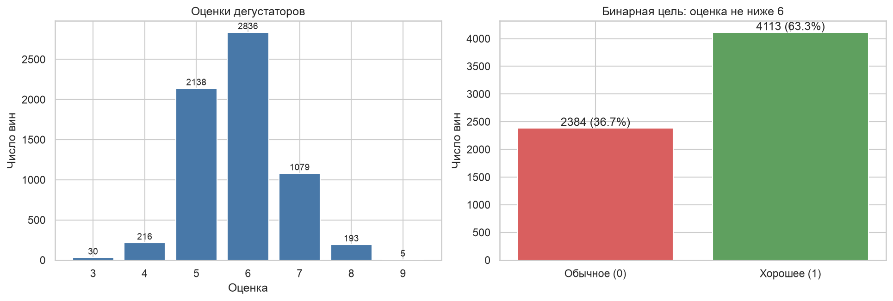
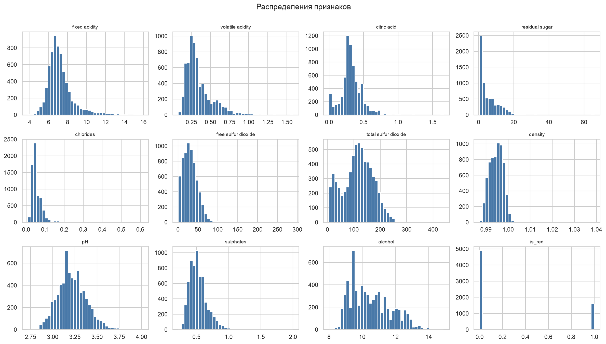
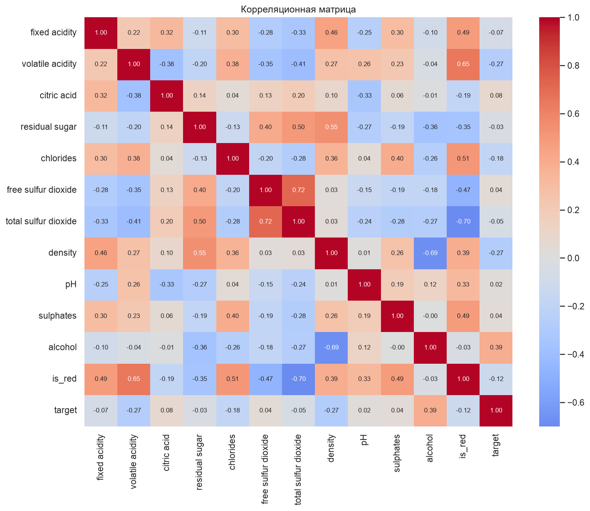
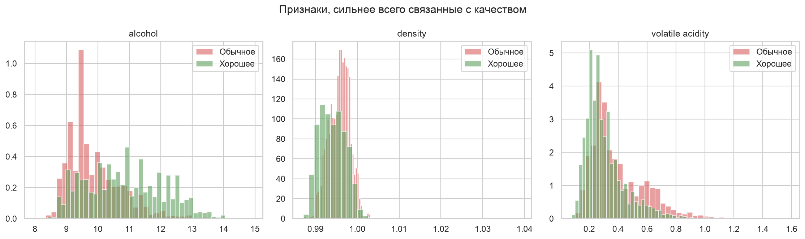
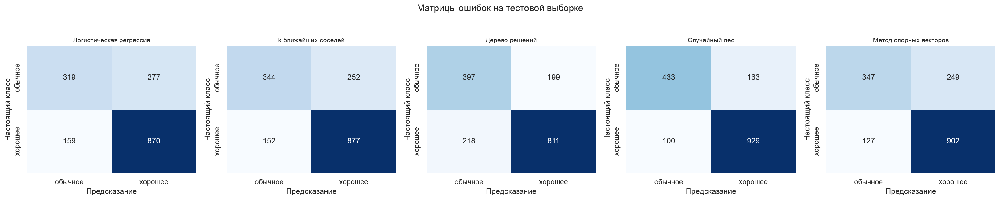
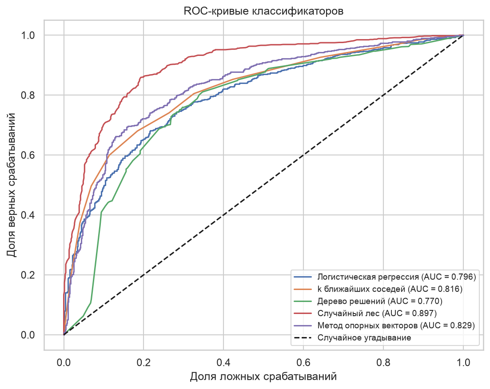
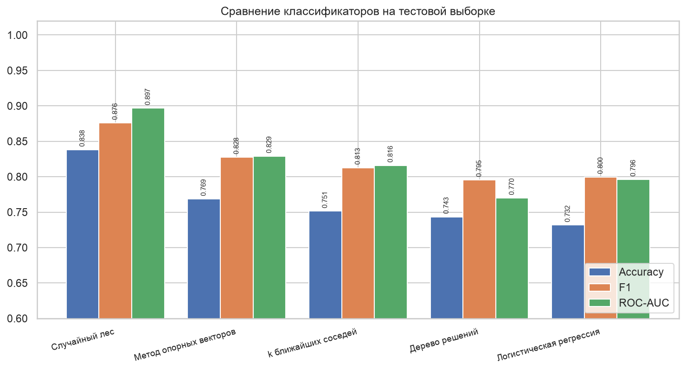
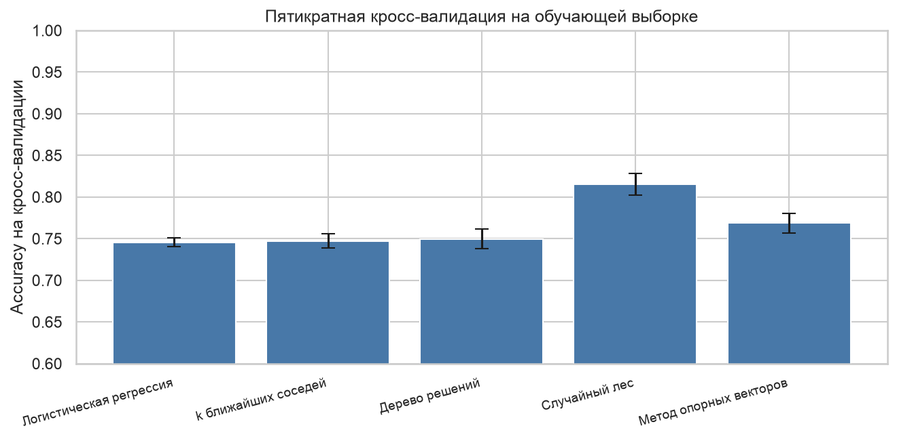
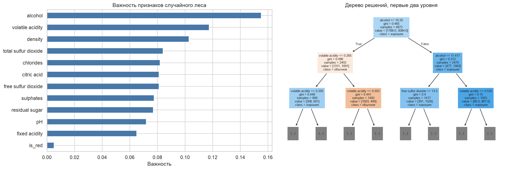

# ВВЕДЕНИЕ

Задача классификации встречается везде, где объект нужно отнести к одной из групп: письмо в спам или не спам, заявка в одобренные или отклонённые. Алгоритмов классификации много, и они устроены по-разному, поэтому для конкретных данных выбирают тот, что даёт лучший результат.

Цель работы: научиться применять разные классификаторы к одному набору данных и сравнивать их по набору метрик.

Как я понял задачу: текста задания в СДО нет, поэтому беру стандартное содержание такой работы. Табличный набор данных, не тот, что в курсовой, пять классификаторов разной природы, сравнение по accuracy, precision, recall, F1 и ROC-AUC, матрицы ошибок и обоснованный вывод, какой классификатор лучше.

Задачи работы:
- выбрать табличный набор данных и описать его;
- провести описательный анализ и сформулировать бинарную задачу;
- разбить выборку и подготовить признаки;
- обучить пять классификаторов;
- сравнить их по метрикам и на кросс-валидации;
- определить, какие признаки важны для лучшей модели.

Работа выполнена на Python 3.12 с библиотеками pandas и scikit-learn. Код и графики лежат в репозитории https://github.com/thehaffk/mmo в папке `lab3`. Все случайные процессы зафиксированы (random_state = 42).

# 1 Набор данных

Использован открытый набор Wine Quality из репозитория UCI [1]. В нём результаты лабораторных измерений португальского вина винью верде и оценка дегустаторов по десятибалльной шкале. Красное и белое вино лежат в отдельных файлах, я объединил их и добавил признак `is_red`.

Всего 6497 записей: 1599 красных вин и 4898 белых. Признаков 12, все числовые: фиксированная и летучая кислотность, лимонная кислота, остаточный сахар, хлориды, свободный и общий диоксид серы, плотность, pH, сульфаты, спирт и цвет вина. Пропусков нет.

Полных дубликатов 1177. Удалять их не буду: разные бутылки одного вина дают одинаковые измерения, это не ошибки ввода.

```python
frames = []
for kind in ['red', 'white']:
    part = pd.read_csv(f'data/winequality-{kind}.csv', sep=';')
    part['is_red'] = int(kind == 'red')
    frames.append(part)
df = pd.concat(frames, ignore_index=True)
```

# 2 Описательный анализ

Оценки дегустаторов распределены неравномерно (рисунок 1): оценок 5 и 6 больше всего, 2138 и 2836, а крайние встречаются редко, 3 балла у 30 вин и 9 баллов у 5. Учить модель на семи классах, где в четырёх меньше 250 примеров, смысла нет, поэтому задача переводится в бинарную: вино хорошее, если оценка не ниже 6. Хороших вин получилось 4113 (63,3 %), обычных 2384.



Распределения признаков приведены на рисунке 2. Спирт, кислотность и pH распределены почти симметрично, а остаточный сахар, хлориды и диоксид серы сильно скошены вправо: у большинства вин значения небольшие, у единиц в разы больше.



Корреляционная матрица (рисунок 3) показывает, что сильнее всего с качеством связан спирт (r = 0,395), затем плотность (−0,269) и летучая кислотность (−0,267). Летучая кислотность это уксусная кислота: чем её больше, тем ближе вино к уксусу. Остальные признаки связаны с целью слабее 0,2, то есть одной линейной зависимости здесь мало.



Три главных признака в разрезе классов приведены на рисунке 4. У хороших вин спирта больше, а летучей кислотности и плотности меньше, но распределения сильно пересекаются, поэтому по одному признаку классы не разделить.



# 3 Разбиение и масштабирование

Разбиение случайное 75 / 25 со стратификацией по классу: 4872 вина на обучение, 1625 на тест. Записи независимы, временной структуры нет, поэтому делить по порядку строк не нужно. Доля хороших вин в обеих частях одинаковая, 63,3 %.

Логистической регрессии, методу k ближайших соседей и методу опорных векторов признаки стандартизированы: они считают расстояния или линейные комбинации, а общий диоксид серы измеряется сотнями при кислотности около единицы. Без стандартизации расстояние между винами определял бы только диоксид серы. Среднее и отклонение считаются по обучающей части, тестовая преобразуется теми же числами. Деревьям и лесу масштабирование не нужно, они сравнивают признак с порогом.

# 4 Пять классификаторов

1. **Логистическая регрессия** строит линейную границу и переводит взвешенную сумму признаков в вероятность через сигмоиду.
2. **k ближайших соседей** относит вино к классу большинства среди 15 ближайших по измерениям вин.
3. **Дерево решений** задаёт вопросы вида «спирт больше 10,25 %» и делит выборку на всё более однородные группы. Глубина ограничена восемью уровнями против переобучения.
4. **Случайный лес** усредняет ответы 300 деревьев, каждое обучено на своей бутстреп-подвыборке со случайным набором признаков в узлах.
5. **Метод опорных векторов** с ядром RBF строит нелинейную границу, максимизируя расстояние до ближайших объектов каждого класса.

```python
models = {
    'Логистическая регрессия': (LogisticRegression(max_iter=2000, random_state=RANDOM_STATE), True),
    'k ближайших соседей': (KNeighborsClassifier(n_neighbors=15), True),
    'Дерево решений': (DecisionTreeClassifier(max_depth=8, random_state=RANDOM_STATE), False),
    'Случайный лес': (RandomForestClassifier(n_estimators=300, random_state=RANDOM_STATE), False),
    'Метод опорных векторов': (SVC(kernel='rbf', probability=True, random_state=RANDOM_STATE), True),
}
```

# 5 Оценка классификаторов

Метрики считались на тестовой выборке из 1625 вин (таблица 1).

Таблица 1 — Метрики классификаторов на тестовой выборке

| Классификатор | Accuracy | Precision | Recall | F1 | ROC-AUC | Время, с |
|---|---|---|---|---|---|---|
| Случайный лес | 0,8382 | 0,8507 | 0,9028 | 0,8760 | 0,8968 | 0,39 |
| Метод опорных векторов | 0,7686 | 0,7837 | 0,8766 | 0,8275 | 0,8291 | 1,55 |
| k ближайших соседей | 0,7514 | 0,7768 | 0,8523 | 0,8128 | 0,8159 | 0,05 |
| Дерево решений | 0,7434 | 0,8030 | 0,7881 | 0,7955 | 0,7700 | 0,02 |
| Логистическая регрессия | 0,7317 | 0,7585 | 0,8455 | 0,7996 | 0,7961 | 0,01 |







Случайный лес выигрывает по всем метрикам сразу. Он ошибается 263 раза из 1625, логистическая регрессия 436 раз. Все модели чаще называют обычное вино хорошим, чем наоборот: у леса 163 такие ошибки против 100 обратных. Причина в перекосе классов, хороших вин 63 %, поэтому при сомнении модель склоняется к большему классу.

Отдельно стоит сравнить дерево и лес. По accuracy разница 9,5 процентного пункта, а по ROC-AUC 12,7: одно дерево выдаёт грубые вероятности, доли классов в листе, и ранжирует вина плохо. Лес усредняет 300 деревьев, поэтому его вероятности плавные.

# 6 Устойчивость результата и важность признаков

Разбиение одно, и высокий результат мог оказаться удачей. Проверяю пятикратной кросс-валидацией на обучающей выборке (рисунок 8): лес 0,8153 с разбросом 0,0128, метод опорных векторов 0,7687, дерево 0,7498, k ближайших соседей 0,7473, логистическая регрессия 0,7457. Порядок тот же, значит преимущество леса не случайность одного разбиения.



Важность признаков леса и верхние уровни дерева приведены на рисунке 9. Лес опирается на спирт (0,155), летучую кислотность (0,117) и плотность (0,103). Дерево решений первым вопросом тоже делит вина по спирту с порогом 10,25 %, а на втором уровне смотрит на летучую кислотность. Цвет вина почти не влияет на качество (важность 0,005).



# ЗАКЛЮЧЕНИЕ

На наборе Wine Quality из 6497 вин обучены и сравнены пять классификаторов. Задача бинарная: предсказать по лабораторным измерениям, поставят ли дегустаторы оценку не ниже 6.

Лучший результат у случайного леса: accuracy 0,8382, precision 0,8507, recall 0,9028, F1 0,8760, ROC-AUC 0,8968 на тесте из 1625 вин. На кросс-валидации 0,8153 с разбросом 0,0128.

Порядок остальных: метод опорных векторов 0,7686, k ближайших соседей 0,7514, дерево решений 0,7434, логистическая регрессия 0,7317. Лес выигрывает, потому что качество вина зависит от измерений нелинейно и через их сочетания: высокое содержание спирта помогает только при низкой летучей кислотности. Линейная модель такую зависимость описать не может, одно дерево ловит её неустойчиво, а сто деревьев эту неустойчивость усредняют. Метод опорных векторов с ядром RBF тоже строит нелинейную границу и обгоняет линейную модель на 3,7 процентного пункта, но обучается дольше всех.

Все классификаторы ошибаются в одну сторону: обычное вино чаще называют хорошим, чем наоборот, из-за перекоса классов.

Главные признаки качества: спирт, летучая кислотность и плотность. Цвет вина роли почти не играет.

Улучшить результат можно подбором гиперпараметров леса, градиентным бустингом, учётом дисбаланса через веса классов и отдельными моделями для красного и белого вина.

# СПИСОК ИСПОЛЬЗОВАННЫХ ИСТОЧНИКОВ

1. Cortez, P. Modeling wine preferences by data mining from physicochemical properties / P. Cortez [et al.] // Decision Support Systems. — 2009. — Vol. 47, № 4. — P. 547–553.
2. Wine Quality : набор данных // UCI Machine Learning Repository : [сайт]. — URL: https://archive.ics.uci.edu/dataset/186/wine+quality (дата обращения: 28.09.2026). — Текст : электронный.
3. Pedregosa, F. Scikit-learn: Machine Learning in Python / F. Pedregosa [et al.] // Journal of Machine Learning Research. — 2011. — Vol. 12. — P. 2825–2830.
4. Breiman, L. Random Forests / L. Breiman // Machine Learning. — 2001. — Vol. 45, № 1. — P. 5–32.
5. Хасти, Т. Основы статистического обучения / Т. Хасти, Р. Тибширани, Дж. Фридман. — 2-е изд. — Москва : Вильямс, 2020. — 768 с. — Текст : непосредственный.
