# ВВЕДЕНИЕ

Свёрточные сети применяют везде, где нужно понять, что изображено на фотографии: от поиска по картинке до определения вида животного по снимку с телефона. В работе такая сеть обучается на собственном наборе цветных изображений.

Вариант задания определяется номером в списке группы. Мой номер 1, вариант «скорпион», поэтому набор данных должен содержать класс со скорпионами. CIFAR-10 не подходит, класса «скорпион» в нём нет.

Как я понял задачу: собрать свой набор цветных изображений с классом «скорпион» и несколькими другими классами, обучить свёрточную сеть, показать точность и ошибку на тесте, метрики Precision, Recall и F1 по каждому классу, привести примеры распознавания и честно описать результат.

Цель работы: получить практические навыки создания и обучения свёрточной нейронной сети для распознавания многоцветных изображений.

Задачи работы:
- собрать набор изображений из открытого источника;
- подготовить изображения к обучению и разбить выборку;
- обучить свёрточную сеть собственной архитектуры;
- оценить её на тесте по классам и разобрать ошибки;
- сравнить результат с переносом обучения на предобученной сети.

Работа выполнена на Python 3.12 с библиотекой PyTorch, обучение шло на ускорителе MPS в чипе Apple M4. Код и графики лежат в репозитории https://github.com/thehaffk/mmo в папке `lab4`. Все случайные процессы зафиксированы (random_state = 42).

# 1 Набор данных

Изображения собраны скриптом `download_data.py` через открытый API iNaturalist [1]. Берутся наблюдения со статусом research и лицензиями CC, порядок фиксирован по возрастанию идентификатора, поэтому выборка повторяется при каждом запуске.

Кроме скорпионов взяты четыре класса, похожих по условиям съёмки: пауки, губоногие многоножки, крабы и жуки. Все они снимаются в природе, примерно с того же расстояния и на таком же пёстром фоне, поэтому задача не сводится к различению фона. Состав набора приведён в таблице 1.

Таблица 1 — Классы набора данных

| Класс | Таксон iNaturalist | Идентификатор | Изображений |
|---|---|---|---|
| scorpion | Scorpiones | 48894 | 500 |
| spider | Araneae | 47118 | 500 |
| centipede | Chilopoda | 49556 | 500 |
| crab | Brachyura | 121639 | 500 |
| beetle | Coleoptera | 47208 | 500 |

Всего 2500 изображений, медианный размер файла 500 на 375 пикселей. Примеры приведены на рисунке 1, баланс классов на рисунке 2.

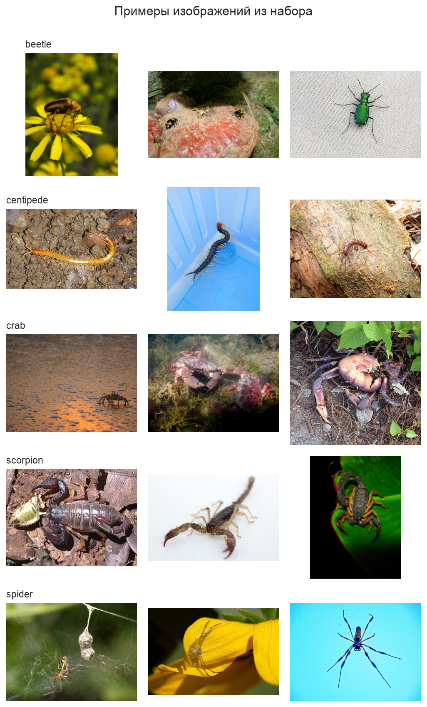

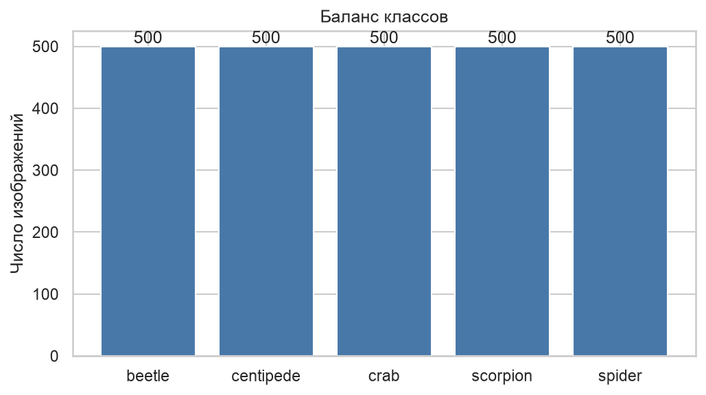

Классы сбалансированы, по 500 изображений в каждом, поэтому accuracy сравнима между классами.

# 2 Предобработка и разбиение выборки

Фотографии имеют разный размер и разные пропорции, а сеть принимает тензоры одинаковой формы. Все изображения приводятся к размеру 128 на 128 пикселей и нормализуются по средним и стандартным отклонениям ImageNet, эти же значения нужны дальше для предобученной сети.

К обучающей части применяется аугментация: случайная обрезка с изменением масштаба, отражение по горизонтали и небольшое изменение яркости и контраста (рисунок 3). Аугментация увеличивает разнообразие примеров, и сеть меньше запоминает конкретные снимки. К валидации и тесту аугментация не применяется, там нужна честная оценка.

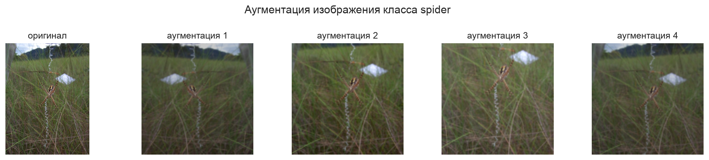

Выборка разбита на три части со стратификацией по классу: 70 % на обучение (1750 изображений), 15 % на валидацию (375) и 15 % на тест (375). Валидация нужна, чтобы выбрать лучшую эпоху обучения, тест используется один раз в самом конце.

```python
train_tf = transforms.Compose([
    transforms.RandomResizedCrop(IMG_SIZE, scale=(0.7, 1.0)),
    transforms.RandomHorizontalFlip(),
    transforms.ColorJitter(brightness=0.2, contrast=0.2),
    transforms.ToTensor(),
    transforms.Normalize(MEAN, STD)])

idx_train, idx_rest = train_test_split(idx_all, test_size=0.30,
                                       stratify=targets, random_state=RANDOM_STATE)
idx_val, idx_test = train_test_split(idx_rest, test_size=0.50,
                                     stratify=targets[idx_rest], random_state=RANDOM_STATE)
```

# 3 Архитектура и обучение собственной сети

Сеть состоит из четырёх одинаковых блоков и классификатора. Блок это свёртка 3 на 3, батч-нормализация, функция активации ReLU и max-pooling 2 на 2. Свёртка ищет локальные признаки, батч-нормализация выравнивает распределение активаций и ускоряет обучение, ReLU обнуляет отрицательные значения и добавляет нелинейность, пулинг уменьшает карту признаков вдвое.

Число каналов растёт по блокам: 32, 64, 128, 128. После четырёх блоков изображение 128 на 128 превращается в карту 8 на 8 со 128 каналами. Глобальный average pooling сжимает каждую карту в одно число, дропаут гасит 30 % связей, линейный слой выдаёт пять чисел по числу классов. Всего в сети 242 181 обучаемый параметр.

```python
def block(c_in, c_out):
    return nn.Sequential(
        nn.Conv2d(c_in, c_out, kernel_size=3, padding=1),
        nn.BatchNorm2d(c_out), nn.ReLU(), nn.MaxPool2d(2))

self.features = nn.Sequential(block(3, 32), block(32, 64), block(64, 128), block(128, 128))
self.head = nn.Sequential(nn.AdaptiveAvgPool2d(1), nn.Flatten(),
                          nn.Dropout(0.3), nn.Linear(128, n_classes))
```

Функция потерь CrossEntropyLoss, оптимизатор Adam с шагом 0,001, каждые 20 эпох шаг уменьшается вдвое. Обучение шло 60 эпох и заняло 367 секунд. Сначала я обучал 30 эпох, но точность на обучении к концу продолжала расти, поэтому число эпох удвоил. После каждой эпохи считается качество на валидации, и в конце берутся веса лучшей эпохи, у неё точность на валидации 0,4827.

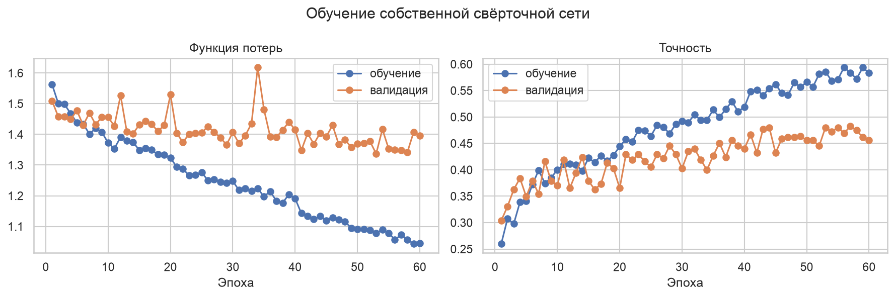

По рисунку 4 видно расхождение кривых: точность на обучении доходит до 0,583, а на валидации останавливается около 0,46. Примерно с 25-й эпохи сеть начинает запоминать обучающие фотографии вместо того, чтобы обобщать.

# 4 Оценка собственной сети

На тесте из 375 изображений точность составила 0,5013, ошибка (значение CrossEntropyLoss) 1,3146. При пяти классах случайное угадывание дало бы 0,2, то есть сеть чему-то научилась, но результат слабый. Метрики по классам приведены в таблице 2.

Таблица 2 — Метрики собственной сети по классам

| Класс | Precision | Recall | F1 | Изображений |
|---|---|---|---|---|
| beetle | 0,4271 | 0,5467 | 0,4795 | 75 |
| centipede | 0,4624 | 0,5733 | 0,5119 | 75 |
| crab | 0,6441 | 0,5067 | 0,5672 | 75 |
| scorpion | 0,5577 | 0,3867 | 0,4567 | 75 |
| spider | 0,4933 | 0,4933 | 0,4933 | 75 |
| среднее | 0,5169 | 0,5013 | 0,5017 | 375 |

Хуже всего распознаётся как раз целевой класс. Из 75 скорпионов верно определены 29, 19 ушли в многоножек, 10 в жуков, 9 в крабов и 8 в пауков (рисунок 5). Скорпион и многоножка на снимке похожи: вытянутое сегментированное тело на песке или земле, а клешни и хвост при сжатии до 128 пикселей почти теряются.

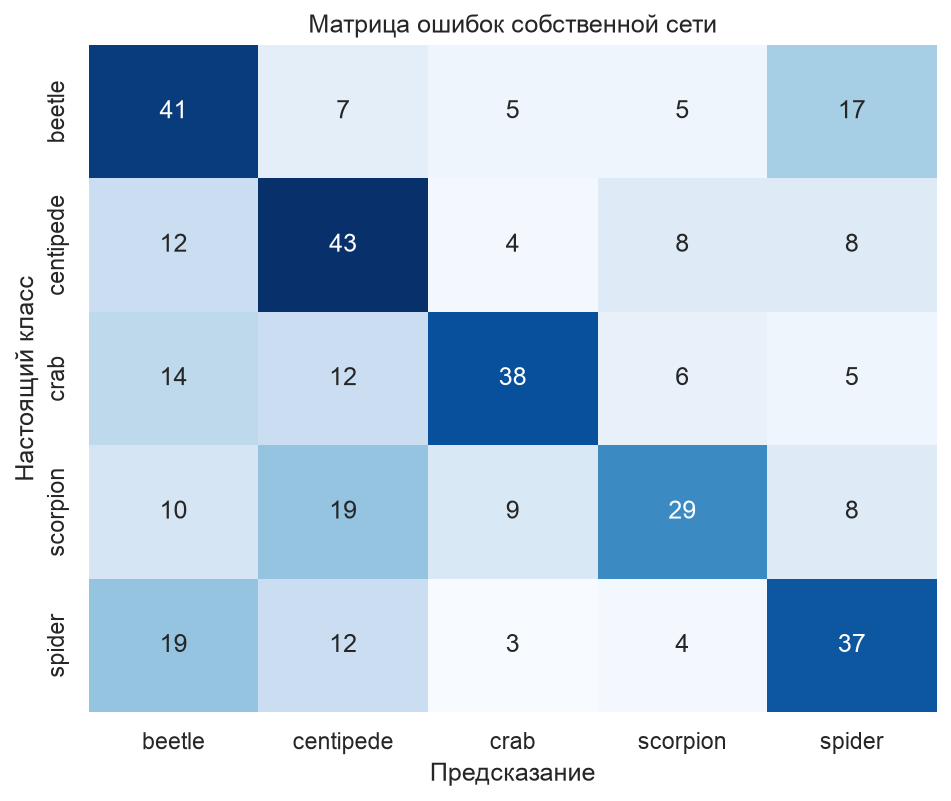

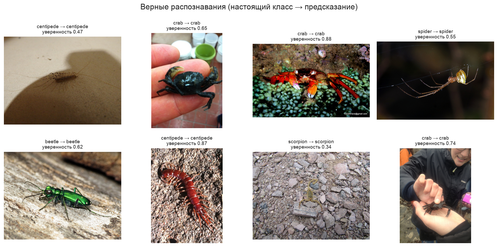

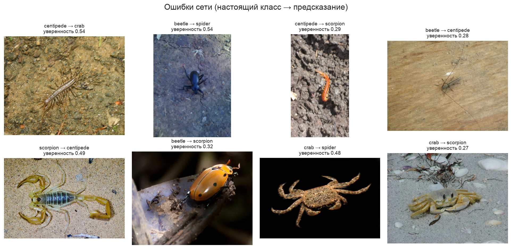

Рисунки 6 и 7 показывают, где сеть справляется, а где нет. Верно распознаются крупные контрастные снимки, где объект занимает почти весь кадр. Ошибки собраны на мелких объектах и пёстром фоне: скорпион на песке ушёл в многоножку с уверенностью 0,49, жук на деревянной доске в многоножку с уверенностью 0,28.

# 5 Улучшение: перенос обучения

Собственная сеть учится с нуля на 1750 изображениях, этого мало. Приём, который в таких задачах помогает сильнее всего, называется переносом обучения: берётся сеть ResNet18 [3], обученная на наборе ImageNet [4] из 1,2 млн изображений, и у неё заменяется последний слой.

Все свёрточные слои заморожены, обучается только новый линейный слой на пять классов: 2 565 параметров против 11 179 077 замороженных. Свёртки ImageNet уже умеют выделять края, текстуру и части объектов, новому слою остаётся научиться складывать эти признаки в мои классы, поэтому хватает десяти эпох и 53 секунд.

```python
resnet = models.resnet18(weights=models.ResNet18_Weights.IMAGENET1K_V1)
for p in resnet.parameters():
    p.requires_grad = False
resnet.fc = nn.Linear(resnet.fc.in_features, len(classes))
history_resnet = fit(resnet, epochs=10, lr=1e-3, params=trainable)
```

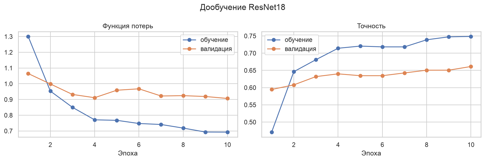

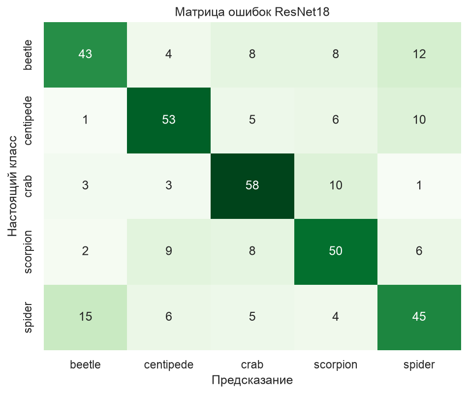

Точность на валидации выходит на 0,66 уже к четвёртой эпохе и дальше не растёт: обучается только один слой, остальная сеть не меняется. На тесте точность 0,6640, ошибка 0,8765. Метрики по классам приведены в таблице 3.

Таблица 3 — Метрики ResNet18 по классам

| Класс | Precision | Recall | F1 |
|---|---|---|---|
| beetle | 0,6719 | 0,5733 | 0,6187 |
| centipede | 0,7067 | 0,7067 | 0,7067 |
| crab | 0,6905 | 0,7733 | 0,7296 |
| scorpion | 0,6410 | 0,6667 | 0,6536 |
| spider | 0,6081 | 0,6000 | 0,6040 |
| среднее | 0,6636 | 0,6640 | 0,6625 |

# 6 Сравнение сетей и проверка

Сводное сравнение приведено в таблице 4, F1 по классам на рисунке 10.

Таблица 4 — Сравнение двух сетей на тесте

| Сеть | Accuracy | Ошибка | F1 (macro) | Обучаемых параметров | Время обучения |
|---|---|---|---|---|---|
| Своя CNN, 60 эпох | 0,5013 | 1,3146 | 0,5017 | 242 181 | 367 с |
| ResNet18, 10 эпох | 0,6640 | 0,8765 | 0,6625 | 2 565 | 53 с |

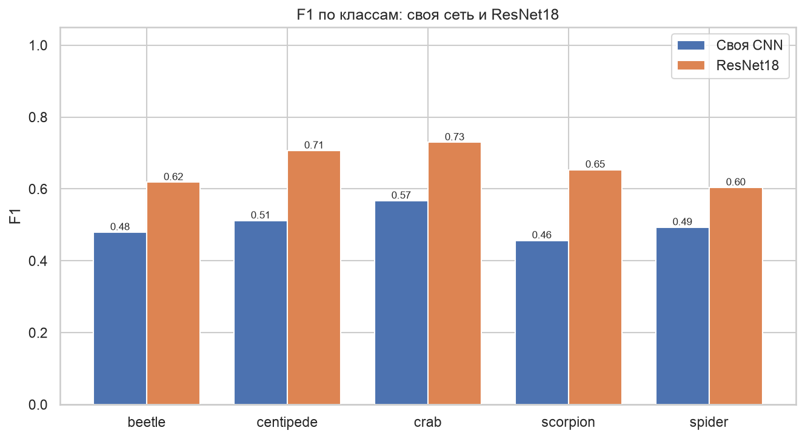

Перенос обучения выигрывает на каждом классе. Сильнее всего разница на скорпионах: F1 вырос с 0,457 до 0,654, полнота с 0,387 до 0,667.

Для проверки я взял восемь случайных изображений теста и посмотрел, что о них говорит лучшая сеть (рисунок 11). Шесть снимков распознаны верно, два с ошибкой: паук на фоне листвы принят за жука с уверенностью 0,95, мелкий скорпион в банке за многоножку с уверенностью 0,34. Высокая уверенность при ошибке означает, что сеть не умеет сомневаться, вероятности у неё плохо откалиброваны.

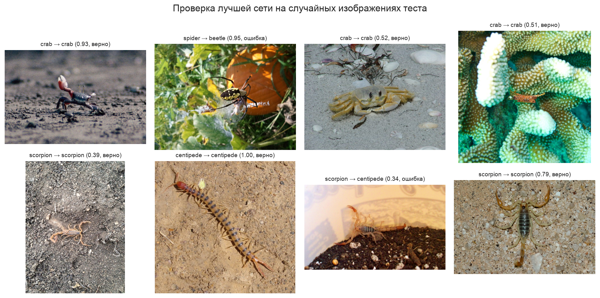

# ЗАКЛЮЧЕНИЕ

Собран собственный набор из 2500 цветных фотографий пяти классов членистоногих, по 500 на класс, с обязательным по варианту классом «скорпион». Обучены две свёрточные сети.

Собственная сеть из четырёх свёрточных блоков (242 181 параметр) после 60 эпох обучения даёт на тесте точность 0,5013 и ошибку 1,3146, средний F1 по классам 0,5017. По скорпионам precision 0,558, recall 0,387, F1 0,457. При случайном угадывании точность была бы 0,2, то есть сеть выделяет какие-то признаки классов, но распознавать изображения с высокой точностью она неспособна.

Дообученная ResNet18 с замороженными свёрточными слоями даёт 0,6640, ошибку 0,8765 и средний F1 0,6625. Прирост 16,3 процентного пункта, при этом обучалось 2 565 параметров вместо 242 181, а времени ушло в семь раз меньше.

Причины невысокой точности видны по данным и по ошибкам. Обучающих фотографий мало, 350 на класс. Объекты на снимках из природы часто мелкие и сливаются с фоном. Разброс внутри класса большой: крабы сняты и под водой, и на песке, скорпионы и на светлом песке, и на тёмной листве. Сжатие до 128 на 128 пикселей убирает детали, по которым скорпион отличается от многоножки, то есть клешни и форму хвоста.

Улучшить результат можно так: увеличить набор, поднять разрешение до 224 на 224, разморозить последние блоки ResNet18 и дообучить их с маленьким шагом, а перед классификацией выделять объект на снимке детектором и классифицировать уже вырезанный фрагмент.

# СПИСОК ИСПОЛЬЗОВАННЫХ ИСТОЧНИКОВ

1. iNaturalist API Reference : описание API // iNaturalist : [сайт]. — URL: https://api.inaturalist.org/v1/docs/ (дата обращения: 25.09.2026). — Текст : электронный.
2. Paszke, A. PyTorch: An Imperative Style, High-Performance Deep Learning Library / A. Paszke [et al.] // Advances in Neural Information Processing Systems. — 2019. — Vol. 32. — P. 8024–8035.
3. He, K. Deep Residual Learning for Image Recognition / K. He, X. Zhang, S. Ren, J. Sun // Proceedings of the IEEE Conference on Computer Vision and Pattern Recognition. — 2016. — P. 770–778.
4. Deng, J. ImageNet: A Large-Scale Hierarchical Image Database / J. Deng [et al.] // Proceedings of the IEEE Conference on Computer Vision and Pattern Recognition. — 2009. — P. 248–255.
5. Лысачев, М. Н. Искусственный интеллект. Анализ, тренды, мировой опыт / М. Н. Лысачев, А. Н. Прохоров ; научный редактор Д. А. Ларионов. — Москва ; Белгород : КОНСТАНТА-принт, 2023. — 460 с. — Текст : непосредственный.
6. Рындина, С. В. Базовые возможности языка Python для анализа данных : учебно-методическое пособие / С. В. Рындина. — Пенза : Изд-во ПГУ, 2022. — 72 с. — Текст : непосредственный.
