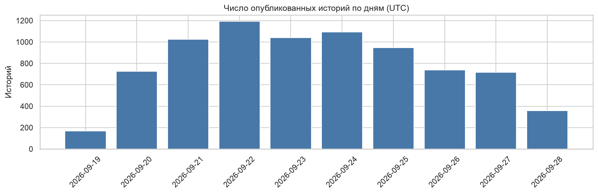
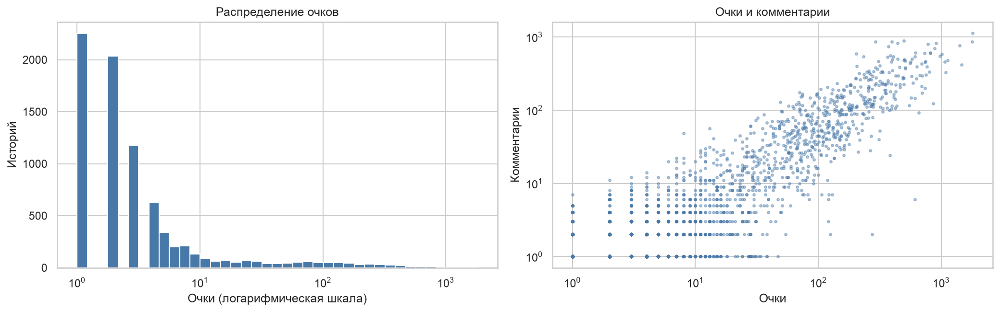
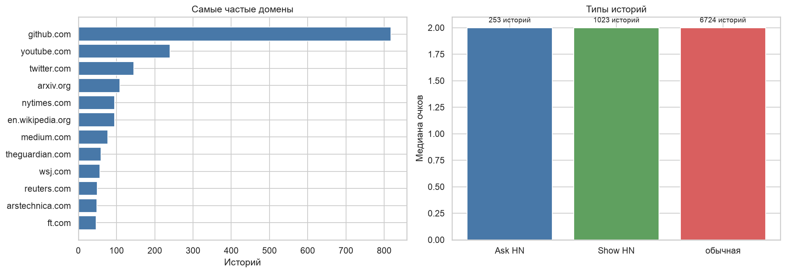
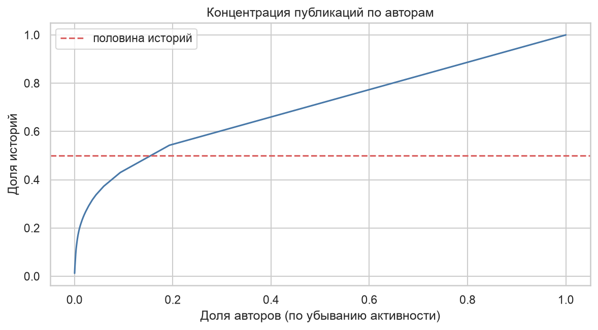

# ВВЕДЕНИЕ

Готовые учебные наборы данных чистые и аккуратные, а реальные данные приходят из сторонних программ и сервисов в «сыром» виде: в формате, удобном программе, а не аналитику, с лишними полями и вложенными структурами. Прежде чем что-то анализировать, из них нужно собрать таблицу.

Цель работы: получить практические навыки сбора, обработки и анализа «сырых» данных, полученных из сторонних программ.

Как я понял задачу: в материалах к работе приложен пример `Анализ-активности`, который читает журнал `watcher.csv` сторонней программы, приводит его к таблице и строит графики активности. Требуется самому получить сырые данные из стороннего источника, собрать из них датасет, очистить, проанализировать, сохранить в csv и показать на модели, что датасет пригоден для обучения.

Задачи работы:
- написать скрипт сбора данных из открытого API;
- разобрать сырой ответ в таблицу и очистить её;
- провести разведочный анализ с визуализацией;
- сохранить датасет в csv;
- обучить модель как демонстрацию пригодности датасета.

Работа выполнена на Python 3.12 с библиотеками pandas и scikit-learn. Код, сырые данные и датасет лежат в репозитории https://github.com/thehaffk/mmo в папке `lab5`.

# 1 Источник данных и сбор

Источник данных Hacker News, новостной агрегатор, где пользователи публикуют ссылки и обсуждают их, а другие голосуют за публикации очками. У сайта открытый API без авторизации.

Официальный API `hacker-news.firebaseio.com` отдаёт записи по одной: запрос возвращает одну историю или один комментарий. Для нескольких тысяч историй это десятки тысяч запросов. Поэтому истории собираю через API поиска Hacker News (`hn.algolia.com`), он отдаёт до 1000 историй за запрос. Это такой же журнал активности, как `watcher.csv` в примере: у каждой записи есть время, автор и содержимое.

Ответ отсортирован от новых историй к старым. Чтобы уйти в прошлое, каждый следующий запрос ограничивается временем публикации самой старой истории предыдущей страницы. Восемь страниц дали 8000 историй с 19 по 28 сентября 2026 года.

```python
def fetch(before=None):
    url = f'{API}?tags=story&hitsPerPage=1000'
    if before:
        url += f'&numericFilters=created_at_i<{before}'
    req = urllib.request.Request(url, headers={'User-Agent': 'mospolytech-ml-coursework'})
    with urllib.request.urlopen(req, timeout=60) as r:
        return json.load(r)['hits']

hits, before = [], None
for page in range(8):
    batch = fetch(before)
    hits += batch
    before = min(h['created_at_i'] for h in batch)
```

Сырой ответ сохраняется в `data/raw_hn_stories.json` (3,5 МБ). Текст историй в файл не пишется, только его длина: в одной из историй автор выложил ключ доступа к стороннему сервису, и GitHub заблокировал загрузку такого файла в открытый репозиторий. При повторном запуске данные берутся из файла: данные API меняются каждую минуту, а результат работы должен воспроизводиться.

# 2 Структурирование и очистка

Каждая сырая запись это словарь из десятка полей, часть из них служебные (подсветка результатов поиска). Из записи берутся нужные поля и считаются производные признаки:
- дата, час и день недели публикации (время в UTC);
- домен ссылки без `www.`;
- тип истории по тегам: обычная, Ask HN (вопрос сообществу без ссылки) или Show HN (показ своего проекта);
- длина заголовка в символах и словах, длина текста для историй без ссылки;
- возраст истории на момент сбора: свежие истории ещё не успели набрать очки.

Имя автора заменяется коротким хешем: для анализа важно, что это один и тот же человек, а не его ник.

Проверка качества данных: пропусков нет, дубликатов по идентификатору нет, пустых заголовков нет, у всех историй есть очки. Удалять ничего не пришлось, в датасете 8000 историй и 16 столбцов.

Таблица 1 — Структура датасета

| Столбец | Тип | Содержание |
|---|---|---|
| id | целое | идентификатор истории |
| datetime, date, hour, weekday | время | момент публикации (UTC) |
| author_hash | строка | хеш автора |
| kind | строка | story, ask или show |
| title_len, title_words | целое | длина заголовка |
| has_url, domain | логический, строка | ссылка и её домен |
| text_len | целое | длина текста истории |
| points, comments | целое | очки и комментарии |
| age_hours | число | возраст на момент сбора, часов |

# 3 Разведочный анализ

За восемь полных дней публикуется в среднем 934 истории в день, от 716 до 1192 (рисунок 1).



Сайт живёт по американскому рабочему дню (рисунок 2): пик публикаций в 15 часов UTC, 558 историй, минимум в 3 часа UTC, 186. В будний день выходит в среднем 992 истории, в выходной 586.


Внимание распределено крайне неравномерно (рисунок 3). Медиана 2 очка, у 28,1 % историй только голос самого автора, у 63 % нет ни одного комментария. При этом 339 историй (4,2 %) набрали 100 очков и больше, максимум 1803. Очки и комментарии связаны умеренно, коэффициент корреляции Спирмена 0,526.



Чаще всего публикуют ссылки на github.com (818 историй, 10,2 %), затем youtube.com и twitter.com, всего 3915 разных доменов (рисунок 4). Историй без ссылки 3,5 %. Медиана очков у обычных историй, Ask HN и Show HN одинаковая, 2 очка.



Авторов 4533, из них 80,7 % опубликовали одну историю, а половину всех историй дают 703 автора, 15,5 % (рисунок 5).



# 4 Демонстрация пригодности датасета

Задача: по тому, что известно в момент публикации, предсказать, наберёт ли история 10 очков. Очки и комментарии в признаки не берутся, это и есть предсказываемый результат.

Устройство проверки:
- в модель идут только истории старше суток, 7196 штук, популярных среди них 13,9 %;
- разбиение по времени: обучение на первых 75 % историй (5397), проверка на последних 25 % (1799), как если бы модель предсказывала новые публикации;
- признаки: час, день недели, длина заголовка, тип истории, ссылка на GitHub, а также история автора и домена: сколько у них было публикаций раньше и какая доля набрала 10 очков. Для обучающих историй она считается только по более ранним публикациям, для тестовых по обучающему периоду;
- популярных историй мало, поэтому классам заданы веса, а модели сравниваются по ROC-AUC, сбалансированной точности и полноте по популярным историям.

Таблица 2 — Результаты на тестовой выборке

| Модель | ROC-AUC | Сбалансированная точность | Полнота популярных |
|---|---|---|---|
| Всегда «меньше 10» | 0,500 | 0,500 | 0,000 |
| Логистическая регрессия | 0,573 | 0,554 | 0,665 |
| Случайный лес | 0,571 | 0,546 | 0,506 |


Результат отрицательный, и это вывод о данных, а не ошибка методики. Первая версия модели без весов классов вообще не называла ни одну историю популярной и совпадала с тривиальным ответом. С весами лес находит половину популярных историй, но почти каждое его «да» ошибочно, точность по популярным 0,158. Ни время публикации, ни прошлые успехи автора и домена популярность почти не предсказывают. На Hacker News её решают первые голоса в ленте новых историй и содержание заголовка, которого в признаках нет.

# ЗАКЛЮЧЕНИЕ

Скриптом через открытый API поиска Hacker News собрано 8000 историй за девять дней. Сырой ответ (3,5 МБ) разобран в таблицу из 16 столбцов и сохранён в `data/hn_stories.csv`, сырые данные сохранены отдельно, поэтому работа воспроизводится без обращения к сети.

Анализ показал американский суточный ритм сайта с пиком в 15 часов UTC и спадом по выходным, крайне неравномерное распределение внимания (медиана 2 очка, 4,2 % историй набирают сотню и больше) и концентрацию активности: половину историй публикуют 15,5 % авторов. Главный источник ссылок github.com.

Модель на метаданных публикации предсказывает популярность истории почти на уровне случайного угадывания: ROC-AUC 0,571–0,573. Это честный отрицательный результат. Датасет при этом пригоден для обучения: он чистый, типизированный, а разбиение по времени исключает подглядывание в будущее. Для задачи популярности следующий шаг это признаки из текста заголовка, например TF-IDF или эмбеддинги, как в лабораторной работе № 2.

# СПИСОК ИСПОЛЬЗОВАННЫХ ИСТОЧНИКОВ

1. Hacker News API : документация // GitHub : [сайт]. — URL: https://github.com/HackerNews/API (дата обращения: 28.09.2026). — Текст : электронный.
2. HN Search API : документация // Algolia : [сайт]. — URL: https://hn.algolia.com/api (дата обращения: 28.09.2026). — Текст : электронный.
3. Pedregosa, F. Scikit-learn: Machine Learning in Python / F. Pedregosa [et al.] // Journal of Machine Learning Research. — 2011. — Vol. 12. — P. 2825–2830.
4. Рындина, С. В. Базовые возможности языка Python для анализа данных : учебно-методическое пособие / С. В. Рындина. — Пенза : Изд-во ПГУ, 2022. — 72 с. — Текст : непосредственный.
5. Лысачев, М. Н. Искусственный интеллект. Анализ, тренды, мировой опыт / М. Н. Лысачев, А. Н. Прохоров ; научный редактор Д. А. Ларионов. — Москва ; Белгород : КОНСТАНТА-принт, 2023. — 460 с. — Текст : непосредственный.
