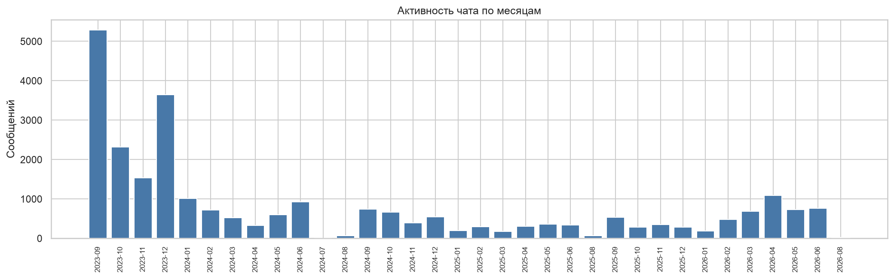
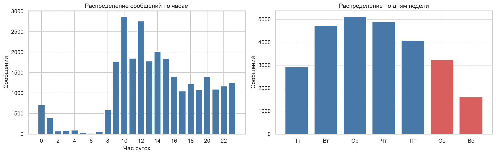
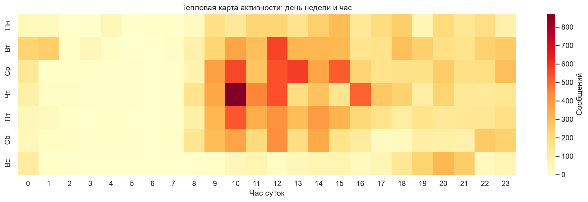
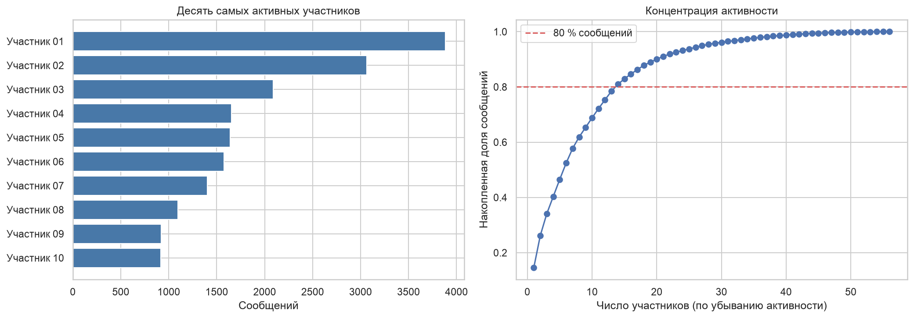
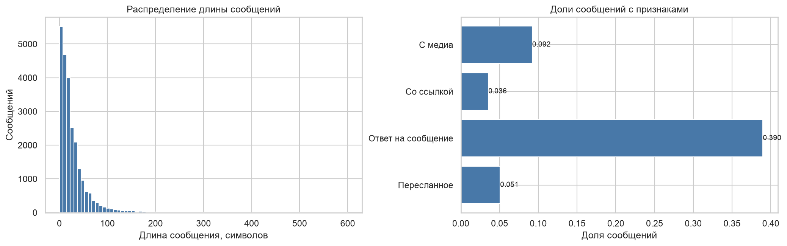
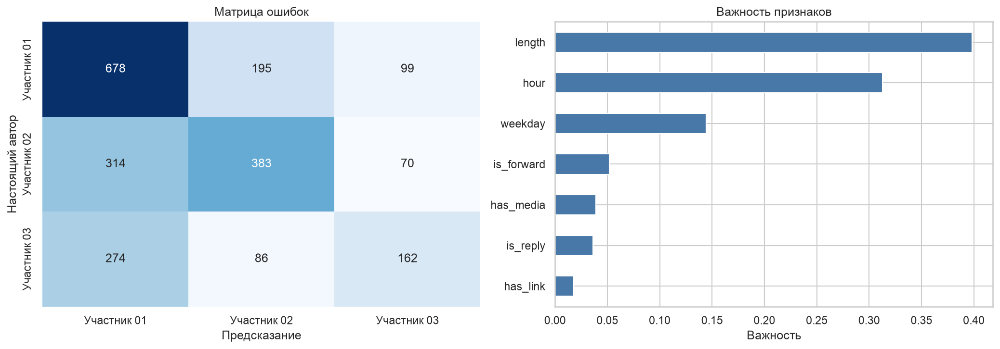

# ВВЕДЕНИЕ

Готовые учебные наборы данных чистые и аккуратные, а реальные данные приходят из сторонних программ в «сыром» виде: в неудобном формате, с разнородными записями и лишней информацией. Прежде чем что-то анализировать, из них нужно собрать таблицу.

Цель работы: получить практические навыки обработки и анализа «сырых» данных, полученных из сторонних программ.

Как я понял задачу: в материалах к работе приложен пример `Анализ-активности`, который читает журнал `watcher.csv` программы, регистрирующей активность пользователя на компьютере, раскладывает события по категориям и строит ленту активности по дням. Требуется реализовать такой же анализ на данных, собранных у себя. В качестве журнала активности я беру экспорт своего рабочего чата в Telegram: у каждого события в нём есть время, автор и содержимое, как у записи `watcher.csv`.

Задачи работы:
- разобрать структуру экспорта;
- собрать из него датасет с нужными полями и очистить его;
- провести разведочный анализ с визуализацией;
- сохранить датасет в csv;
- показать, что датасет пригоден для обучения модели.

Работа выполнена на Python 3.12 с библиотеками pandas и scikit-learn. Код и графики лежат в репозитории https://github.com/thehaffk/mmo в папке `lab5`. Исходный экспорт в репозиторий не выгружается.

# 1 Исходные данные

Telegram выгружает чат одним файлом JSON. Экспорт чата группы 231-329 занимает 12,9 МБ и содержит 26 895 записей за период с 9 сентября 2023 года по 20 августа 2026 года: 26 721 сообщение и 174 служебные записи (вход в чат, смена названия).

Записи неоднородные. У текстового сообщения есть поле `text`, у картинки `photo`, у файла `file` и `mime_type`, у опроса `poll`. У ответа есть `reply_to_message_id`, у пересланного `forwarded_from`. Поле `text` бывает строкой, а бывает списком кусков, где часть кусков это ссылки или упоминания с разметкой.

**Приватность.** Тексты сообщений в датасет не попадают, сохраняется только их длина. Имена отправителей заменяются псевдонимами вида «Участник 07», соответствие нигде не сохраняется.

# 2 Сборка и очистка датасета

При сборке служебные записи отбрасываются, из каждого сообщения берутся время, отправитель, длина текста и признаки: есть ли медиа, ссылка, ответ, пересылка. Текст собирается рекурсивно, ссылка ищется и среди размеченных кусков, и по подстроке `http`.

```python
def extract_text(node):
    if isinstance(node, str):
        return node
    if isinstance(node, list):
        return ''.join(extract_text(part) for part in node)
    if isinstance(node, dict):
        return node.get('text', '')
    return ''

rows.append({
    'datetime': m.get('date'),
    'sender_raw': m.get('from'),
    'length': len(text),
    'has_media': bool(m.get('photo') or m.get('file') or m.get('media_type') or m.get('poll')),
    'has_link': has_link(m),
    'is_reply': 'reply_to_message_id' in m,
    'is_forward': 'forwarded_from' in m,
})
```

Из времени выводятся дата, час, день недели и месяц. Имена заменяются псевдонимами по убыванию активности, дополнительно хранится короткий хеш имени, чтобы можно было склеить данные разных выгрузок.

Очистка: у 170 сообщений нет отправителя (удалённые аккаунты), 2072 сообщения пустые по тексту, но 2042 из них содержат медиа. Удаляются сообщения без отправителя и пустые без медиа, всего 200 записей. Итог: 26 521 сообщение, 14 столбцов, файл `data/messages.csv` размером 2,83 МБ.

Таблица 1 — Структура датасета

| Столбец | Тип | Содержание |
|---|---|---|
| datetime, date | дата и время | момент отправки |
| hour, weekday, month | целое, строка | час, день недели, месяц |
| chat | строка | название чата |
| sender, sender_hash | строка | псевдоним и хеш отправителя |
| length | целое | длина текста в символах |
| has_media, has_link | логический | есть ли медиа, есть ли ссылка |
| is_reply, is_forward | логический | ответ или пересылка |

# 3 Разведочный анализ

Активность по месяцам приведена на рисунке 1. Пик в сентябре 2023 года, когда группа только собралась, 5288 сообщений за месяц. Дальше в среднем около 780 сообщений в месяц с провалами летом: в июле 2024 года всего 5.



Распределение по часам и дням недели (рисунок 2) показывает, что чат живёт по учебному расписанию. Пик в 10 часов утра, 2867 сообщений, ночью с 0 до 6 часов пишется 5,1 % сообщений, в выходные 18,2 %.



Тепловая карта (рисунок 3) это аналог ленты активности из примера к работе. Самая активная клетка четверг в 10 часов, 870 сообщений. Яркая полоса идёт по будним дням с 9 до 18 часов.



Активность сильно сконцентрирована (рисунок 4): 14 участников из 56 дают 80 % сообщений, на самого активного приходится 14,7 %.



Сообщения в чате короткие (рисунок 5): медиана 16 символов, три четверти короче 33 символов. Ответами на другие сообщения оказались 39,0 %, с медиа 9,2 %, пересланных 5,1 %, со ссылкой 3,6 %.



# 4 Демонстрация пригодности датасета

Чтобы проверить, что по собранным признакам можно чему-то научиться, решается задача определения автора сообщения по времени и форме, без текста. Берутся три самых активных участника (9041 сообщение), признаки: час, день недели, длина, наличие медиа, ссылки, ответа и пересылки. Модель случайный лес, разбиение 75 / 25 со стратификацией.

Таблица 2 — Определение автора сообщения

| Модель | Accuracy |
|---|---|
| Всегда самый активный участник | 0,4299 |
| Случайный лес | 0,5409 |



Лес обгоняет тривиальную модель на 11 процентных пунктов. Результат скромный и ожидаемый: без текста у сообщений мало различий. Но прирост показывает, что у участников разные привычки: важнее всего длина сообщения (0,398) и час отправки (0,313). Хуже всего распознаётся третий участник (F1 0,380), у него меньше всего сообщений.

# ЗАКЛЮЧЕНИЕ

Из экспорта чата Telegram размером 12,9 МБ собран датасет из 26 521 сообщения и 14 столбцов. Экспорт неоднородный: разные поля у разных типов сообщений, текст то строкой, то списком кусков с разметкой, поэтому разбор потребовал отдельных функций для текста и ссылок. Очистка убрала 200 записей без отправителя или без содержимого. Тексты и настоящие имена в датасет не попали.

Анализ показал, что чат живёт по учебному расписанию: пик в 10 часов, самая активная клетка четверг утром, ночью 5,1 % сообщений. Активность сконцентрирована: 14 участников из 56 дают 80 % сообщений. По месяцам виден всплеск в первый месяц учёбы и провалы летом.

Пригодность датасета подтверждена моделью: случайный лес определяет автора по времени и форме сообщения с точностью 0,5409 против 0,4299 у тривиальной модели.

По смыслу работа повторяет пример из материалов: журнал событий с временем и источником, категории событий и визуализация активности по дням и часам. Развить её можно разметкой сообщений по содержанию, связью активности с календарём сессий и графом ответов между участниками.

# СПИСОК ИСПОЛЬЗОВАННЫХ ИСТОЧНИКОВ

1. Telegram Desktop : экспорт истории чата // Telegram : [сайт]. — URL: https://telegram.org/blog/export-and-more (дата обращения: 28.09.2026). — Текст : электронный.
2. pandas documentation : Working with text data and time series // pandas : [сайт]. — URL: https://pandas.pydata.org/docs/ (дата обращения: 28.09.2026). — Текст : электронный.
3. Pedregosa, F. Scikit-learn: Machine Learning in Python / F. Pedregosa [et al.] // Journal of Machine Learning Research. — 2011. — Vol. 12. — P. 2825–2830.
4. Рындина, С. В. Базовые возможности языка Python для анализа данных : учебно-методическое пособие / С. В. Рындина. — Пенза : Изд-во ПГУ, 2022. — 72 с. — Текст : непосредственный.
5. Лысачев, М. Н. Искусственный интеллект. Анализ, тренды, мировой опыт / М. Н. Лысачев, А. Н. Прохоров ; научный редактор Д. А. Ларионов. — Москва ; Белгород : КОНСТАНТА-принт, 2023. — 460 с. — Текст : непосредственный.
