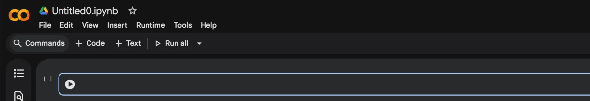
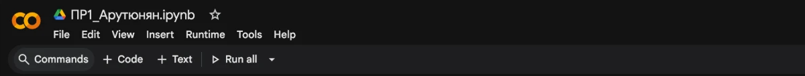
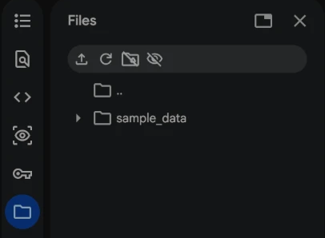
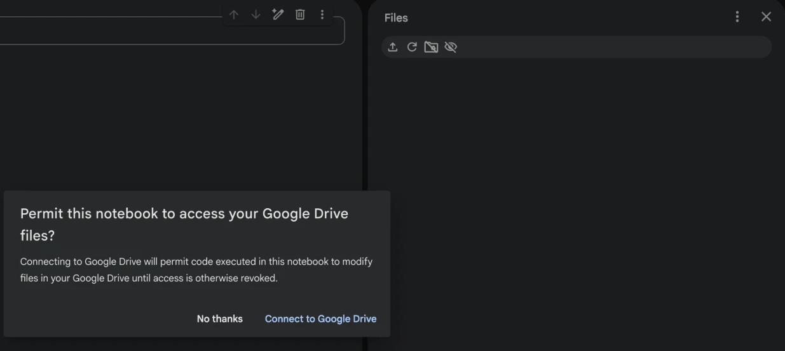
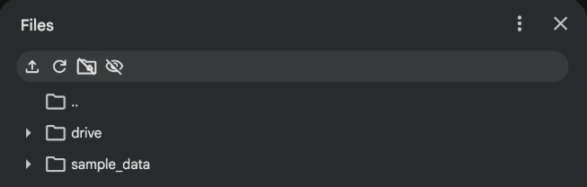
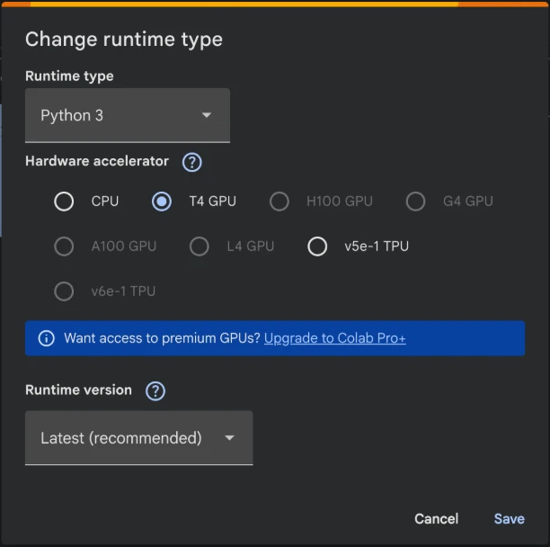
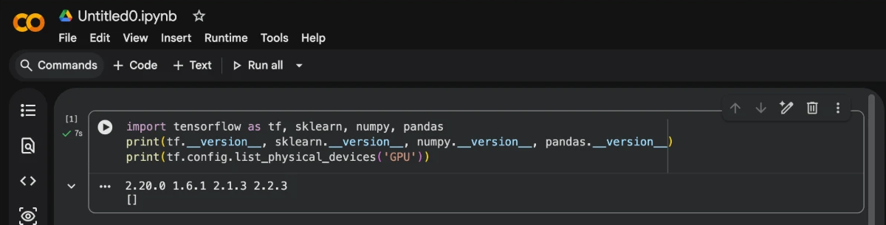
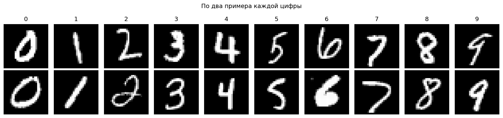
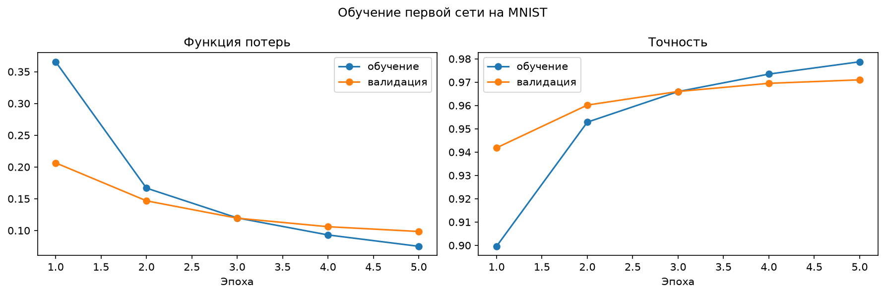
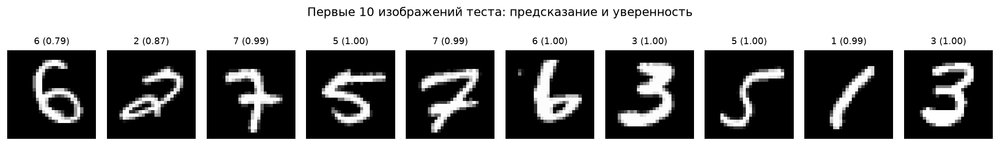

# ВВЕДЕНИЕ

Для работы с нейронными сетями нужна среда, где уже установлены библиотеки и есть доступ к вычислительным ресурсам. Google Colab даёт такую среду прямо в браузере: блокнот Jupyter хранится на Google Диске, библиотеки установлены заранее, а графический процессор предоставляется бесплатно.

Цель работы: изучить среду Google Colab, освоить создание и выполнение кода в блокноте, подключение Google Диска, импорт основных библиотек и загрузку набора данных для нейронной сети.

Задачи работы:
- создать блокнот в Google Colab и подключить Google Диск;
- импортировать библиотеки TensorFlow, Keras, NumPy, Matplotlib и scikit-learn;
- проверить доступные вычислительные устройства;
- загрузить набор MNIST и разбить его по своему варианту;
- вывести изображение и его метку;
- обучить первую простую нейронную сеть.

Ноутбук написан так, чтобы выполняться и в Colab, и локально. Код лежит в репозитории https://github.com/thehaffk/mmo в папке `prac1`.

# 1 Работа в Google Colab

Для работы нужен аккаунт Google. На странице https://colab.research.google.com новый блокнот создаётся через меню «Файл» → «Создать блокнот» (рисунок 1). Блокнот сразу можно переименовать, щёлкнув по названию (рисунок 2).





Блокноты сохраняются на Google Диск в папку Colab Notebooks. Чтобы блокнот мог читать и записывать файлы Диска, Диск подключается: в левом меню нажимается значок папки, затем значок папки с логотипом Диска (рисунок 3), и доступ подтверждается (рисунок 4). После этого в левом меню появляется папка drive (рисунок 5).







То же самое делается кодом. В моём блокноте эта ячейка сама определяет, где запущена, и подключает Диск только в Colab:

```python
try:
    import google.colab
    IN_COLAB = True
except ImportError:
    IN_COLAB = False

if IN_COLAB:
    from google.colab import drive
    drive.mount('/content/drive')
    os.chdir('/content/drive/MyDrive/Colab Notebooks')
```

Главное преимущество Colab это бесплатный графический процессор. Он включается в меню «Среда выполнения» → «Сменить среду выполнения» (рисунок 6). Ограничения: после 30 минут простоя сессия отключается, после 12 часов работы данные сессии стираются, поэтому файлы нужно хранить на Диске.



# 2 Импорт библиотек и проверка устройств

Основная библиотека курса TensorFlow, внутри неё Keras, который позволяет собрать и обучить сеть в несколько строк. NumPy нужен для массивов, Matplotlib для графиков, scikit-learn для разбиения выборки.

```python
import numpy as np
import matplotlib.pyplot as plt
import sklearn
import tensorflow as tf
from tensorflow import keras

print(tf.config.list_physical_devices())
```



В Colab (рисунок 7) библиотеки уже установлены: TensorFlow 2.20.0, scikit-learn 1.6.1, NumPy 2.1.3, pandas 2.2.3. Список графических процессоров пуст: по умолчанию сессия запускается на центральном процессоре, и GPU нужно включить в настройках среды выполнения, как на рисунке 6.

Локальный запуск для проверки: Python 3.12, TensorFlow 2.21, Keras 3.15, NumPy 2.5, scikit-learn 1.9 на Mac с процессором Apple M4. TensorFlow видит только центральный процессор, поэтому локально сеть обучается на CPU. В Colab с включённым GPU тот же код выполняется на графическом процессоре без изменений.

# 3 Набор данных MNIST

MNIST содержит 70 000 изображений рукописных цифр размером 28 на 28 пикселей, яркость от 0 до 255, каждое изображение размечено цифрой. Keras загружает его сразу разбитым 60 000 на 10 000, но это разбиение одинаковое у всех. По методичке обе части объединяются и разбиваются заново случайным образом со своим значением `random_state`. Мой номер в списке группы 1, его я и использую.

```python
from keras.datasets import mnist
from sklearn.model_selection import train_test_split

(X_train, y_train), (X_test, y_test) = mnist.load_data()
X = np.concatenate((X_train, X_test))
y = np.concatenate((y_train, y_test))

X_train, X_test, y_train, y_test = train_test_split(
    X, y, test_size=10000, train_size=60000, random_state=1)
```

Размерности после разбиения: X_train (60000, 28, 28), y_train (60000,), X_test (10000, 28, 28), y_test (10000,).

Изображение с индексом 123 выводится функцией `imshow` в градациях серого (рисунок 8). В моём разбиении это цифра 7, а не пример из методички: так и должно быть, у каждого студента своя выборка.

![Рисунок 8 — Изображение X_train[123] из моего разбиения](figures/01_x_train_123.png)

Цифры пишутся очень по-разному (рисунок 9). Классы почти сбалансированы: от 5383 пятёрок до 6691 единицы в обучающей части.



# 4 Первая нейронная сеть

Чтобы проверить, что среда полностью рабочая, обучена простейшая сеть: изображение разворачивается в вектор из 784 чисел, один скрытый слой из 128 нейронов с активацией ReLU и выходной слой из 10 нейронов с softmax. Яркость делится на 255, чтобы входы были от 0 до 1. Всего 101 770 параметров.

```python
model = keras.Sequential([
    keras.Input(shape=(28, 28)),
    keras.layers.Flatten(),
    keras.layers.Dense(128, activation='relu'),
    keras.layers.Dense(10, activation='softmax'),
])
model.compile(optimizer='adam', loss='sparse_categorical_crossentropy', metrics=['accuracy'])
history = model.fit(X_train / 255.0, y_train, epochs=5, batch_size=128, validation_split=0.1)
```

Уже после первой эпохи точность на валидации 0,942, после пятой 0,971 (рисунок 10). Кривые обучения и валидации идут рядом, переобучения нет. На тестовой выборке точность 0,9680, ошибка 0,1060.



Все десять первых изображений тестовой выборки распознаны верно (рисунок 11).



# ЗАКЛЮЧЕНИЕ

Освоена работа в Google Colab: создание блокнота, подключение Google Диска, выбор графического процессора. Блокнот написан так, что выполняется и в Colab, и локально, ячейка подключения Диска сама определяет среду.

Импортированы библиотеки TensorFlow 2.21, Keras 3.15, NumPy, Matplotlib и scikit-learn. Набор MNIST загружен через Keras и разбит заново по варианту с random_state = 1: 60 000 изображений на обучение и 10 000 на тест.

Первая сеть с одним скрытым слоем из 128 нейронов за 5 эпох достигла точности 0,9680 на тестовой выборке.

Colab удобен тем, что библиотеки уже установлены и есть бесплатный GPU, но сессия обрывается после простоя и данные нужно хранить на Диске. Локальная среда стабильнее, но библиотеки и их версии приходится ставить и согласовывать самому.

# СПИСОК ИСПОЛЬЗОВАННЫХ ИСТОЧНИКОВ

1. Google Colaboratory : документация // Google : [сайт]. — URL: https://colab.research.google.com/notebooks/intro.ipynb (дата обращения: 28.09.2026). — Текст : электронный.
2. TensorFlow : Learn // TensorFlow : [сайт]. — URL: https://www.tensorflow.org/learn (дата обращения: 28.09.2026). — Текст : электронный.
3. LeCun, Y. Gradient-Based Learning Applied to Document Recognition / Y. LeCun, L. Bottou, Y. Bengio, P. Haffner // Proceedings of the IEEE. — 1998. — Vol. 86, № 11. — P. 2278–2324.
4. Лысачев, М. Н. Искусственный интеллект. Анализ, тренды, мировой опыт / М. Н. Лысачев, А. Н. Прохоров ; научный редактор Д. А. Ларионов. — Москва ; Белгород : КОНСТАНТА-принт, 2023. — 460 с. — Текст : непосредственный.
5. Рындина, С. В. Базовые возможности языка Python для анализа данных : учебно-методическое пособие / С. В. Рындина. — Пенза : Изд-во ПГУ, 2022. — 72 с. — Текст : непосредственный.
