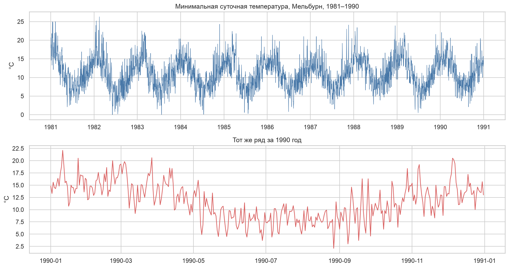
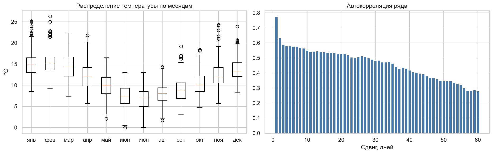
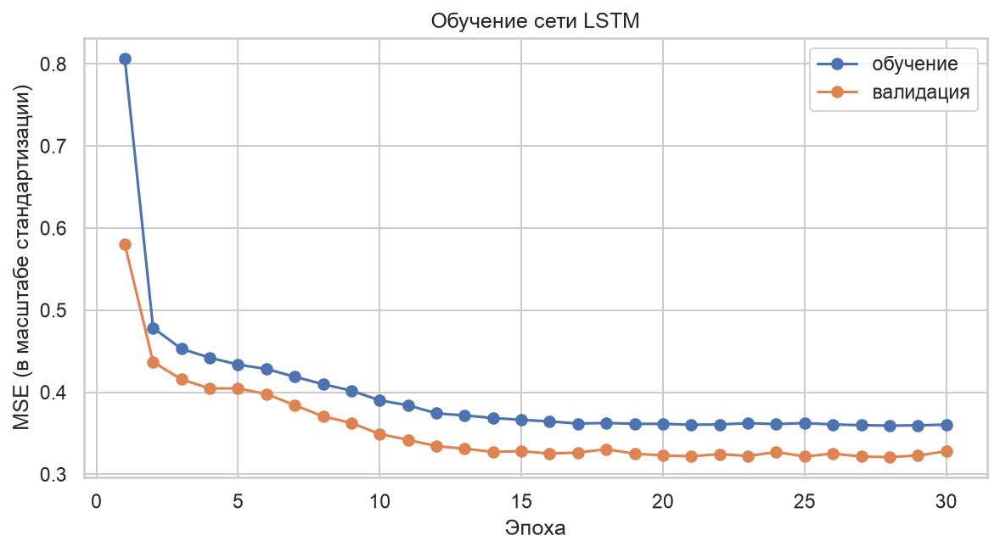
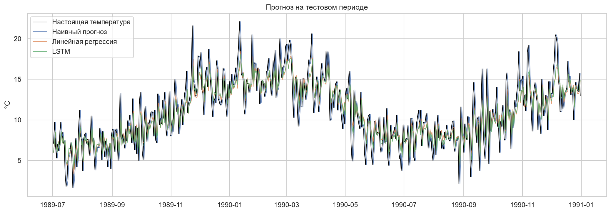
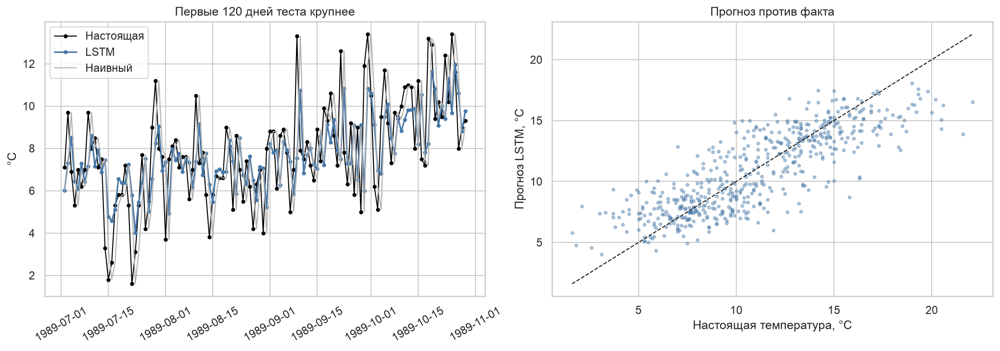
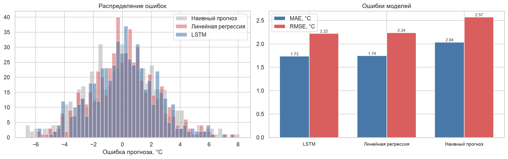

# ВВЕДЕНИЕ

Обычная полносвязная сеть обрабатывает каждый объект отдельно и ничего не помнит о предыдущих. Рекуррентная сеть устроена иначе: она читает последовательность по элементам и хранит состояние, в которое записывает прочитанное. Это позволяет работать с текстом, речью и временными рядами.

Цель работы: разобраться, как устроена рекуррентная сеть, обучить её на последовательностях и понять, когда она даёт выигрыш по сравнению с простыми моделями.

Как я понял задачу: текста задания в СДО нет, беру стандартное содержание. Рекуррентная сеть на последовательностях, сравнение с простой моделью, графики обучения и объяснение, зачем нужна рекуррентность. В лабораторной работе № 2 сеть LSTM уже применялась к текстам, поэтому здесь беру вторую типовую задачу, прогноз временного ряда.

Задачи работы:
- взять открытый временной ряд и изучить его свойства;
- нарезать ряд на окна и разбить выборку по времени;
- построить наивный прогноз и линейную регрессию как базовые уровни;
- обучить сеть LSTM и сравнить её с базовыми моделями по MAE, RMSE и R².

Работа выполнена на Python 3.12 с библиотеками pandas, scikit-learn и PyTorch. Код и графики лежат в репозитории https://github.com/thehaffk/mmo в папке `prac2`. Все случайные процессы зафиксированы (random_state = 42).

# 1 Временной ряд

Использован открытый набор Daily Minimum Temperatures [1]: ежедневная минимальная температура в Мельбурне с 1 января 1981 года по 31 декабря 1990 года, 3650 значений. Среднее 11,18 °C, отклонение 4,07 °C, минимум 0 °C, максимум 26,3 °C.



Ряд колеблется с годовым периодом и без заметного тренда. Мельбурн в южном полушарии, поэтому самые тёплые месяцы январь и февраль (в среднем 15,0 и 15,4 °C), самые холодные июнь и июль (7,3 и 6,7 °C).



Автокорреляция показывает, насколько значение ряда связано с самим собой через несколько дней: на сдвиге в один день 0,775, через неделю 0,576, через месяц 0,483. Вчерашний день предсказывает завтрашний лучше всего, и это подсказывает сильный базовый уровень.

# 2 Нарезка на окна и разбиение

Сеть учится на парах «30 дней подряд → следующий день». Такая нарезка превращает ряд в обучающую выборку.

Разбивать её случайно нельзя. Соседние окна перекрываются на 29 днях, и при перемешивании в обучение попали бы дни из будущего относительно тестовых. Оценка тогда получится завышенной, а модель в реальном применении сработает хуже. Поэтому разбиение строго по времени: первые 70 % ряда на обучение (2525 окон), следующие 15 % на валидацию (547), последние 15 % на тест (548). Тестовый период это второе полугодие 1989 года и весь 1990 год.

Стандартизация считается по обучающему отрезку: среднее 10,98 °C, отклонение 4,09 °C. Метрики пересчитываются обратно в градусы.

```python
def make_windows(series, start, end):
    X, y, idx = [], [], []
    for t in range(max(start, WINDOW), end):
        X.append(series[t - WINDOW:t])
        y.append(series[t])
        idx.append(t)
    return np.array(X), np.array(y), np.array(idx)
```

# 3 Базовые модели

**Наивный прогноз:** температура завтра равна температуре сегодня. Для суточных температур это сильный базовый уровень, потому что автокорреляция на сдвиге в один день 0,775.

**Линейная регрессия:** взвешенная сумма тех же 30 значений окна. Модель подбирает веса, но состояния не хранит.

На тесте наивный прогноз даёт MAE 2,036 °C и R² 0,565, линейная регрессия 1,745 °C и 0,670.

# 4 Рекуррентная сеть LSTM

Рекуррентная сеть проходит по окну по одному дню за шаг. На каждом шаге она получает новое значение и своё состояние с прошлого шага, а выдаёт обновлённое состояние. Из последнего состояния линейный слой считает прогноз.

LSTM это рекуррентная ячейка с тремя вентилями. Вентиль забывания решает, что стереть из состояния, входной что записать, выходной что отдать наружу. Вентили нужны против затухания градиента: у простой рекуррентной сети на длинной последовательности сигнал от первых шагов до конца почти не доходит.

Архитектура: вход из одного числа на шаг, LSTM с 32 скрытыми нейронами, линейный слой на один выход. Всего 4513 параметров, обучение 30 эпох заняло 8 секунд.

```python
class LSTMForecast(nn.Module):
    def __init__(self, hidden=32):
        super().__init__()
        self.lstm = nn.LSTM(1, hidden, batch_first=True)
        self.fc = nn.Linear(hidden, 1)

    def forward(self, x):
        out, (h, c) = self.lstm(x.unsqueeze(-1))
        return self.fc(h[-1]).squeeze(1)
```



Ошибка на валидации падает с 0,580 до 0,321 за двадцать эпох и дальше не улучшается. Кривые обучения и валидации идут рядом, переобучения нет.

# 5 Сравнение моделей

Таблица 1 — Метрики на тестовой выборке из 548 дней

| Модель | MAE, °C | RMSE, °C | R² |
|---|---|---|---|
| LSTM | 1,735 | 2,221 | 0,675 |
| Линейная регрессия | 1,745 | 2,239 | 0,670 |
| Наивный прогноз | 2,036 | 2,572 | 0,565 |







Сеть обогнала наивный прогноз на 0,30 °C по MAE, а линейную регрессию всего на 0,01 °C. Это честный результат, и он показателен: на суточных температурах зависимость от предыдущих дней почти линейная, запоминать порядок внутри окна почти нечего.

Худшие прогнозы приходятся на резкие потепления. 23 ноября 1989 года фактическая температура 21,6 °C, прогноз сети 13,9 °C, ошибка 7,7 °C. Такие скачки вызваны сменой воздушной массы, а в самом ряде температур этой информации нет, поэтому ни одна модель по прошлым значениям их не предскажет.

# ЗАКЛЮЧЕНИЕ

На ряде из 3650 суточных температур обучена рекуррентная сеть LSTM и сравнена с наивным прогнозом и линейной регрессией. Выборка разбита строго по времени, метрики считались на 548 днях второго полугодия 1989 и всего 1990 года.

Результат: LSTM MAE 1,735 °C, RMSE 2,221 °C, R² 0,675. Линейная регрессия 1,745 °C, 2,239 °C и 0,670. Наивный прогноз 2,036 °C, 2,572 °C и 0,565.

Рекуррентная сеть уверенно обогнала наивный прогноз, но сравнялась с линейной регрессией. Вывод по применимости: рекуррентность окупается там, где важен порядок элементов и длинные зависимости, то есть в текстах, речи, рядах со сменой режимов. На суточных температурах с почти линейной зависимостью от последних дней простая модель даёт то же качество при несравнимо меньшей сложности.

Отдельный практический вывод касается методики: временной ряд нельзя разбивать случайно. Окна перекрываются, и при перемешивании модель увидит будущее, а оценка окажется завышенной.

Улучшить прогноз можно признаками календаря, внешними данными о давлении и влажности, прогнозом на несколько дней вперёд с оценкой по горизонту и более глубокой сетью при большем объёме данных.

# СПИСОК ИСПОЛЬЗОВАННЫХ ИСТОЧНИКОВ

1. Daily Minimum Temperatures in Melbourne : набор данных // GitHub : [сайт]. — URL: https://github.com/jbrownlee/Datasets (дата обращения: 28.09.2026). — Текст : электронный.
2. Hochreiter, S. Long Short-Term Memory / S. Hochreiter, J. Schmidhuber // Neural Computation. — 1997. — Vol. 9, № 8. — P. 1735–1780.
3. Paszke, A. PyTorch: An Imperative Style, High-Performance Deep Learning Library / A. Paszke [et al.] // Advances in Neural Information Processing Systems. — 2019. — Vol. 32. — P. 8024–8035.
4. Бринк, Х. Машинное обучение / Х. Бринк, Дж. Ричардс, М. Феверолф ; перевод с английского. — Санкт-Петербург : Питер, 2017. — 336 с. — Текст : непосредственный.
