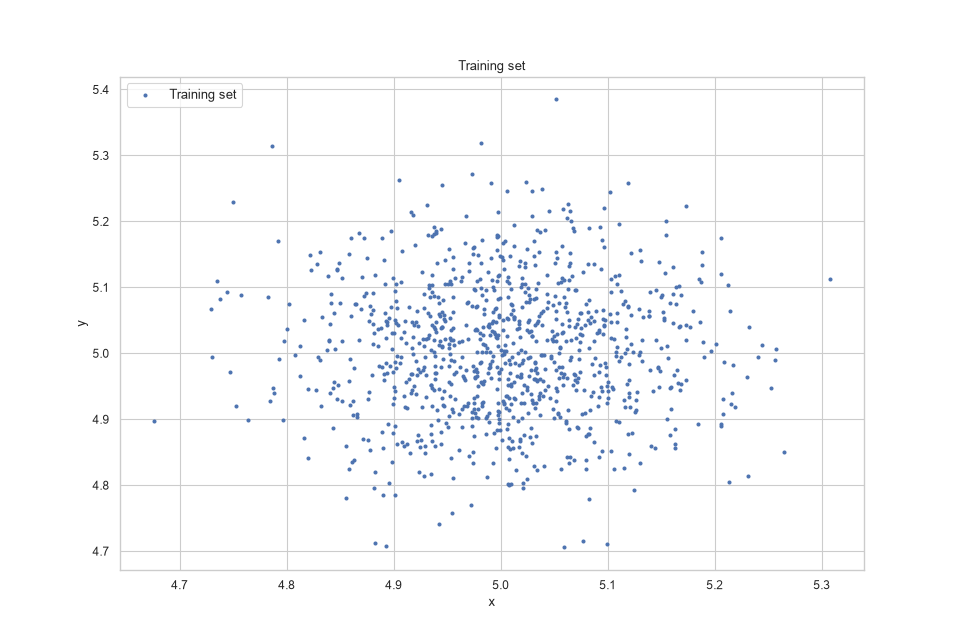
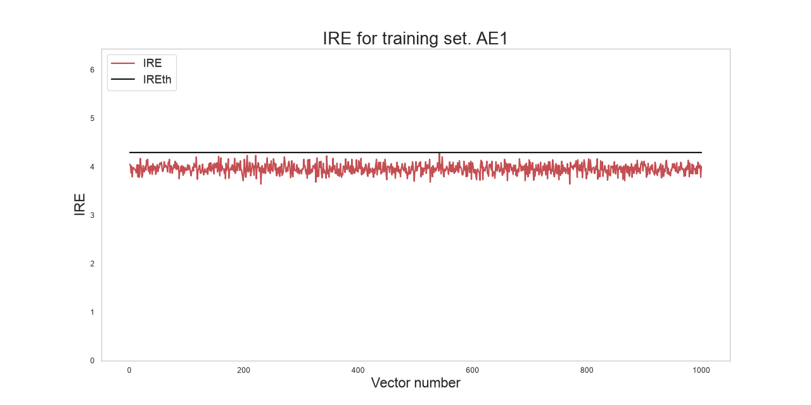
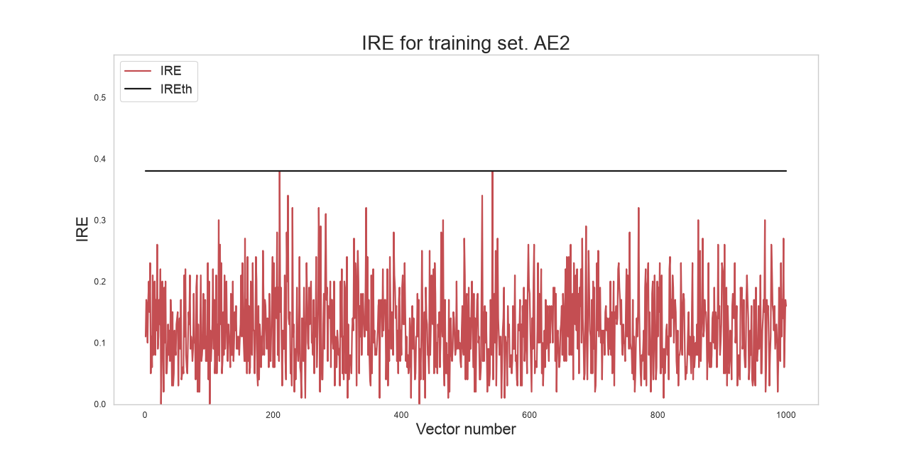
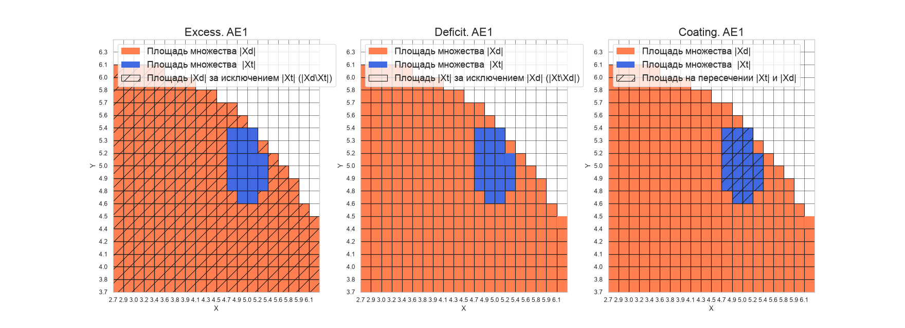
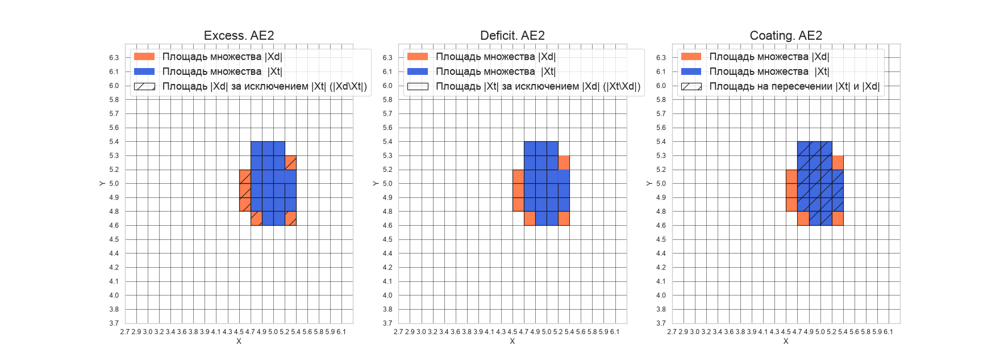
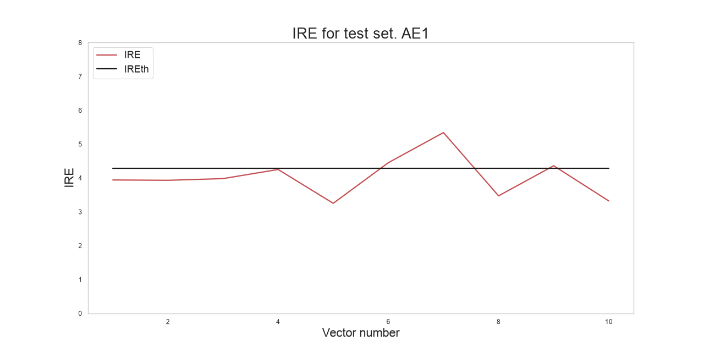
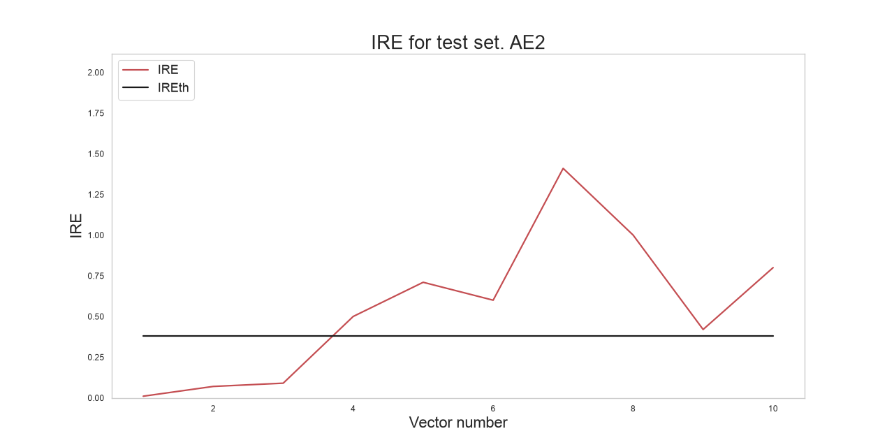
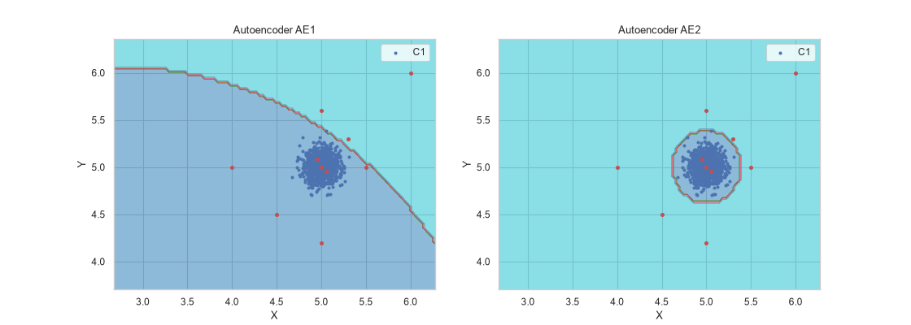
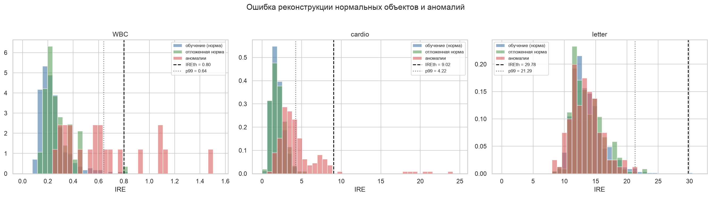
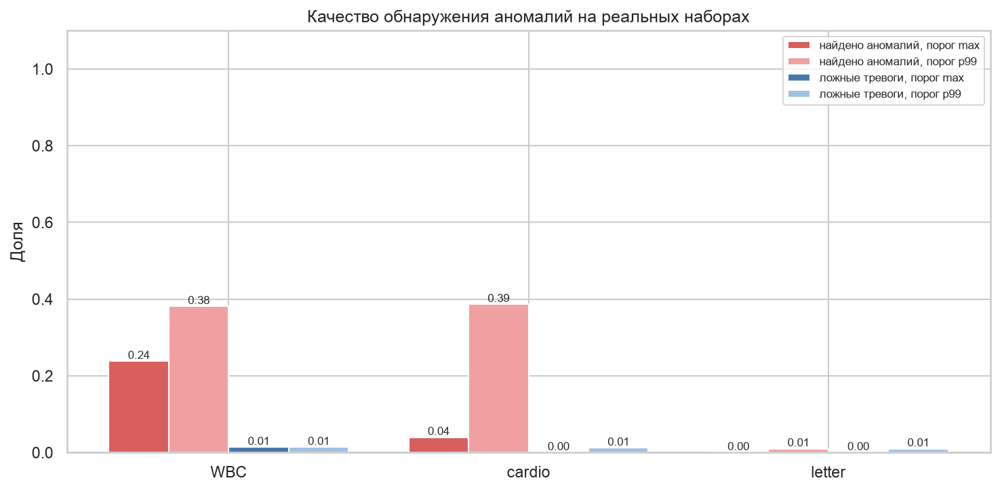

# ВВЕДЕНИЕ

Обнаружение аномалий нужно там, где редкие события важнее обычных: сетевые атаки, мошеннические транзакции, неисправности оборудования, патологии в медицинских данных. Примеров аномалий обычно мало или нет совсем, поэтому модель учат только на нормальных данных, а всё непохожее на них считают аномалией.

Цель работы: получить практические навыки создания, обучения и применения автокодировщиков, исследовать влияние архитектуры и числа эпох на область, которую автокодировщик распознаёт после обучения, и решить задачу обнаружения аномалий с помощью автокодировщика как одноклассового классификатора.

Задачи работы:
- перенести библиотеку `lab02_lib.py` из материалов к работе на актуальные версии библиотек;
- обучить два автокодировщика разной сложности на синтетических двумерных данных;
- оценить их характеристиками качества EDCA;
- проверить обнаружение аномалий на тестовой выборке;
- применить метод к реальным наборам данных из архива.

Работа выполнена на Python 3.12 с библиотеками TensorFlow 2.21 и Keras 3.15. Код лежит в репозитории https://github.com/thehaffk/mmo в папке `prac3`. Случайные процессы зафиксированы (random_state = 42).

# 1 Автокодировщик как одноклассовый классификатор

Автокодировщик это нейронная сеть, у которой число нейронов на входе и выходе равно числу признаков, а в скрытых слоях меньше. Сеть учится восстанавливать на выходе свой вход, проходя через узкое горлышко, поэтому ей приходится выучить сжатое описание обучающих данных. Качество обучения измеряется среднеквадратичной ошибкой, ошибка, на которой обучение остановилось, обозначается MSE_stop.

После обучения для каждого примера считается ошибка реконструкции IRE, расстояние между входом и выходом. На данных, похожих на обучающие, она маленькая, на непохожих большая. Порог IREth это максимальная ошибка на обучающей выборке. Пример с ошибкой выше порога считается аномалией.

# 2 Перенос библиотеки

Библиотека `lab02_lib.py` из архива к работе написана под старые версии scikit-learn и TensorFlow и в актуальной среде не запускается. Я перенёс её, не меняя логику функций. Изменения:
- импорт `make_blobs` из `sklearn.datasets` вместо удалённого модуля `samples_generator`;
- аргумент `learning_rate` у оптимизатора Adam вместо удалённого `lr`;
- вызов конструктора базового класса в `EarlyStoppingOnValue`, иначе в Keras 3 не работает `self.model`;
- архитектура автокодировщика передаётся параметром `arch`, а не вводится с клавиатуры через `input()`, чтобы ноутбук выполнялся целиком;
- параметр `random_state` в `datagen` для воспроизводимости;
- к обученной модели прикрепляются MSE_stop и число пройденных эпох.

Для TensorFlow создано отдельное окружение, чтобы не менять версии библиотек в общем окружении остальных работ.

# 3 Синтетические данные и обучение

По методичке сгенерирован двумерный набор из 1000 точек с центром в точке (5, 5) и разбросом 0,1 (рисунок 1).



Обучены два автокодировщика:
- **AE1**: один скрытый слой из одного нейрона. Намеренно слабая модель: вся двумерная точка должна пройти через одно число;
- **AE2**: архитектура по умолчанию из библиотеки, скрытые слои 3, 2, 1, 2, 3.

```python
patience = 300
ae1, IRE1, IREth1 = lib.create_fit_save_ae(data, 'out/AE1.h5', 'out/AE1_ire_th.txt',
                                           1000, False, patience, arch=[1])
ae2, IRE2, IREth2 = lib.create_fit_save_ae(data, 'out/AE2.h5', 'out/AE2_ire_th.txt',
                                           3000, False, patience)
```

Параметр patience = 300 останавливает обучение, если ошибка 300 эпох подряд не уменьшается.

AE1 прошёл все 1000 эпох, MSE_stop 7,83, порог IREth1 = 4,29 (рисунок 2). AE2 остановился на 2701-й эпохе, MSE_stop 0,0098, порог IREth2 = 0,38 (рисунок 3). Это соответствует требованию методички: у первого автокодировщика MSE_stop не меньше единицы, у второго около 0,01.





# 4 Характеристики качества EDCA

Функция `lib.square_calc` делит пространство признаков сеткой 20 на 20 и сравнивает клетки, где лежат обучающие точки (|Xt|), с клетками, которые автокодировщик относит к своему классу (|Xd|). По ним считаются четыре характеристики:
- Excess: доля лишних клеток, которые автокодировщик считает своими, хотя обучающих точек там нет, идеал 0;
- Deficit: доля обучающих клеток, которые автокодировщик не распознал, идеал 0;
- Coating: доля обучающих клеток, покрытых распознанной областью, идеал 1;
- Approx: отношение площадей |Xt| / |Xd|, идеал 1.





Таблица 1 — Характеристики EDCA

| Автокодировщик | Excess | Deficit | Coating | Approx |
|---|---|---|---|---|
| AE1 | 13,25 | 0 | 1 | 0,070 |
| AE2 | 0,30 | 0 | 1 | 0,769 |
| Идеальный | 0 | 0 | 1 | 1 |

AE1 относит к своему классу площадь в 14 раз больше площади обучающих данных. AE2 очерчивает облако плотно и близок к идеалу. В методичке приведены числа того же порядка: у AE1 Excess 11,25 и Approx 0,08, у AE2 0,5 и 0,67.


# 5 Обнаружение аномалий на тестовой выборке

Тестовая выборка составлена самостоятельно: 3 точки внутри облака и 7 на разном удалении от него. Для каждой точки заранее известно, аномалия это или нет.

```python
data_test = np.array([
    [5.00, 5.00], [5.05, 4.95], [4.95, 5.08],
    [5.50, 5.00], [4.50, 4.50], [5.00, 5.60], [6.00, 6.00],
    [4.00, 5.00], [5.30, 5.30], [5.00, 4.20]])
predicted_labels, ire = lib.predict_ae(ae2, data_test, IREth2)
```

Таблица 2 — Результаты на тестовой выборке

| Автокодировщик | Найдено аномалий из 7 | Ложных тревог из 3 | Верных ответов из 10 |
|---|---|---|---|
| AE1 | 3 | 0 | 6 |
| AE2 | 7 | 0 | 10 |





AE1 пропустил 4 аномалии: их ошибка от 3,25 до 4,25 ниже его завышенного порога 4,29. Более того, у точек внутри облака ошибка 3,93–3,98, то есть выше, чем у части аномалий: AE1 вообще не отличает норму от аномалий. AE2 нашёл все 7 аномалий: у нормальных точек ошибка 0,01–0,09, у аномалий от 0,42 до 1,41 при пороге 0,38.



Рисунок 9 показывает уязвимость, о которой говорит методичка: аномалии, попавшие внутрь раздутой области AE1, проходят незамеченными.

# 6 Реальные данные из архива

В архиве к работе три набора: WBC (опухоли молочной железы, 30 признаков), cardio (кардиотокография, 21 признак) и letter (распознавание букв, 32 признака). Это наборы бенчмарка обнаружения аномалий ODDS: обучающий файл содержит только нормальные объекты, тестовый только аномалии.

Чтобы оценить ложные тревоги, 20 % нормальных объектов откладывались и в обучении не участвовали. Для многомерных данных взята более широкая архитектура с горлышком из 4 нейронов. Кроме порога по максимуму проверен порог по 99-му процентилю ошибки на обучении: он не зависит от единственного нетипичного объекта.

Таблица 3 — Обнаружение аномалий на реальных наборах

| Набор | Аномалий | Найдено (порог max) | Ложные тревоги (max) | Найдено (p99) | Ложные тревоги (p99) |
|---|---|---|---|---|---|
| WBC | 21 | 23,8 % | 1,4 % | 38,1 % | 1,4 % |
| cardio | 176 | 4,0 % | 0 % | 38,6 % | 1,2 % |
| letter | 100 | 0 % | 0 % | 1,0 % | 1,0 % |





Результат на реальных данных скромный. Порог по максимальной ошибке слишком строгий: один нетипичный нормальный объект задирает его, и большинство аномалий проходит ниже. Порог по 99-му процентилю находит около 38 % аномалий WBC и cardio при ложных тревогах около 1 %. На letter метод не работает: аномальные буквы по расстоянию до центра не отличаются от нормальных (медианы 13,12 и 13,16), а признаки от 0 до 15 без нормализации дали MSE_stop 5,99, то есть модель недообучена.

# ЗАКЛЮЧЕНИЕ

Библиотека `lab02_lib.py` перенесена на Python 3.12, TensorFlow 2.21 и Keras 3.15 шестью изменениями без изменения логики функций.

На синтетических двумерных данных обучены два автокодировщика. Простой AE1 с одним нейроном в горлышке (MSE_stop 7,83) распознаёт область в 14 раз больше обучающей: Excess 13,25, Approx 0,070. Глубокий AE2 (MSE_stop 0,0098) очерчивает облако плотно: Excess 0,30, Approx 0,769. На тестовой выборке AE2 нашёл все 7 аномалий без ложных тревог, AE1 только 3. Характеристики EDCA показывают эту разницу ещё до тестирования, и это их главная ценность: по ним видно, насколько автокодировщик уязвим для пропуска аномалий.

На реальных наборах метод даёт скромный результат. С порогом по максимуму найдено 23,8 % аномалий WBC и 4,0 % cardio, с порогом по 99-му процентилю около 38 % при ложных тревогах около 1 %. На наборе letter автокодировщик аномалии не находит.

Улучшить результат можно нормализацией признаков, выбором порога по отложенной норме с заданной долей ложных тревог, более широким горлышком для многомерных данных и сравнением с Isolation Forest и One-Class SVM.

# СПИСОК ИСПОЛЬЗОВАННЫХ ИСТОЧНИКОВ

1. Rayana, S. ODDS Library : Outlier Detection DataSets // Stony Brook University : [сайт]. — 2016. — URL: https://odds.cs.stonybrook.edu (дата обращения: 28.09.2026). — Текст : электронный.
2. Goodfellow, I. Deep Learning / I. Goodfellow, Y. Bengio, A. Courville. — Cambridge : MIT Press, 2016. — 800 p. — Chapter 14: Autoencoders.
3. Keras documentation : Model training APIs // Keras : [сайт]. — URL: https://keras.io/api/ (дата обращения: 28.09.2026). — Текст : электронный.
4. Лысачев, М. Н. Искусственный интеллект. Анализ, тренды, мировой опыт / М. Н. Лысачев, А. Н. Прохоров ; научный редактор Д. А. Ларионов. — Москва ; Белгород : КОНСТАНТА-принт, 2023. — 460 с. — Текст : непосредственный.
5. Рындина, С. В. Базовые возможности языка Python для анализа данных : учебно-методическое пособие / С. В. Рындина. — Пенза : Изд-во ПГУ, 2022. — 72 с. — Текст : непосредственный.
