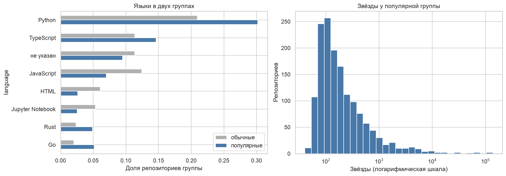
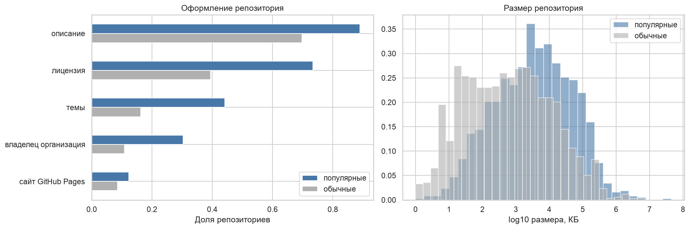
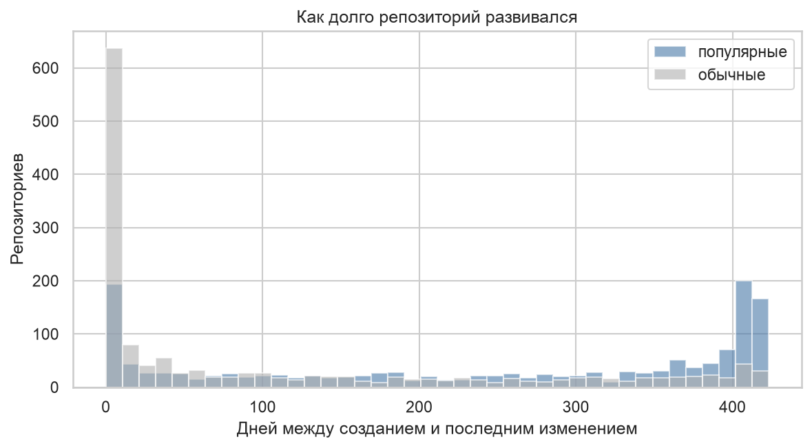
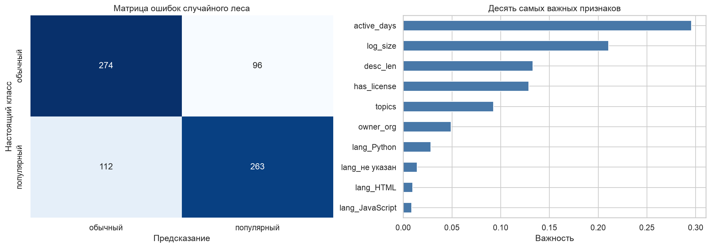

# ВВЕДЕНИЕ

Работа парная к лабораторной № 5, где датасет собирался из открытого API Hacker News. Здесь источник другой, API поиска GitHub, а работа компактнее, с упором на процесс сбора.

Цель работы: научиться собирать датасет из открытого API стороннего сервиса, структурировать, очищать и анализировать его.

Как я понял задачу: текста задания в СДО нет. Работа парная к лабораторной № 5, источник данных должен быть другим, объём и описание компактнее.

Задачи работы:
- выбрать открытый источник и проверить, подходит ли он для сбора;
- собрать сырые данные скриптом;
- разобрать их в таблицу и очистить;
- проанализировать и сохранить датасет;
- показать на модели, что датасет пригоден для обучения.

Работа выполнена на Python 3.12 с библиотеками pandas и scikit-learn. Код, сырые данные и датасет лежат в репозитории https://github.com/thehaffk/mmo в папке `prac4`.

# 1 Выбор источника

Сначала я проверил ленту публичных событий GitHub `api.github.com/events`. Без авторизации она кешируется: заголовок ответа `X-Poll-Interval: 60`, два запроса с разницей 8 секунд вернули одни и те же 100 событий, а всего лента отдаёт не больше 300 событий. Датасет из неё не собрать.

API поиска репозиториев тоже работает без авторизации, отдаёт по 100 репозиториев за запрос и умеет отбирать их по дате создания и числу звёзд. Ограничение 10 запросов в минуту.

Выборка устроена в два слоя. Первая версия брала только 100 самых популярных репозиториев каждого дня, и выборка оказалась обрезана снизу: меньше 49 звёзд в неё не попадало, а модель внутри такой выборки давала ROC-AUC 0,57. Поэтому за каждый день с 1 по 15 августа 2025 года беру 100 самых популярных репозиториев и 100 обычных. Даты взяты год назад, чтобы число звёзд успело устояться.

# 2 Сбор сырых данных

```python
QUERIES = {'popular': 'created:{d}&sort=stars&order=desc',
           'ordinary': 'created:{d}+stars:1..3'}
for day in DAYS:
    for group, q in QUERIES.items():
        resp = search(q.format(d=day.isoformat()))
        for it in resp['items']:
            it['_group'] = group
        raw['items'] += resp['items']
        time.sleep(7)
```

30 запросов с паузой 7 секунд заняли около трёх с половиной минут. Сырой ответ сохранён в `data/raw_github_repos.json`, при повторном запуске данные берутся из файла. Запрос `stars:1..3` вернул репозитории ровно с тремя звёздами: сортировка по совпадению ставит их первыми.

# 3 Структурирование и очистка

В сырой записи 82 поля, большинство из них это ссылки на другие методы API. Взяты 15 содержательных: даты создания и последнего изменения, язык, размер, звёзды, форки, открытые задачи, наличие лицензии, длина описания, число тем, тип владельца, наличие сайта и срок развития. Имена репозиториев и владельцев в датасет не попадают.

Очистка: дубликатов и пропусков нет, удалены 22 пустых репозитория с размером 0. У 3 репозиториев последнее изменение раньше даты создания: их история перенесена из другого места, срок развития у них обрезан до нуля. Итог: `data/github_repos.csv`, 2978 репозиториев, 15 столбцов, 343 КБ.

# 4 Анализ

Среди популярных репозиториев больше Python (30,2 % против 20,9 %), Rust и Go, среди обычных больше JavaScript, HTML и ноутбуков Jupyter (рисунок 1). Звёзды у популярной группы от 49 до 138 009, медиана 147.



Популярные репозитории заметно лучше оформлены (рисунок 2): лицензия у 73,4 % против 39,4 %, темы у 44,1 % против 16,2 %, владелец организация у 30,3 % против 10,9 %. Медианный размер в 6,5 раза больше, 3667 КБ против 561.



Популярные проекты развиваются дольше (рисунок 3): медиана 281 день между созданием и последним изменением против 27. В первую же неделю забрасывают 40,5 % обычных репозиториев и только 11,7 % популярных.



# 5 Демонстрация пригодности датасета

Задача: по свойствам репозитория отличить популярный от обычного. Звёзды, форки и открытые задачи в признаки не входят: это следствие популярности, с ними модель подсмотрела бы ответ. Признаки: размер, длина описания, число тем, лицензия, тип владельца, сайт, срок развития и восемь самых частых языков.

Таблица 1 — Результаты на тестовой выборке из 745 репозиториев

| Модель | Accuracy | ROC-AUC |
|---|---|---|
| Случайный лес | 0,7208 | 0,7994 |
| Логистическая регрессия | 0,7060 | 0,7782 |



Главные признаки: срок развития (0,296), размер (0,211), длина описания (0,133) и лицензия (0,129). Оговорка: срок развития отчасти следствие популярности, популярный проект чаще продолжают поддерживать.

# ЗАКЛЮЧЕНИЕ

Из открытого API поиска GitHub 30 запросами собраны 3000 репозиториев, после очистки в датасете 2978 записей и 15 столбцов. Лента публичных событий GitHub для сбора не подошла: без авторизации она кешируется и отдаёт не больше 300 событий.

Анализ показал, чем популярные репозитории отличаются от обычных: лицензией, темами, описанием, размером, принадлежностью организациям и долгим развитием. Случайный лес по этим признакам отличает популярный репозиторий от обычного с accuracy 0,7208 и ROC-AUC 0,7994.

Отдельный урок по методике: первая выборка из одних популярных репозиториев давала модель на уровне 0,57. Правильно устроенная двухслойная выборка превратила задачу в осмысленную.

# СПИСОК ИСПОЛЬЗОВАННЫХ ИСТОЧНИКОВ

1. GitHub REST API : Search repositories // GitHub Docs : [сайт]. — URL: https://docs.github.com/en/rest/search/search (дата обращения: 28.09.2026). — Текст : электронный.
2. GitHub REST API : Rate limits // GitHub Docs : [сайт]. — URL: https://docs.github.com/en/rest/using-the-rest-api/rate-limits-for-the-rest-api (дата обращения: 28.09.2026). — Текст : электронный.
3. Pedregosa, F. Scikit-learn: Machine Learning in Python / F. Pedregosa [et al.] // Journal of Machine Learning Research. — 2011. — Vol. 12. — P. 2825–2830.
4. Рындина, С. В. Базовые возможности языка Python для анализа данных : учебно-методическое пособие / С. В. Рындина. — Пенза : Изд-во ПГУ, 2022. — 72 с. — Текст : непосредственный.
