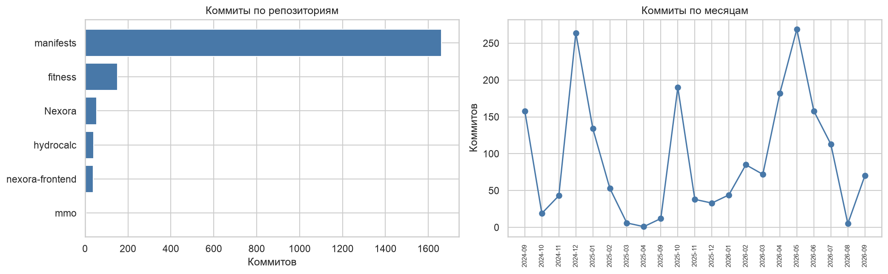
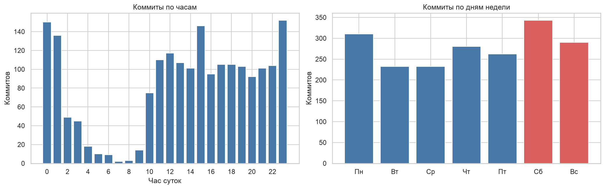
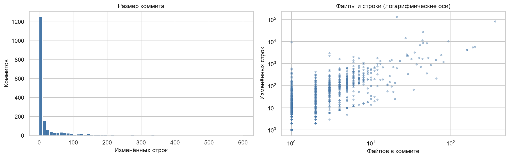
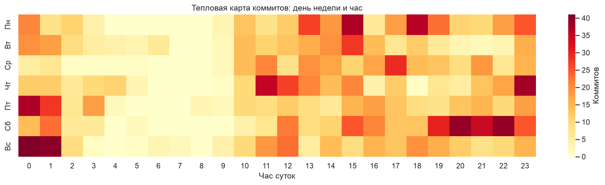
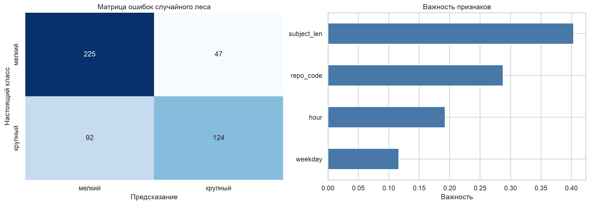

# ВВЕДЕНИЕ

Работа парная к лабораторной № 5, где датасет собирался из экспорта переписки. Здесь источник другой: история моих git-репозиториев. Для каждого коммита git хранит время, автора, сообщение и статистику изменённых файлов, то есть история коммитов это готовый журнал активности разработчика.

Цель работы: научиться собирать датасет из вывода консольной программы, очищать его и анализировать.

Как я понял задачу: текста задания в СДО нет. Работа парная к лабораторной № 5 и должна быть компактнее, с упором на процесс сбора данных. Источник данных другой.

Задачи работы:
- получить сырой вывод `git log` из нескольких репозиториев;
- разобрать его в таблицу и очистить;
- проанализировать ритм и размер коммитов;
- сохранить датасет и показать его пригодность для обучения модели.

Работа выполнена на Python 3.12 с библиотеками pandas и scikit-learn. Код и графики лежат в репозитории https://github.com/thehaffk/mmo в папке `prac4`.

# 1 Сбор сырых данных

`git log` печатает историю в заданном формате. Использую разделитель из редких символов `|~|`, чтобы поля не путались с текстом сообщения, и флаг `--numstat`: после каждого коммита идёт по строке на изменённый файл с числом добавленных и удалённых строк. Слияния пропускаются флагом `--no-merges`, своих изменений у них нет.

```python
FORMAT = f'%H{SEP}%aI{SEP}%an{SEP}%s'
subprocess.run(['git', '-C', path, 'log', '--no-merges',
                f'--pretty=format:{FORMAT}', '--numstat'],
               capture_output=True, text=True, check=True).stdout
```

Данные собраны из шести репозиториев: учебные проекты Nexora, nexora-frontend, hydrocalc и mmo, личный fitness и командный manifests.

# 2 Разбор и очистка

Вывод разбирается построчно: строка с разделителем начинает новый коммит, строки из трёх колонок через табуляцию относятся к текущему. Бинарные файлы git помечает дефисами вместо чисел, такие файлы считаются с нулём строк.

Часть репозиториев командные, поэтому имена авторов заменяются псевдонимами вида «Автор 03», а сообщения коммитов в датасет не попадают, сохраняется только их длина.

Собрано 1951 коммит за период с 3 сентября 2024 года по 28 сентября 2026 года от 27 авторов. У двух коммитов нет изменённых файлов, они удалены. Самый большой коммит на 133 920 строк это первый импорт проекта, но удалять крупные коммиты я не стал: это реальные события, и они важны для задачи о размере коммита.

Итог: `data/commits.csv`, 1949 коммитов, 15 столбцов, 207 КБ.

# 3 Анализ

Больше всего коммитов в командном репозитории manifests, 1660 из 1949 (рисунок 1). Учебные проекты дают от 5 до 153 коммитов. Самый активный месяц май 2026 года, 269 коммитов.



Ритм разработки обратный ритму чата группы из лабораторной № 5 (рисунок 2). Пик коммитов в 23 часа, ночью с 0 до 6 часов сделано 20,9 % коммитов, в выходные 32,5 %.



Большинство коммитов мелкие (рисунок 3): медиана 4 изменённые строки в одном файле. Число файлов и число строк связаны умеренно, коэффициент корреляции 0,43.



Тепловая карта (рисунок 4) подтверждает вечерний и ночной ритм: яркие клетки идут поздним вечером и в выходные, а не в учебные часы.



# 4 Демонстрация пригодности датасета

Задача: отличить крупный коммит от мелкого по признакам, не связанным напрямую с объёмом правок. Крупным считается коммит, у которого изменений больше медианы (4 строки), таких 44,3 %. Признаки: час, день недели, длина сообщения коммита и репозиторий.

Таблица 1 — Определение крупного коммита

| Модель | Accuracy | ROC-AUC |
|---|---|---|
| Случайный лес | 0,7152 | 0,7882 |
| Логистическая регрессия | 0,6516 | 0,6486 |



Главный признак длина сообщения коммита (важность 0,404): крупную правку описывают подробнее. Следом репозиторий (0,288) и час (0,192). Лес лучше логистической регрессии, потому что зависимость от репозитория и часа нелинейная.

# ЗАКЛЮЧЕНИЕ

Из вывода `git log` шести репозиториев собран датасет из 1949 коммитов и 15 столбцов. Разбор потребовал своего формата вывода с редким разделителем и построчного парсинга статистики файлов. Имена авторов заменены псевдонимами, тексты коммитов не сохранены.

Анализ показал ночной ритм разработки: пик в 23 часа, пятая часть коммитов ночью, треть в выходные. Это противоположно ритму чата группы из лабораторной № 5 с пиком в 10 утра. Типичный коммит маленький, медиана 4 строки, при этом распределение имеет очень длинный хвост.

Датасет пригоден для обучения: случайный лес отличает крупный коммит от мелкого с accuracy 0,7152 и ROC-AUC 0,7882, главный признак длина сообщения коммита.

# СПИСОК ИСПОЛЬЗОВАННЫХ ИСТОЧНИКОВ

1. Git documentation : git-log // Git : [сайт]. — URL: https://git-scm.com/docs/git-log (дата обращения: 28.09.2026). — Текст : электронный.
2. Pedregosa, F. Scikit-learn: Machine Learning in Python / F. Pedregosa [et al.] // Journal of Machine Learning Research. — 2011. — Vol. 12. — P. 2825–2830.
3. Рындина, С. В. Базовые возможности языка Python для анализа данных : учебно-методическое пособие / С. В. Рындина. — Пенза : Изд-во ПГУ, 2022. — 72 с. — Текст : непосредственный.
