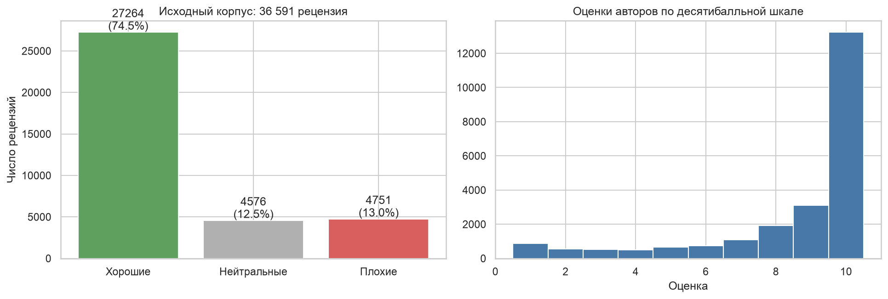
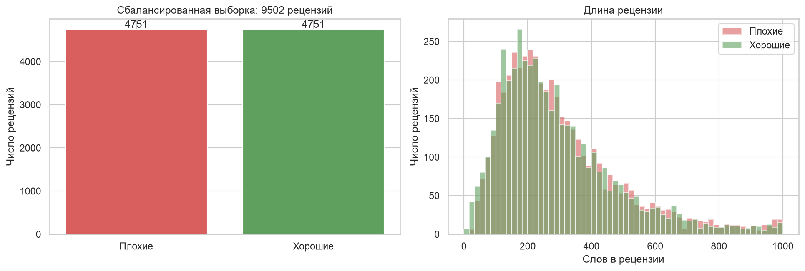
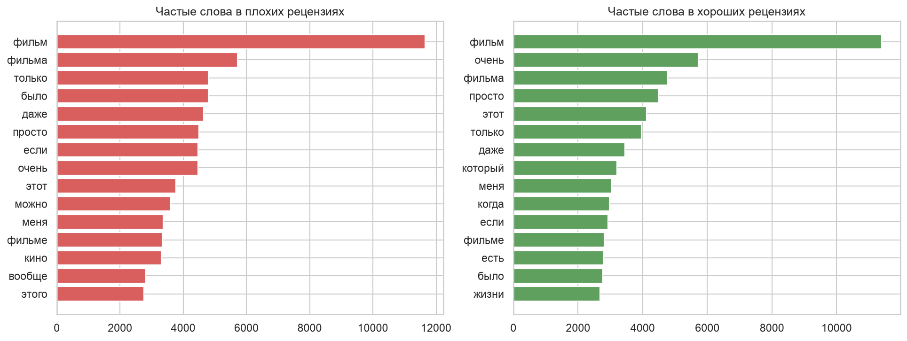
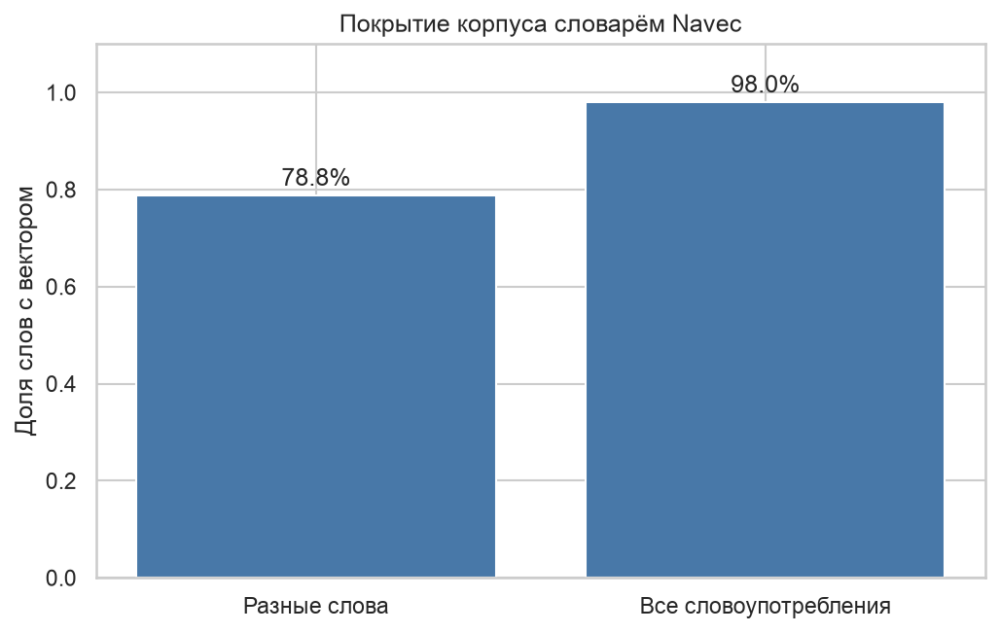
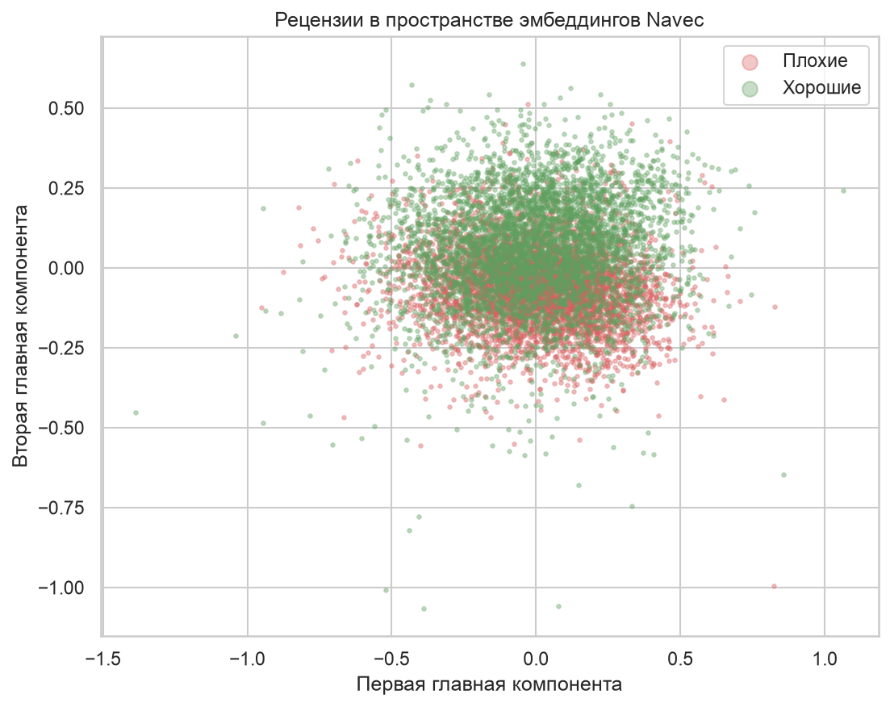
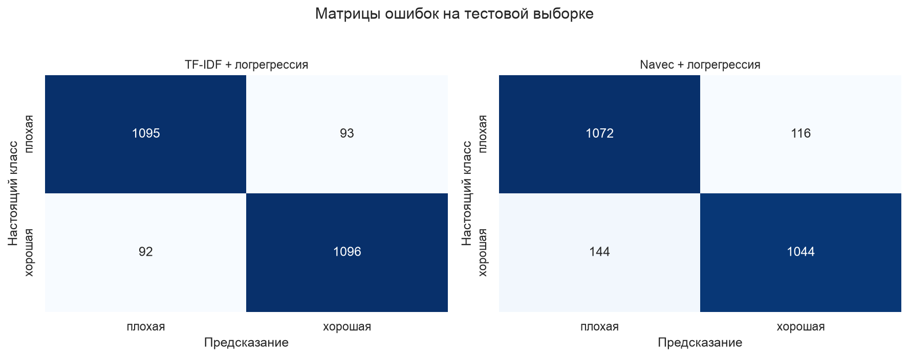
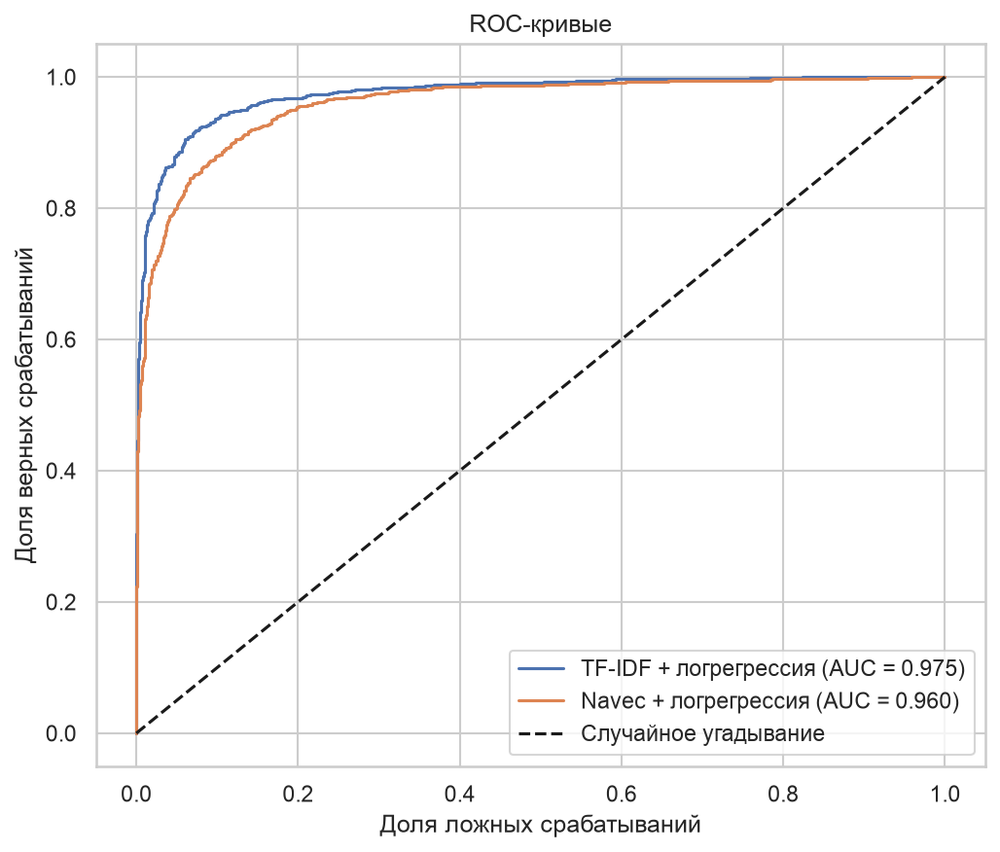
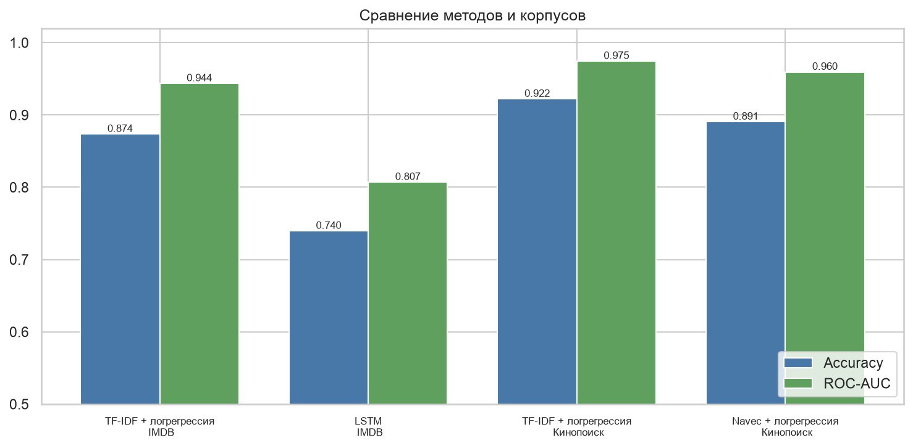

# ВВЕДЕНИЕ

Работа парная к лабораторной № 2, где я определял тональность англоязычных отзывов IMDB мешком слов и рекуррентной сетью. Здесь беру другой корпус и другой метод, а в конце сравниваю результаты.

Цель работы: научиться применять предобученные векторные представления слов к задаче анализа тональности и сравнить их с мешком слов.

Как я понял задачу: текста задания в СДО нет, поэтому опираюсь на пару к лабораторной № 2. Корпус русскоязычный, метод другой, предобученные эмбеддинги, и нужно сравнение с результатом лабораторной работы.

Задачи работы:
- собрать корпус русскоязычных рецензий с метками тональности;
- выровнять классы и предобработать тексты;
- проверить, насколько словарь предобученных эмбеддингов покрывает корпус;
- обучить логистическую регрессию на эмбеддингах и на TF-IDF;
- сравнить методы между собой и с лабораторной работой № 2.

Работа выполнена на Python 3.12 с библиотеками pandas, scikit-learn и navec. Код и графики лежат в репозитории https://github.com/thehaffk/mmo в папке `prac5`. Все случайные процессы зафиксированы (random_state = 42).

# 1 Корпус рецензий

Использован открытый набор `blinoff/kinopoisk` с площадки Hugging Face [1]: 36 591 рецензия пользователей Кинопоиска на фильмы из топ-250 и из худшей сотни. У каждой рецензии есть оценка автора по десятибалльной шкале и метка тональности Good, Neutral или Bad, которую автор ставит сам при публикации.

Корпус сильно перекошен (рисунок 1): хороших рецензий 27 264 (74,5 %), плохих 4751, нейтральных 4576.



Нейтральные рецензии убираю, задача бинарная, как в лабораторной № 2. Классы выравниваю: беру все плохие рецензии и столько же случайных хороших. Итого 9502 рецензии, по 4751 в каждом классе. Длина у классов почти одинаковая, медиана 259 слов у плохих и 250 у хороших (рисунок 2), то есть по длине тональность не определить.



# 2 Предобработка

Русский текст отличается от английского богатой морфологией: у слова много форм. Лемматизацию не делаю, потому что словарь Navec содержит именно словоформы. Что делаю: перевожу в нижний регистр, заменяю букву ё на е, убираю всё, кроме кириллицы, дефиса и пробелов, склеиваю повторяющиеся пробелы.

```python
NON_CYR = re.compile(r'[^а-яё\- ]')

def clean(text):
    text = str(text).lower().replace('ё', 'е')
    return ' '.join(NON_CYR.sub(' ', text).split())
```

Частотный анализ (рисунок 3) показывает, что верх у обоих классов занимают нейтральные слова: фильм, фильма, только, просто. У хороших рецензий выше стоит слово очень, у плохих можно и вообще. По одним частотам классы почти не различаются, нужна модель, которая взвесит слова.



# 3 Предобученные эмбеддинги Navec

Эмбеддинг это вектор, который заменяет слово при вычислениях. Векторы обучают так, что слова, встречающиеся в похожих контекстах, оказываются рядом в пространстве. В мешке слов каждое слово это отдельная колонка, и «ужасный» с «отвратительный» для модели никак не связаны. В эмбеддингах они соседи.

Беру Navec из проекта Natasha [2]: 500 002 слова, вектор длиной 300, обучены на художественных текстах, размер файла 50 МБ за счёт квантования. Проверка на словах показывает, что расстояния осмысленные:

- скучный: унылый (0,716), нудный (0,686), неинтересный (0,660);
- шедевр: произведение (0,598), искусства (0,533);
- актер: артист (0,778), режиссер (0,749), сценарист (0,620).

Словарь покрывает корпус хорошо (рисунок 4): вектор нашёлся у 78,8 % разных слов и у 98,0 % всех словоупотреблений. Без вектора остаются в основном фамилии актёров и названия фильмов: дикаприо, хатико, галустян.



Вектор рецензии получаю усреднением векторов её слов. Рецензия превращается в 300 чисел независимо от длины.

```python
def embed(text):
    vecs = [navec[w] for w in text.split() if w in navec.vocab]
    return np.mean(vecs, axis=0) if vecs else np.zeros(300, dtype=np.float32)
```

На плоскости двух главных компонент (рисунок 5) облака классов сильно перекрываются, плохие рецензии лишь слегка смещены вниз. Две компоненты объясняют только 23,7 % дисперсии, поэтому судить о разделимости по такой картинке рано, это задача классификатора.



# 4 Обучение и сравнение методов

Разбиение 75 / 25 со стратификацией: 7126 рецензий на обучение, 2376 на тест. Логистическая регрессия обучается на двух представлениях: TF-IDF с парами слов (как в лабораторной № 2) и усреднённые эмбеддинги Navec.

Таблица 1 — Метрики на тестовой выборке из 2376 рецензий

| Метод | Accuracy | Precision | Recall | F1 | ROC-AUC |
|---|---|---|---|---|---|
| TF-IDF + логрегрессия | 0,9221 | 0,9218 | 0,9226 | 0,9222 | 0,9746 |
| Navec + логрегрессия | 0,8906 | 0,9000 | 0,8788 | 0,8893 | 0,9595 |





TF-IDF ошибается 185 раз из 2376, почти поровну в обе стороны (93 и 92). Эмбеддинги ошибаются 260 раз и чаще принимают хорошую рецензию за плохую (144 против 116).

Проигрыш эмбеддингов объясним. Вектор рецензии это среднее по всем словам, а рецензия длинная, медиана 250 слов. Одно резкое «отвратительно» растворяется среди сотен нейтральных слов. TF-IDF, наоборот, даёт редкому оценочному слову большой вес и не усредняет его ни с чем.

# 5 Сравнение с лабораторной работой № 2

Таблица 2 — Результаты двух работ

| Работа, корпус | Метод | Accuracy | ROC-AUC |
|---|---|---|---|
| ЛР2, IMDB, английский | TF-IDF + логрегрессия | 0,8736 | 0,9437 |
| ЛР2, IMDB, английский | LSTM, обучена с нуля | 0,7396 | 0,8072 |
| ПР5, Кинопоиск, русский | TF-IDF + логрегрессия | 0,9221 | 0,9746 |
| ПР5, Кинопоиск, русский | Navec + логрегрессия | 0,8906 | 0,9595 |



Главный вывод по методам: предобученные эмбеддинги (0,8906) заметно обходят рекуррентную сеть с векторами, обученными с нуля (0,7396). Сеть в лабораторной № 2 должна была выучить представления слов по 7500 отзывам, а Navec обучен на миллиардах слов, и эта разница даёт 15 процентных пунктов.

Точность на русском корпусе выше по двум причинам, и язык здесь ни при чём. Рецензии Кинопоиска длиннее (медиана 250 слов против 174 у IMDB), а фильмы взяты с полюсов рейтинга, из топ-250 и худшей сотни, поэтому оценки выражены ярче.

Таблица 3 — Число рецензий по классам

| Часть выборки | Плохие | Хорошие | Всего |
|---|---|---|---|
| Сбалансированная выборка | 4751 | 4751 | 9502 |
| Тестовая часть | 1188 | 1188 | 2376 |
| Предсказано лучшим методом | 1187 | 1189 | 2376 |

Среди ошибок попадаются рецензии с противоречивой разметкой. Например, рецензия на «Тёмного рыцаря» помечена автором как плохая, но оценка в ней 7 из 10, и модель считает её хорошей с вероятностью 0,71. Метку ставит сам автор рецензии, и она не всегда согласуется с его же баллом, поэтому часть ошибок относится к шуму разметки, а не к модели.

# ЗАКЛЮЧЕНИЕ

Собран корпус из 9502 русскоязычных рецензий Кинопоиска с выровненными классами и обучены две модели на разных представлениях текста.

Предобученные эмбеддинги Navec покрывают 98,0 % словоупотреблений корпуса и дают accuracy 0,8906, F1 0,8893, ROC-AUC 0,9595 при размерности признаков 300 вместо 20 000 у мешка слов.

TF-IDF с логистической регрессией остаётся лучше: accuracy 0,9221, F1 0,9222, ROC-AUC 0,9746, 185 ошибок против 260. Усреднение векторов размывает редкие оценочные слова, а TF-IDF именно им даёт наибольший вес.

По сравнению с лабораторной работой № 2 видно главное: предобученные представления обходят обученные с нуля на 15 процентных пунктов (0,8906 против 0,7396), при этом обучение занимает секунды вместо четырёх минут и не требует настройки сети.

Часть ошибок вызвана шумом в разметке: метку тональности ставит сам автор рецензии, и она расходится с его же оценкой по десятибалльной шкале.

Улучшить результат можно взвешиванием векторов по TF-IDF вместо простого усреднения, лемматизацией, объединением двух наборов признаков в одну модель и дообучением языковой модели вроде ruBERT.

# СПИСОК ИСПОЛЬЗОВАННЫХ ИСТОЧНИКОВ

1. Kinopoisk reviews : набор данных // Hugging Face : [сайт]. — URL: https://huggingface.co/datasets/blinoff/kinopoisk (дата обращения: 28.09.2026). — Текст : электронный.
2. Navec : предобученные эмбеддинги для русского языка // Natasha : [сайт]. — URL: https://github.com/natasha/navec (дата обращения: 28.09.2026). — Текст : электронный.
3. Mikolov, T. Efficient Estimation of Word Representations in Vector Space / T. Mikolov [et al.] // arXiv : [сайт]. — 2013. — URL: https://arxiv.org/abs/1301.3781 (дата обращения: 28.09.2026). — Текст : электронный.
4. Pedregosa, F. Scikit-learn: Machine Learning in Python / F. Pedregosa [et al.] // Journal of Machine Learning Research. — 2011. — Vol. 12. — P. 2825–2830.
5. Рындина, С. В. Базовые возможности языка Python для анализа данных : учебно-методическое пособие / С. В. Рындина. — Пенза : Изд-во ПГУ, 2022. — 72 с. — Текст : непосредственный.
